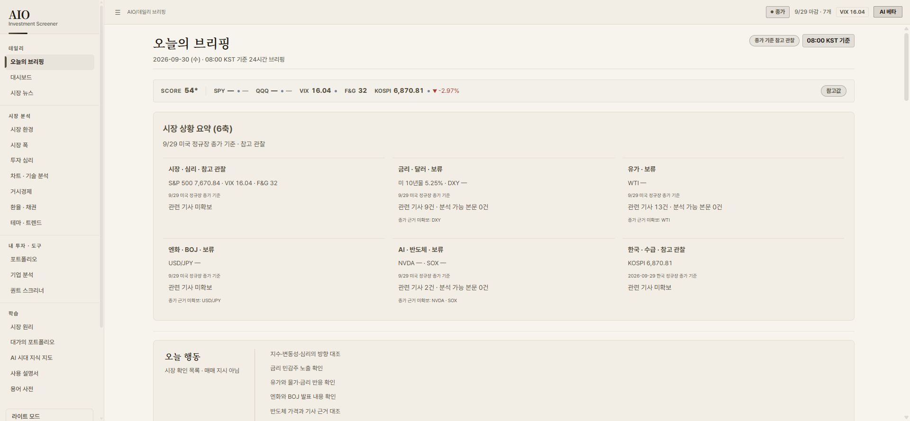
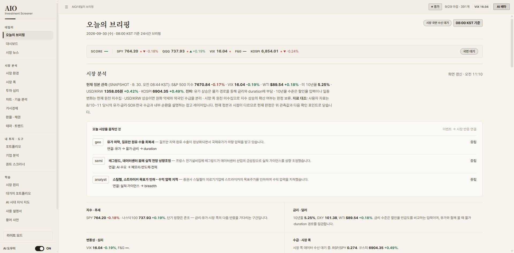

# 2026-09-30 구조·데이터·브라우저 감사 마무리

구조 개편은 실제 구현되어 있다. 19개 라우트의 native ESM 로딩, 상태·이벤트 연결, 라우트 종료 정리, 데이터 증거 계약과 회귀 게이트를 확인했다. 다만 legacy 셸이 여전히 크고, 실제 운영 배포의 출처 증명과 일부 화면의 문구·정보 구조에는 잔여 문제가 있다. 전체 재구축 및 모든 UI의 의미 검수가 끝났다고 판정하지 않는다.

사용자의 빠른 마무리 요청에 따라 추가 조사와 신규 수정은 여기서 종료한다. 이번 수정은 로컬 **v56.86**에 반영했다. 기존 dirty 변경을 보존했으며 커밋·푸시·배포는 수행하지 않았다.

## 참조한 이력과 작업 경계

- `NEXT-SESSION-20260930.md`, 현재 상태, 실행 상태, 이전 감사·재구축 인계 문서의 관련 범위를 대조했다.
- Git 로그·reflog·최근 변경 통계·코드 차이와 접근 가능한 저장소 산출물의 시간 정보를 확인했다. 작업 시작 HEAD는 `6441a2c6595bed848c0d7b58d3f407e698daaee3`이다.
- 시작 시 content-hash 기준선 `codex-audit-20260930`을 확보했다. 원래 staged `.gitattributes`와 기존 문서·버전 변경, 미추적 인계 파일은 사용자 소유로 보존했다.
- 별도 Claude 대화 원문이나 제공되지 않은 편집기 세부 이력까지 확인했다고 주장하지 않는다.
- 데이터 생산 스크립트는 로컬에서 실행하지 않았다. 현재 생성 산출물과 실행 가능한 게이트를 사용했다.

## 구현한 보강

| 기록 | 문제와 수정 |
| --- | --- |
| P1345 | 직전 미국 정규장 종가 증거를 엄격하게 적용했다. 날짜·시장 상태·수치 타입이 맞지 않는 입력을 보류하고, 이동평균에서 중복·미래·이월 관측을 제외했다. 늦게 도착하는 snapshot의 분석 갱신을 연결했다. 한국 기업명은 정확한 레지스트리 일치만 허용한다. |
| P1346 | 브리핑에 시장·금리·유가·엔화·AI·한국의 6개 축을 추가했다. 각 축의 근거 시점을 표시하고, 미확인 입력은 보류한다. 체크 항목을 긴 서술보다 앞에 배치했다. native 컴포넌트가 점수·배지·체크 항목을 일관되게 갱신하도록 중복 legacy 쓰기를 제거했다. 뉴스 수는 같은 분석 가능 시간 창을 사용한다. |
| P1347 | dead-code 삭제가 같은 줄의 인접 코드를 함께 지우지 않도록 수정했다. record-fix의 기존 QA 항목 갱신을 명시적이고 유일한 일치에 한해 허용하고 회귀 검사를 추가했다. 수정 에이전트별 worktree 원칙과 읽기 전용 감사의 공유 작업 경계를 정리했다. |
| P1348 | legacy 내비게이션을 정규 alias 레지스트리에 맞췄다. chart/news/help/options 등의 목적지를 바로잡고 theme-detail의 인라인 동작을 보존했다. |

버전·기록·현재 상태·에이전트 미러·분해 크기 기준은 공식 스크립트로 갱신했다. 새 회귀 검사는 관련 P 기록을 인용한다. 상세 기록 입력은 이 폴더의 `fix-*.json`에 있다.

## 검증 결과와 증거 수준

| 증거 수준 | 결과 | 해석 |
| --- | --- | --- |
| 수정 전 로컬 full | 136개 선택 게이트, 실패·skip 0 | 초기 상태 확인이다. 최종 수정 후 full 인증으로 대신 쓰지 않는다. |
| 최종 affected | **123개 선택 게이트: 신규 실행 104 + 캐시 19, 실패·skip 0** | 세션 기준선 이후 변경에 필요한 검증을 완료했다. |
| 정적·계약 | workspace, knowledge, skill, ledger, assertion trace, version, generated state, diff 검사 통과 | 문서·기록·생성물과 실행 계약의 일관성을 확인했다. |
| runtime/headless | 수치·종가·MA·기업명·늦은 snapshot 회귀, 브리핑 구조, 내비게이션 검사 통과 | fixture 및 실제 런타임 계약 증거다. 모든 시장 데이터의 현실 정확성을 대신하지 않는다. |
| 자동 브라우저 | boot, architecture, route lifecycle, 19개 라우트 3회 순환, desktop, 접근성, critical surface, portfolio vault 등 통과 | 자동화된 브라우저 시나리오의 결과다. |
| 수동 Chrome | 로컬과 운영 화면의 19개 라우트·표면을 방문하고 주요 구성·상태를 비교 | 밝은 테마의 데스크톱 화면 중심이다. 모든 제어와 모든 콘텐츠를 전수 검수하지 않았다. |
| 운영/live | live invariants 통과, external pipeline 실패 | 로컬 QA 통과와 배포 수락 상태는 별개다. 아래 운영 잔여 항목을 참조한다. |

최종 QA 실행 ID: `2026-09-30T02-57-06-216Z-18192-29u0xh`.

실행 보고서: `.cache/aio-qa/runs/2026-09-30T02-57-06-216Z-18192-29u0xh.json`. 브라우저 순환 결과는 `_artifacts/route-soak-report.json`에 있다. 캐시 재사용과 새 실행을 구분했으며, 보고서·이미지 보존 이후 코드 변경은 없다.

실제 로컬 reader 관측에서 SPX 7670.84, VIX 16.04, TNX 5.25 및 근거 있는 입력이 유지됐다. 이월 관측을 제거한 MA50은 7693.09, MA200은 7258.16이었다. 근거가 부족한 DXY/WTI/VVIX는 보류했고, 부분 참조 점수는 54였다. 이는 이번 산출물의 관측 결과이며 매매 판단이나 운영 화면과 동일 입력의 수치 비교를 뜻하지 않는다.

## 직접 확인한 화면

| 라우트·표면 | 직접 확인한 범위와 제한 |
| --- | --- |
| home | 참조 점수와 보류 입력 표시. 운영과 데이터·시점이 달라 숫자 차이를 회귀로 단정하지 않았다. |
| signal | 환경 요약·체크리스트·보류 표시. 상단 질문 문구의 판단 유도 문제는 남았다. |
| briefing | 수정 후 6개 축, 종가 기준, 보류, 앞쪽 체크 항목을 확인했다. |
| market-news | 뉴스·Telegram·분석 상태. 일부 escaped entity 노출이 남았다. |
| breadth | 과거 차트·범위 수치·증거 부족 시 판단 보류를 확인했다. |
| sentiment | FG·AAII·PCR·HY 및 관측 시점 표시를 확인했다. |
| technical | 지표·차트 상태를 확인했다. 로컬 provider 제한이 있어 외부 차트 전체 정상성은 미인증이다. |
| macro | 금리·거시 데이터와 출처 표시를 확인했다. 내부 용어가 화면에 많이 노출된다. |
| fxbond | 금리·환율과 기준 시점을 확인했다. 근거 미확인 입력 보류가 유지된다. |
| themes | RRG·한국 테마 28개와 펼침 상태를 확인했다. 일부 legacy 경기 서술과 native 보류가 공존한다. |
| theme-detail | 테마 인라인 상세·구성·리더 상태를 확인했다. 내부 구현 용어가 노출된다. |
| ticker | 한국 테마에서 삼성전자 클릭 → 005930.KS, 기업명·통화·관련 테마를 확인했다. 모든 종목 상세를 전수 확인하지 않았다. |
| fundamental | 초기 빈 상태·종목 선택 안내를 확인했다. 개별 기업 전체 SEC 원문 대조는 하지 않았다. |
| portfolio | 빈 초기 상태·안내를 확인했다. 실제 사용자 포지션이나 복원 데이터는 변경·검증하지 않았다. |
| screener | 서버 복구 후 873개 universe, ready 844, 통과 343, 보류 27과 결과 표시를 확인했다. 출처·내부 상태 문구가 과밀하다. |
| principles | 12개 학습 구조와 내용을 확인했다. 전체 학습 문장의 사실 검수는 미완료다. |
| masters | 13F 목록·보유 정보·기준일 표시를 확인했다. 모든 개별 공시의 사실 대조는 미완료다. |
| atlas | 48개 개념·55개 배치 등 현재 구조를 확인했다. 상단 카드와 학습 정보의 밀도가 높다. |
| guide | 빠른 링크·용어·조건부 커버리지 안내를 확인했다. 세부 제어 전수 검수는 하지 않았다. |

점검 도중 로컬 서버 종료로 일부 화면에 모듈 로딩 실패가 발생했다. 서버 복구 후 관련 페이지의 ready 상태와 오류 해소를 확인했다. 이 환경 장애를 제품 회귀로 기록하지 않았다. 일부 초기 캡처는 로딩·전환 상태이므로 완성 화면의 증거로 사용하지 않는다. 브리핑 최종 화면은 `briefing-local-restored.jpg`이다.

화면 캡처는 [screenshots](./screenshots/)에 보존했다. 로컬·운영 비교는 서로 다른 데이터 원본과 배포 버전의 화면 비교이며 동일 입력의 픽셀 회귀 검사가 아니다.

### 수정 후 로컬 브리핑

### 관측 당시 운영 브리핑

## 남은 항목

### 운영에서 확인된 미완료

운영 관측 버전은 v56.83이었다. fast quotes 데이터 커버리지 16/16은 정상이나 health의 `sourceSha`가 null이어서 CI가 요구하는 배포 출처 증명이 충족되지 않는다. 로컬 v56.86 변경은 아직 배포하지 않았다.

확인한 main CI `36659932287`은 성공했다(SHA `c6a850460fa88ad86152e745302e025517b285a2`). Pages 실행 `36660430066`의 배포 단계는 성공했고, 이후 외부 plane 수락 검증 단계는 실패했다. fast Worker 실행 `36654511869`는 기존 배포 기준선 확인에서 실패해 새 배포를 건너뛰었다. 따라서 "Pages 배포 자체 실패"나 "전체 서비스 중단"으로 해석하지 않는다. market refresh `36659824550`은 성공했다.

외부 관측 도구가 최신 실행 목록을 오래된 실행으로 보고한 결과와 직접 조회한 실행 사이에 불일치가 있었다. 원인은 확정하지 않았다. 다음에는 attestation/deployment run ID의 정확한 조회 fallback과 관측 시각·쿼리 기록을 보강해야 한다.

### 정적 검토에서 남은 위험

- data bot의 후속 커밋과 workflow_dispatch CI 경로에서 Worker가 최종 main으로 수렴하는 조건이 충분한지 추가 구현·검증이 필요하다. 실제 장애 재현 증거로 승격하지 않는다.
- Pages 배포 직전에 최신 main과 attested SHA를 비교하는 장치가 없어 늦게 끝난 이전 CI가 구버전을 배포할 가능성이 남는다. 현재 구버전 재배포가 발생했다고 단정하지 않는다.
- legacy 셸의 분해는 진행 중이다. native ESM 기반 전환과 거대한 기존 파일 제거는 서로 다른 완료 조건이다.

### 직접 관측한 UI 잔여 문제

- signal의 “지금 거래해야 할까?” 문구가 참조용 시장 환경 설명이라는 제품 기준과 어긋난다.
- Telegram 일부 내용에 `&#33;&#33;` 같은 문자열이 그대로 보인다.
- themes의 일부 이전 경기 서술과 native 보류 상태가 공존해 해석 기준이 혼동될 수 있다.
- macro/fxbond/screener/theme-detail에 BLOCKED, source kind, canonical 등 내부 용어·과도한 출처 정보가 노출된다.
- atlas 등 학습 화면과 일부 작은 글씨·긴 카드의 정보 밀도는 추가 정리가 필요하다.

유료 AI provider의 실제 답변 품질, 실제 포트폴리오 전체 흐름, 모든 학습 문장·기업 공시의 사실 검수, 어두운 테마의 수동 전수 비교 및 장기 운영 수렴은 이번 완료 범위에 포함하지 않는다. 모바일은 의도적으로 제외된 제품 범위다.

## 다음 작업의 출발점

운영 출처 증명·배포 수렴과 위 UI 잔여 항목을 다음 묶음으로 다룬다. 새 세션 기준선을 잡고 해당 변경에 필요한 게이트를 실행한다. 커밋·푸시는 사용자의 명시적 요청 이후에만 진행한다. 이번 감사의 로컬 수정과 검증은 여기서 마무리한다.
