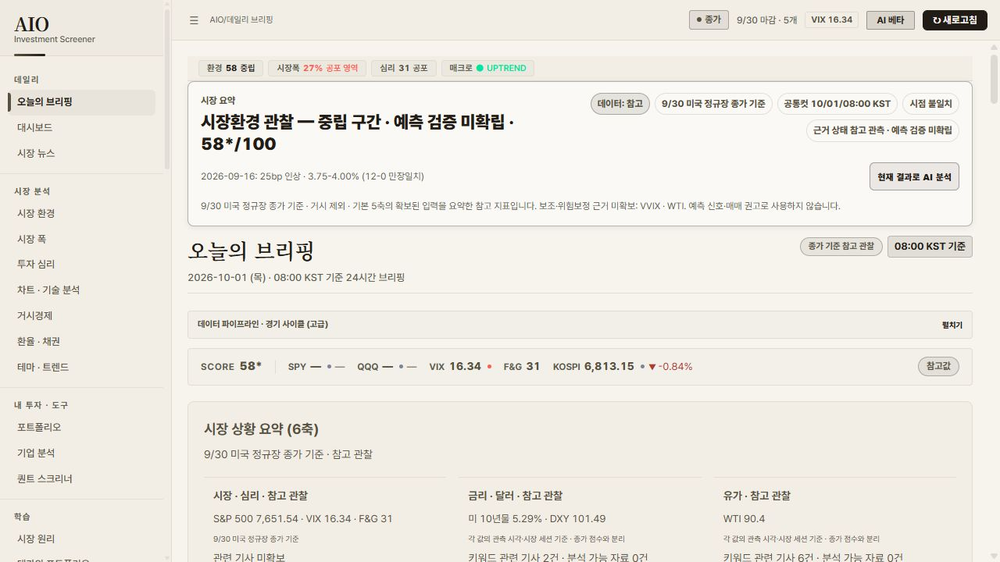

# 구조·의미·데이터 운영 보강 중간 보고 — 2026-10-01

현재 로컬 구현은 **v56.87 / main**이다. 구조 개편과 native ESM 연결은 구현되어 있으며, 이번에는 관측 시점·판정 범위·재무 저장·비용·운영 출처를 중심으로 실제 결함을 수정했다. 전체 콘텐츠의 의미 검수나 최신 데이터의 전 기능 커버리지가 완료되었다고 판정하지 않는다. **커밋·push·배포는 하지 않았다.**

Claude가 이어갈 실행 지침은 [NEXT-SESSION-20261001.md](./NEXT-SESSION-20261001.md)에 있다. 이전 v56.86 구조 감사는 [첫 보고서](../codex-audit-20260930/REPORT.md)를 참조한다. 과거 보고서의 숫자와 운영 버전은 해당 관측 시점의 기록이며 현재값으로 승격하지 않는다.

## 작업 경계와 참조 이력

- HEAD: `6441a2c6595bed848c0d7b58d3f407e698daaee3`. 신규 커밋 없이 기존 main 작업 트리에 통합했다.
- content-hash 세션: `codex-semantic-audit-20260930`. 시작 시 v56.86의 기존 수정이 있었으며 staged `.gitattributes`를 포함해 보존했다.
- Claude 인계, 실행 상태, Git log/reflog/diff, 파일 이력·기존 감사 산출물을 대조했다. 제공되지 않은 별도 Claude 대화 원문이나 편집기 전체 이력까지 읽었다고 주장하지 않는다.
- 독립 감사와 구현은 범위를 나누어 worktree에서 진행하고 root가 필요한 파일·함수만 통합했다. 작업 트리를 초기화하거나 전체 파일로 기존 변경을 덮어쓰지 않았다.
- 시장 데이터 생산 스크립트는 로컬에서 실행하지 않았다. 실제 Actions 산출물의 읽기·수신과 격리 회귀 검사를 사용했다. 유료 AI 호출, workflow dispatch, 공급자 설정 변경도 하지 않았다.

## 이번 수정과 근거

| 기록 | 발견한 근본 원인과 구현 |
|---|---|
| P1349 | 날짜·타입·세션 증거를 느슨하게 해석하던 경로를 보강했다. 관측 거래일 MA, 중복·미래·충돌 값, 연속시장과 정규장 종가의 구분을 검사한다. SMH를 SOX로 설명하거나 선택 입력 부족을 완전한 점수로 포장하지 않는다. |
| P1350 | PIN 파생키 생성만으로 성공을 판단하던 Vault를 실제 암호문 인증으로 바꿨다. 틀린 PIN, 구버전 마이그레이션, 잠금 중 비동기 작업, 포지션·ledger·FX 복원, 동의한 AI 데이터 범위를 보강했다. 실제 생산 함수의 Chromium 55개 격리 시나리오를 검증했다. |
| P1351 | CI attestation의 SHA·run·저장소·main 연결, 최신 main guard와 rollback 날짜를 엄격하게 검사한다. 자동 배포 정책 확장 제안은 적용하지 않았다. |
| P1352 | 관찰 점수를 매수·진입 권고로 보이게 하던 문구, 미확인 값을 50으로 표시하던 경로, 테마 분포를 경기 국면으로 해석하던 경로를 수정했다. 검증되지 않은 신뢰도 퍼센트를 근거 상태로 바꿨다. |
| P1353 | 공유 Worker에 UTC 월 AI 예산 예약·보수적 가격 계산·동시성 보호를 추가했다. 비용 상한을 계산할 수 없는 유료 검색은 거부한다. 개인 키와 Actions 호출은 별도 청구 범위임을 명시했다. |
| P1354 | null·빈 문자열·boolean을 숫자 0으로 표시하던 formatter를 수정했다. 실제 0은 유지한다. |
| P1355 | 성공한 원격 생산 commit의 blob을 확인해 12개 산출물을 수신했다. 수신본의 시점·관측·출처를 유지하고 버전 정렬은 검증된 세 개 release metadata 필드에 한정했다. |
| P1356 | 만료된 PCE 다음 발표 일정을 BEA 공식 일정과 대조해 수정했다. 발표가 일어났다고 가정해 lastRelease를 바꾸지 않았다. |
| P1357 | 종가 점수, 각 시장의 최신 참고 관측, 매매 적격성을 분리했다. native 점수 변경 시 legacy 빈 점수 캐시를 해제하고 공통 헤더·pulse를 갱신한다. 심리 설명도 이전 TTL 점수 대신 현재 canonical 입력에서 계산한다. |
| P1358 | 매 방문자의 브라우저 Yahoo hydration에 의존하던 RRG에 durable 생산 경로를 추가했다. Actions에서 SPY+25 ETF의 완료 adjusted-close 세션을 정렬하고 파생 분석만 발행한다. 동일 세션 재사용·실패 관측 보존·권리 제한을 유지한다. |
| P1359 | 원문·번역 뉴스의 해석 경계를 정규화 단계 한 곳으로 통일해 이중 entity 해석을 막았다. textContent 출력과 HTML 실행 방지는 유지한다. |
| P1360 | 선택 종목이 없는 SEC 관심종목 화면을 선택 기업의 결측으로 판정하던 시점 계약을 분리했다. 관심종목의 실제 관측일을 모두 확인하며 선택 기업의 결측을 목록으로 대체하지 않는다. |
| P1361 | 최종 Chromium 검사에서 소수점 배치로 24px 미만이 되던 뉴스 원문 링크의 클릭 영역을 28px로 보강했다. 검사 기준은 유지했다. |
| P1362 | 늦게 렌더링되는 뉴스 키 설정 동작이 17px span이던 문제를 실제 버튼으로 수정해 키보드·클릭 접근을 보강했다. |

공식 기록 입력은 이 폴더의 `fix-1349.json`~`fix-1362.json`이다. P/R/QA/CHANGELOG·버전은 공식 도구로 기록했고 CURRENT-STATE·CONTEXT-CATALOG는 생성했다. 규칙은 R677~R680까지 반영되어 있다. 이미 적용한 기록 입력을 다시 실행하면 중복이므로 재실행하지 않는다.

## 검증 증거

| 수준 | 결과와 제한 |
|---|---|
| 정적·계약 | 버전, workspace, knowledge, skill, ledger, assertion trace, 생성 상태, 분해 ratchet, 데이터 계보·reconciliation 등이 통과했다. 최종 변경 후 통합 검사 결과는 아래 실행 표를 확인한다. |
| native/runtime | P1349~P1360 양성·결측·오래된 관측·잘못된 타입·이벤트 순서 회귀를 검증했다. Worker 비용과 생산기 검사는 mock/격리 검증이며 실제 공급자 청구 인증이 아니다. |
| 자동 브라우저 | 실제 portfolio Vault 55개 시나리오 및 architecture, route lifecycle, 학습, 사용자 여정, 접근성, desktop, critical surface 등 통과. 원문 nested entity/XSS 검사의 실제 실패를 수정했다. |
| 직접 브라우저 | v56.86 전체 19개 라우트의 로컬/운영 비교 기록을 보존했다. v56.87은 테마·브리핑·펀더멘털을 직접 확인했다. 모든 종목·제어·학습 문장의 의미 검수는 미완료다. |
| 실제 생산 | run `36796745469`, commit `9896adec45cc5de78fba2af481554602f3e89c6d`의 성공과 수신 blob을 확인했다. 새 P1358 producer 코드의 실제 Actions 생산 증거는 아직 없다. |
| 운영 배포 | v56.87은 미배포다. 이전 live v56.83·data-plane sourceSha 결측 기록을 현재 재측정 결과처럼 사용하지 않는다. |

### QA 실행 이력

- `2026-10-01T01-12-46-724Z-6324-vztis5`: full **신규 PASS 126 + 캐시 11 / FAIL 1 / SKIP 0**. 실패는 headless T895가 옛 inline 인증 구현을 요구하던 검사였다.
- `2026-10-01T01-23-38-314Z-15344-zj4kmi`: 보존된 G087 실패 배치 재검증 **PASS 1 / FAIL 0**. 실제 위임된 Vault 인증 계약을 확인하도록 수정했다.
- `2026-10-01T01-24-08-317Z-30936-xhxrp5`: P1360·심리 동기화 회귀를 포함한 affected **122 신규 PASS + 16 캐시 / FAIL 1 / SKIP 8**. 실패는 실제 뉴스 원문 링크 클릭 영역이었다. SKIP 8개는 이 실패에 종속된 external watchdog-local 검사로, PASS로 계산하지 않는다.
- `2026-10-01T01-31-11-682Z-13744-0of6yw`: P1361 후 동일 a11y 재검증에서 늦게 나타난 뉴스 키 설정 span 1개가 FAIL. P1362 실제 버튼으로 수정했다.
- `2026-10-01T01-33-43-612Z-35132-j5ofbh`: P1362 후 **19-route browser-a11y PASS / FAIL 0**, 보존된 실패 배치 해소. 이후 변경은 동일 버튼의 주석 줄 정리와 공식 크기·문서 기록이다. 앞선 full을 최종 트리 전체 인증으로 대신 쓰지 않는다. external watchdog-local 8개와 새로운 운영 배포 인증은 미검증이다.

### 직접 확인한 최신 브리핑

점수는 9/30 미국 정규장 종가 기준 **58***의 참고 관찰로 표시된다. DXY 101.49, WTI 90.4, KOSPI 6,813.15가 각각 관측 시각·장중 지연·참고용 라벨로 표시되며 점수 종가와 구분된다. 이는 수신 데이터와 화면 연결의 증거이며 외부 독립 시세 대조나 매매 정확성 인증은 아니다.

USD/JPY·NVDA·SMH는 관측 근거 부족으로 보류한다. 새 RRG가 없는 현재 artifact에서는 생산 코드의 mock PASS만으로 테마가 실데이터로 복구됐다고 말할 수 없다. 펀더멘털은 생산 catalog/timeline 회귀가 통과했으나 실제 화면의 SEC 상태·상단 준비 판단은 추가 대조가 필요하다.

## 의도와 설계의 객관적 판단

가족·지인 약 5명을 위한 무료 중심 정적 리서치 도구라는 방향은 운영 규모와 맞는다. native ESM·명시적 상태·출처 계약·공유 생산 산출물을 유지하는 것이 적합하다. 한편 웹에서 찾을 수 있다는 사실은 자동 수집·재배포 권리, 과거 데이터 품질, 완전한 커버리지를 보장하지 않는다.

월 $10 목표·$20 상한은 관심종목과 핵심 지표 중심의 참고 서비스에는 검토 가능한 제약이다. 모든 종목·거래소 breadth·옵션 체인·라이선스 심리 지표의 실시간 커버리지를 이 예산으로 보장하지 않는다. 수집 범위와 지연을 명시하고 부족한 영역별로 비용 대비 개선을 입증해야 한다. 공개 SaaS, mobile, 옵션 라우트 부활은 제품 목표와 맞지 않아 추가하지 않았다.

관측 점수를 예측 확률·경제 국면·기관급 품질 인증으로 해석하는 것은 근거가 부족하다. 이번 수정에서 여러 오표현을 제거했지만 개발자 자가 진단의 `기관급 90/100` 등은 아직 미보정이다. 지식 현황도 `human review complete=false`, `publication ready=false`를 유지한다.

## 남은 작업·차단·미검증

1. **실제 생산·배포 미검증:** P1358 durable RRG 코드를 Actions에서 생산하고 새 real artifact와 테마 화면을 대조해야 한다. 사용자 커밋·push 요청이 없는 상태에서 workflow를 임의 실행하지 않는다.
2. **피드 범위 부족:** durable snapshot은 핵심 지표 16개 범위다. 개별 종목·ETF·JPY·OHLCV는 별도 provider/CORS/출처 경로와 관측 metadata가 필요하다. 현재 브리핑 narrative F&G `—`와 상단 심리 31의 소비자 차이도 남는다.
3. **펀더멘털 실제 화면:** 8개 SEC 관심종목에 대한 생산 모듈 계약은 수정했지만, 브라우저 기본 화면은 여전히 SEC 미수신·준비 판단 보류를 표시했다. catalog 개선만으로 presenter와 상단 판정까지 완료됐다고 보고하지 않는다.
4. **선택 수익률과 RRG 결합:** native rotation consumer가 dailyPct/weeklyPct 결측까지 좌표 전체를 거부한다. 유효 좌표와 선택 수익률의 결측을 분리할 필요가 있는지 추가 양성 fixture와 함께 검토한다.
5. **운영 비용:** Worker 월 예약은 개인 키·GitHub Actions·별도 계정 비용을 통제하지 않는다. 공급자 console의 실제 총 청구 상한은 설정·검증하지 않았다. 유료 원천 도입도 하지 않았다.
6. **권리·시점:** Yahoo T3와 일부 공개 심리값은 REVIEW_REQUIRED/참고 제한이다. AAII/NAAIM/II·한국 라이선스 원천을 임의로 decision 입력으로 승격하지 않는다. universe는 관측 당시 77일로 monthly 갱신 기준을 넘었으며 hard expiry는 90일이다.
7. **전체 의미·UI 검수:** principes/masters/atlas/guide 모든 문장·원문 공시·제어의 전수 검수는 미완료다. 개발자 진단의 고정 품질 점수·퇴역 라우트 경고와 과밀한 내부 용어도 별도 정리가 필요하다.
8. **승인 검토 차단:** 자동 배포 수렴 확장은 자동 승인 검토가 거부했다. 정확한 배포 정책 변경에 대한 명시적 사용자 승인 부족이 사유다. [검토 가능한 제안](./DEPLOYMENT-PROPOSAL.md)만 보존했으며 적용·배포하지 않았다.

## 최종 인계 검증

필수 문서 동기화 검사(생성 상태, workspace, knowledge, skill, skill fixture, ledger, assertion trace, profiles/skills mirror)와 버전·diff 검사를 수행했다. 과거 7월 문서 2개의 replacement-character 손상 경고는 historical explicit-only로 유지되며 복구 검수는 미완료다. 검사 로그는 `qa/documents-closeout.json`, 실행 보고서 사본은 `qa/`에 보존한다. 참조 인덱스·기존 인계 포인터·누적 실행 상태도 최신 Claude 인계로 연결했다.

지식의 인간 의미 검수, 실제 신 RRG 생산, 외부 watchdog/배포 인증, 개별 지표의 독립 원천 대조는 여전히 미검증이다. 자동 배포 정책 확장은 승인 검토 차단 상태다. **커밋·push·배포는 없으며 전체 완료 선언 없이 Claude로 이어갈 수 있는 상태다.**
