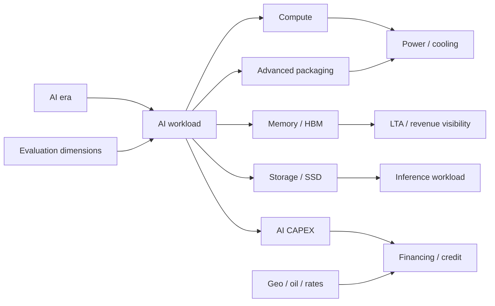

# 시장 원리 / 자본의 지도 — 저충실도 검증 보드

> 상태: `LOW_FI_DESIGN_ONLY`
> 입력: `telegram-primary-source-reconciliation-2026-08-01.md`
> 목적: 검증된 후보 node/edge가 Tree·Graph·Path 세 모드에서 학습 가능한지 구조적으로 확인
> 구현 금지: MP-00/KG-00 승인과 별도 구현 승인 전에는 실제 renderer, route, version, deploy를 변경하지 않음

## 1. 저충실도 입력 범위

12개 노드는 화면에 표시할 수 있지만, 각 노드의 상태는 `REVIEWED_CANDIDATE` 또는 `CANDIDATE`로 보인다. `PUBLISHED/LIVE` 표시는 사용하지 않는다.



## 2. 세 모드 wireframe

### TREE — 위치와 계층

```text
[시장 원리 / 자본의 지도]                    [Tree] [Graph] [Path]
┌─────────────────────────────────────────────────────────────┐
│ AI era                                                      │
│  └─ AI workload                                              │
│      ├─ Compute                                              │
│      ├─ Memory / HBM       [REVIEWED_CANDIDATE · 2 sources]  │
│      ├─ Advanced packaging [REVIEWED_CANDIDATE · 2 sources]  │
│      ├─ Storage / SSD      [REVIEWED_CANDIDATE · 4 sources]  │
│      └─ Power / cooling    [CANDIDATE · 2 sources]            │
├─────────────────────────────────────────────────────────────┤
│ 선택 노드: Memory / HBM                                     │
│ 검증 명제 · 출처 · 보류된 일반화 · 1-hop 열기               │
└─────────────────────────────────────────────────────────────┘
```

검증 질문: 초심자가 `AI era → AI workload → Memory/HBM`을 세 번 이내에 찾을 수 있는가? 선택 노드에서 출처와 보류 사유를 동시에 읽을 수 있는가?

### GRAPH — 인과와 교차 연결

```text
┌─────────────────────────────────────────────────────────────┐
│ [1-hop] [2-hop] [Show source status]                         │
│                                                             │
│ [AI CAPEX] ──candidate──> [Memory / Packaging / Storage]    │
│      │                              │                       │
│      └──reviewed──> [Financing]    └──reviewed──> [Inference]│
│                                      │                       │
│ [Geo / oil / rates] ─reviewed───────┘                       │
│                                                             │
│ 우측 panel: edge type · evidence IDs · reviewed scope       │
└─────────────────────────────────────────────────────────────┘
```

검증 질문: edge를 클릭했을 때 “공식 자료가 지지하는 좁은 명제”와 “아직 증명하지 않은 일반화”가 분리되는가? F4의 미검증 flow edge가 암묵적으로 그려지지 않는가?

### PATH — 초심자 순서

```text
1. AI 수요는 어떤 workload를 만든다?
   ↓
2. 왜 compute만 보면 안 되는가? (memory / packaging / storage / power)
   ↓
3. 왜 LTA와 CAPEX가 매출 가시성과 자금조달을 동시에 바꾸는가?
   ↓
4. 유가·금리는 이 투자 사슬에 어떻게 들어오는가?
   ↓
5. 어떤 원자료를 읽으면 주장을 무효화할 수 있는가?
```

검증 질문: `PATH`가 투자 추천이나 단기 신호로 바뀌지 않고, 원리·근거·무효화 조건을 가르치는가?

## 3. 공통 상호작용 계약

| 동작 | 기대 결과 |
|---|---|
| 노드 선택 | 제목, 좁혀 쓴 명제, `sourceKind`, 상태, evidence ID, 마지막 검토일 표시 |
| edge 선택 | `type`, from/to, 지지 범위, 보류된 일반화, 1-hop 확장 |
| source badge 선택 | 공식 출처 목록으로 이동. Telegram 원문은 discovery trail로만 표시 |
| `1-hop` | 선택 노드 인접 관계만 표시. 전체 그래프 자동 확장 금지 |
| 모바일 전환 | Graph는 세로 카드/accordion으로 대체. 가로 overflow 없음 |
| text alternative | Tree·Graph·Path의 같은 내용을 순서 있는 텍스트로 제공 |

## 4. 저충실도 binary gate

| Gate | 판정 |
|---|---|
| `LF-1` 12개 입력 노드와 status를 명시했다 | `YES` |
| `LF-2` Tree/Graph/Path의 목적이 서로 다르다 | `YES` |
| `LF-3` 노드/edge에서 primary-source 상태가 보인다 | `YES` |
| `LF-4` Telegram 숫자·목표가·현재 신호가 화면 기본값에 없다 | `YES` |
| `LF-5` Graph에 1-hop과 text alternative가 있다 | `YES` |
| `LF-6` 실제 브라우저에서 3-click, mobile overflow, route/deep-link를 검증했다 | `NO` — 구현 후 KG-07/MP-07에서 실행 |
| `LF-7` MP-00와 KG-00 승인을 받았다 | `NO` — 사용자/설계 승인 필요 |

따라서 저충실도 구조 검증은 **문서 수준 PASS**, 실제 화면 검증은 **미실행**이다. `LF-6`와 `LF-7`이 닫히기 전에는 구현으로 진행하지 않는다.

## 5. 다음 순서

1. 이 보드에 대한 `MP-00`·`KG-00` 결정 기록
2. 승인된 ontology에 맞춰 `KG-01`의 60~90개 content graph 중 MVP 12개를 고정
3. 실제 low-fi 화면에서 `LF-6` 검증
4. 통과 후에만 `MP-01→MP-08`, `AI-0→AI-6`, `KG-01→KG-07` 구현 계획을 실행

