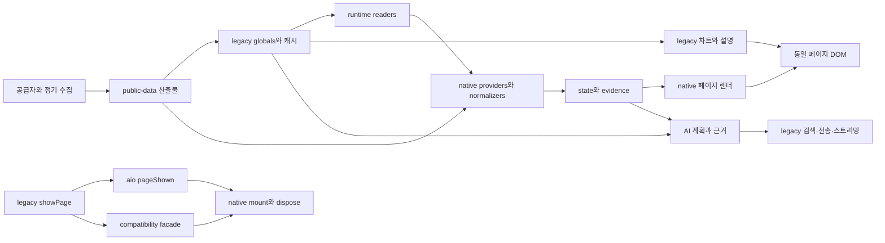

# 00 — 핵심 구조 진단과 단계적 개편 설계

기획·설계·집필: Astra · 조사 지원: GPT-5.6 Luna / MAX · 2026-09-19

상태: **핵심 구조의 1차 설계 기준선**. 전체 소스·콘텐츠 의미 검수 완료가 아니며, 후속 패키지에서 코드 근거와 반증을 누적한다.

> 현재성: A01/A02는 v55.21 당시의 발견으로 현재 결함이라고 재인용하지 않는다. P1143/P1150에서 typed entity·단일 navigation authority·일부 route/store 정합성 보강이 들어갔다. 그러나 v56.15 독립 재검토 R24-08은 facade가 legacy `showPage` 효과를 먼저 내고 router transition을 뒤에 실행하며, router의 same-route fast path가 `viewState` 변화를 비교하지 않는 잔여를 찾았다. 따라서 W00은 완료가 아니라 부분 완료다. [24](24-INDEPENDENT-STRUCTURAL-REVIEW-20260923.md)와 [25 상태 crosswalk](25-CURRENT-FINDING-STATUS-CROSSWALK.md)를 현재 기준으로 본다.

## 1. 구조적 결론

AIO는 정적 HTML 셸 위에 native ESM을 추가하여 데이터·상태·화면 소유권을 순차 이전 중인 시스템이다. 문제는 단순히 대형 파일이 남아 있다는 데 있지 않다. **라우트와 상태의 기준, 관측값의 기준, 화면 설명의 기준, 정책의 기준이 서로 다른 경로에서 결정되는 곳**이 있어 각 경로가 정상이어도 전체 사용자 경험이 어긋날 수 있다.

따라서 권장 방향은 기존 ESM 기반을 활용한 **완결된 기능 단위의 이전**이다. 첫 단위는 sentiment의 입력→수치→설명→갱신 수명이고, 동시에 공통 navigation 경계의 중복 명령과 초기 상태를 정렬한다. 이어 데이터 계약·AI 정책·콘텐츠 생성으로 같은 원칙을 확장한다. 전면 프레임워크 교체는 현재 근거만으로 비용을 정당화하지 못한다.

## 2. 이번에 확인한 현재 구조

작업 트리에는 추적 파일 2,542개가 있다. 이 중 `src/` 177개, legacy `js/` 10개, `scripts/` 207개, `public-data/` 1,417개, `architecture/` 35개, workflow 9개다. 이는 **목록 범위**이며 읽은 파일 수나 검수 완료율이 아니다. 생성된 데이터 파일은 개별 파일 수보다 producer·schema·실제 consumer의 계약을 묶어 검토한다.



도식은 주요 의존 방향을 보여준다. 모든 데이터가 반드시 legacy를 거친다는 뜻은 아니다. `runtime-readers.js`처럼 legacy 값을 native 형태로 읽는 경로와, artifact를 직접 읽는 경로가 함께 있다.

| 핵심 영역 | 현재 책임 위치 | 유지할 기반 | 심층 검토의 핵심 질문 |
|---|---|---|---|
| 부팅·라우트 | `js/aio-core.js`, `src/app/bootstrap.js`, `router.js`, compatibility facade | lazy page, route scope, abort/resource bag | 한 사용자 이동이 한 scope/한 canonical state가 되는가? |
| 상태·관측 | provider/normalizer/orchestrator, state, evidence, runtime readers | null-preserving 모델과 source evidence | 값과 시각·단위·source·허용 용도가 같이 이동하는가? |
| 도메인 | `src/domain/**` + legacy 계산/서술 | 순수 함수 추출과 명시적 보류 | 동일 지표·분모·기준일에 같은 의미를 부여하는가? |
| 화면·상호작용 | native pages + HTML/legacy secondary surfaces | 대부분 primary renderer 이전, 화면별 상태 표시 | 카드·설명·배지·차트가 같은 관측 revision인가? |
| 지식·기관공시 | builders, knowledge/masters artifacts, repository, pages | reference 경계, 원문 연결, bounded projections | 필드 이름과 내용이 일치하는가? 집계가 선택 범위와 같은가? |
| AI | `src/ai/**` + `js/aio-chat.js` | intent/evidence/claim 구조, provider abstraction 일부 | 정책이 호출 전·stream 중·완료 후 동일하게 적용되는가? |
| 운영·검증 | workflows, QA manifest/runner, SW, Workers | affected gates, 실패 재실행, 독립 배포 경계 | 현재 운영 증거인가? 실패·캐시·비용 한계가 관찰 가능한가? |

## 3. 우선 구조 문제: navigation의 단일 소유권

### A01 — 화면 위치와 canonical state가 부팅에서 갈라진다

`src/app/bootstrap.js:620`의 `aio:pageShown` listener만 `route/changed`를 dispatch한다. 그러나 초기 진입은 `641–647`에서 `router.transition(initialRoute)`를 직접 실행한다. 실제 로컬 cold boot에서 다음을 확인했다(`core-runtime.json`).

```text
DOM active     = page-home
router.active  = home
store.route    = null
```

내부 watchdog의 `store.route || router.active()` fallback(`bootstrap.js:629`) 덕분에 일부 기능은 동작한다. 하지만 canonical route를 구독하는 consumer에는 아직 위치가 없다는 뜻이다. 현재 특정 사용자 기능의 오동작까지 모두 확인한 것은 아니다. **상태 불변식 위반은 runtime에서 확정**했다.

### A02 — 한 번의 탐색이 두 번의 scope 전환과 잘못된 entity ID를 만든다

일반 `showPage`는 DOM/history/nav/focus/scroll을 바꾸고 `aio:pageShown`를 발행한다(`js/aio-core.js:27555`). facade는 원래 showPage 후 다시 `router.transition(canonicalRoute, {args})`를 호출한다(`src/legacy/compatibility-facade.js:441`). router는 entity route에서 `args[0]`를 ticker처럼 읽는다(`src/app/router.js:98`).

실제 사이드바의 기업 분석을 한 번 클릭한 결과:

```text
초기 mountId = 1
클릭 후 route = fundamental
클릭 후 mountId = 3
scope.entityId = [OBJECT HTMLDIVELEMENT]
```

nav 항목의 `data-pass-el=1`이 전달한 DOM 요소가 identity로 들어갔다. 이 관찰은 `core-runtime.json`에 보존한다. entity orchestrator는 현재 scope ID를 종목 조회 키로 사용하지 않으므로 **잘못된 종목 데이터 표시까지 확정하지 않는다**. 확인한 문제는 scope 식별자 오염과 중복 전환이며, 추가 abort/restart가 생기는 구조다.

### A03 — route 단위 완료율은 화면 의미 단위 완료율이 아니다

`architecture/route-owners.json`은 20 route의 lifecycle/renderer/data를 native로 선언하지만 chart native는 8개, narrative native는 1개이며 나머지에는 legacy 또는 해당 없음이 있다. 이 구분은 정직한 기반이다. 다만 route-level renderer 하나만 보면 secondary narrative의 다른 입력/갱신 경로가 가려진다.

**대표 사용자 의미 단위**의 소유권은 추적하되 기존 레지스트리 유지 자체를 요구하지 않는다. 현재 레지스트리가 선언과 실제 writer를 일치시킬 수 있는지 평가해 보강 또는 교체한다. 매 DOM node에 수동 원장을 만드는 방식은 유지비가 크다. 우선 `sentiment.put-call`, `sentiment.summary`, `home.regime`, `portfolio.valuation`처럼 수치와 설명이 함께 움직여야 하는 단위를 선택한다.

## 4. 목표 구조와 의존 규칙

### 4.1 Navigation은 한 번의 typed command로 확정

제안 경계는 `navigate({routeId, entityId, viewState, source, historyMode})`다. DOM element나 임의 positional args를 identity로 해석하지 않는다.

1. 별칭·파생 화면을 normalize한다. `theme-detail`은 canonical `themes` + detail state로 처리하되 기존 deep link를 보존한다.
2. 유효한 route/entity를 검증하고 transition ID를 만든다.
3. canonical route state와 active scope를 같은 transition에 묶는다.
4. 셸 effect(history, 제목, nav, focus, scroll)를 실행한다.
5. route module을 mount하고 필요할 때 provider를 동기화한다.
6. 통지 이벤트는 결과 관찰용으로 발행한다. 같은 결과 이벤트를 다시 명령으로 처리해 transition을 재생하지 않는다.

정확한 내부 commit 순서는 현 router의 취소/오류 정책에 맞춰 정하되, lazy import 실패 시에도 주소·화면·state가 어떤 상태인지 일관되게 노출해야 한다. 초기 진입, 클릭, 뒤로/앞으로, entity 변경이 같은 normalize/commit 경계를 사용해야 한다.

**단계적 이전:** 먼저 facade가 보낸 raw args를 typed entity context로 정리하고 event/facade 중 하나를 transition authority로 만든다. 이어 초기 route state를 같은 commit 경계로 옮긴다. 마지막에 셸 effect를 별도 모듈로 추출한다. 처음부터 모든 `showPage` 호출자를 일괄 치환하지 않는다. legacy callers는 thin adapter로 보존하되 내부 권한은 한 곳에만 둔다.

### 4.2 데이터는 숫자와 근거를 분리하지 않고 전달

권장 흐름은 기존의 `provider → normalize → evidence/state → domain selector → UI`다. 각 boundary에서 instrument/metric ID, 값, 단위, 관측일, 수집일, 기준 기간, source, revision, allowedUse를 잃지 않아야 한다. 이 설계는 새로운 전역 evidence 시스템을 추가하자는 의미가 아니다.

현재 `market-snapshot` validator의 self-reported coverage 의존, portfolio의 current/partial 혼합, market UI의 freshness 소비는 후속 데이터 패키지에서 같은 기준으로 다룬다. producer가 정상이어도 consumer가 null을 0으로 바꾸면 최종 사용자 의미는 깨진다. 반대로 모두 reference로 표시하는 것만으로 잘못된 수치나 분모가 정당화되지 않는다.

### 4.3 도메인 결과와 서술의 입력을 같게 유지

UI에서 DOM text를 읽어 도메인 판단을 만들지 않는다. 값·상태·문장을 같은 view model에서 파생하고 설명별 input evidence를 남긴다. 첫 적용은 패키지 01이다. chart도 같은 revision의 관측을 사용하되 차트 instance lifetime은 resource bag이 담당한다.

### 4.4 AI는 한 실행 계획과 공개 경계를 공유

두 채팅 화면의 UI는 유지하더라도 request plan, research result, policy decision, claim support, streaming publication은 공통 service 경계로 모은다. 정책 문서와 현재 코드가 다른 경우 **더 강한 차단으로 임의 변경하지 않는다**. 최근 제품 의도와 현재 테스트의 기대를 먼저 대조하여 정본을 결정해야 한다. 단계별 구현안은 후속 패키지에서 작성한다.

### 4.5 콘텐츠 구조 완성과 의미 검수를 별도 상태로 관리

배열에 문자열이 있다고 KPI가 되는 것은 아니다. 콘텐츠 builder의 입력 필드와 생성 필드 간 의미를 계약한다. `STRUCTURAL_REFERENCE_DRAFT` 등 기존 상태를 유지하면서 검토자·검토 대상·근거·갱신 필요 조건을 연결한다. 전수 semantic 완료는 schema PASS로 생성하지 않는다.

### 4.6 운영 증거는 코드 revision과 관측 수명에 연결

별도 배포인 app/Worker의 버전이 무조건 같아야 한다고 요구하지 않는다. 대신 protocol compatibility, source SHA, 관측시각, 실제 시도 여부, 환경을 명시한다. 저장된 예전 health 성공은 현재 연결 성공이 아니다. 네트워크 장애 시 route별 fanout과 retry 예산은 후속 운영 패키지에서 별도로 측정한다.

## 5. W00 현재 상태와 남은 navigation 재설계

W00의 기존 구현을 보존하되 재개 지시를 현재 상태로 착각하지 않는다.

| 작업 | 현재 근거 | 상태 |
|---|---|---|
| W00-A typed command/entity 입력 | facade가 명시적 문자열을 전달하고 router가 object를 entity ID로 취급하지 않도록 보강됐다(P1143/P1150) | 부분 완료. legacy `originalShowPage`의 DOM/history effect가 router transition보다 앞선다 |
| W00-B 단일 route authority/초기 진입 | facade authority claim, pageShown 관찰 전용, typed initial route 경로가 존재하고 일부 unit/browser fixture가 있다 | 부분 완료. 같은 route/entity에서 viewState만 달라지는 전이가 fast path에서 무시될 수 있다 |
| W00-C 전환 lifecycle | scope와 abort, 늦은 mount 억제, route error 관측이 있다 | 부분 완료. URL/DOM/store/scope/history의 전이 원자성과 mount/import 실패 복구는 따로 인수해야 한다 |
| W00-D surface owner | 현재 route-owners는 route/lifecycle/renderer/data 책임을 추적한다 | 미완료. route 내부 chart/narrative/요약의 writer·revision 범위까지 필요한 대표 surface부터 추적 |

### A04 / R24-08 — 같은 route의 다른 viewState가 실제 화면 상태가 되지 않는다

현재 경로는 legacy facade가 원래 `showPage`를 먼저 불러 DOM·history 등 shell 효과를 낸 뒤 router transition을 호출한다. Router는 현재 route와 entity가 같으면 곧바로 반환하며 `viewState`/query state를 전이 key로 비교하지 않는다. 그러므로 route와 entity가 같은 상태에서 선택한 상세 panel, 탭, query, sort/filter state가 바뀌어도 router/store/module이 새 canonical 상태를 반영하지 않을 수 있다. 이는 navigation의 상위 계약 결함이다. 구체적인 사용자 화면의 오표시는 이번 정적 재검토만으로 모두 확정하지 않는다.

목표는 한번의 typed command가 route identity뿐 아니라 route가 소유한 모든 canonical view state를 결정하게 하는 것이다.

```js
navigate({ routeId, entityId, viewState, query, source, historyMode })
```

정규화된 command에는 `transitionId`와 `canonicalStateKey`를 부여한다. entity route는 registry의 identity 형식으로 검증하며 DOM node·positional element arg·문자열화한 object는 거부한다. `viewState`와 query는 schema에 맞게 정규화하고 deterministic serialization으로 비교한다. `same route + same entity`만으로 no-op을 만들지 말고 route module이 선언한 canonical state가 같은 경우에만 idempotent로 처리한다. 같은 화면의 다른 viewState는 state update와 renderer update를 수행한다. route/entity scope를 바꿀 필요가 없으면 불필요한 remount를 만들지 않되 저장된 run과 표시가 새 state에 맞는지 확인한다.

History mode는 `push`, `replace`, `pop`을 구분한다. 사용자 이동과 canonical detail 선택은 사전 규칙에 따라 push/replace를 쓰고, back/forward 복원은 현재 URL state를 다시 push하지 않는다. `aio:pageShown`은 legacy caller 관찰로 유지할 수 있지만 결과 이벤트는 transition을 재호출하는 명령으로 취급하지 않는다. store, router, DOM의 canonical page marker, URL/history state, active scope는 같은 transition ID를 가진 commit 결과로 관측되어야 한다.

### 전환 단계·동시성·복구 계약

1. **Normalize/validate:** alias와 deep link를 canonical route + entity + query + viewState로 정규화한다. 잘못된 route/identity는 현재 상태를 바꾸기 전에 거부한다.
2. **Prepare:** 필요한 lazy module과 route contract를 준비한다. 현재 활성 scope는 아직 유지하고, 새 navigation sequence가 생기면 이전 prepare를 취소하거나 결과 commit을 무효화한다.
3. **Commit:** 동기 경계에서 transition ID를 한 번 만들고 history, canonical store state, route DOM marker/visible page, scope 및 module state를 함께 교체한다. 기존 scope dispose와 새 scope 활성화는 한 authority만 수행한다. shell focus/scroll/title 효과는 commit 뒤 동일 command에서 한번만 낸다.
4. **Observe:** `aio:navigationCommitted` 같은 결과 이벤트는 committed state를 포함한다. observer는 store를 맞추되 새 transition을 만들지 않는다.
5. **Recover:** import/prepare 실패 시 기존 route/entity/viewState·scope·history를 유지하고 접근 가능한 오류를 알린다. commit 뒤 mount failure가 발생하면 이전 state를 정확히 복원하거나, 복원이 불가능하면 error view 자체를 URL/store/router와 일치하는 새 canonical route state로 commit한다. 어느 경우든 반쪽 상태를 current로 표시하지 않는다.

빠른 A→B→A, 같은 route의 detail/query 변경, back/forward, 취소 후 늦은 import/data 응답은 마지막 유효 transition만 commit할 수 있다. 이전 transition의 늦은 callback이 DOM, store, saved run, focus를 다시 쓰면 실패다. `transitionId`는 로그·fixture에서 DOM marker, history state, store route state, active scope가 같은 commit임을 추적할 수 있게 한다.

### W00 수용 fixture

| 사례 | 인수 조건 |
|---|---|
| 무해시 초기 home / hash direct entry | URL, DOM active route, router, store, active scope가 같은 canonical state/transition에 해당 |
| 기업 분석 sidebar click + 명시적 NVDA | 한 click이 한 commit; entityId는 NVDA; mount/scope가 이중 생성되지 않음 |
| DOM node가 positional/raw arg로 전달됨 | route identity가 object 문자열화되지 않고 거부되거나 안전한 entity-null route로 처리 |
| same route/entity, detail tab/query/filter만 변경 | URL/store/view model/UI가 모두 새 viewState를 표현; 조용한 same-route no-op 없음 |
| 뒤로/앞으로 및 hash 재진입 | state가 복원되고 history entry가 증식하지 않음; selected entity/detail 일치 |
| lazy import rejection / module mount throw | 이전 상태 또는 일관된 error state가 남고 주소·focus·scope의 절반 전환 없음; 재시도 가능 |
| A→B→A 응답 역순 완료 | 첫 A/B의 늦은 callback이 최신 A 결과·화면·store를 덮지 않음 |
| 키보드/스크린리더 이동 | 제목·포커스·active item을 명확히 알리고 취소/실패 상태를 색에만 의존하지 않음 |

Positive control은 서로 다른 entity로 이동할 때 entity-specific data가 바뀌고, 같은 entity에서 unrelated state는 보존되는 경우다. Gate에는 해당 기존 P의 의미가 실제 ledger에 연결된 뒤에 assertion을 인용하고, 라우트 수/마커 통과만으로 same-route semantic acceptance를 대체하지 않는다.

### 소유권·이행·rollback

Navigation coordinator/router가 normalize, transition ID, commit/rollback을 소유한다. Legacy facade는 positional args와 alias를 typed command로 변환하는 compatibility adapter로만 남고, `originalShowPage`의 별도 history/DOM 전이를 다시 실행하지 않는다. Store는 committed navigation event만 canonical route owner로 반영한다. Route module은 자신의 viewState schema와 same-route update/mount policy를 소유한다. UI owner는 shell effect·focus·scroll 복원을 담당한다. Route registry는 전이 소유권의 substitute가 아니다.

이행은 먼저 command schema와 read-only trace를 추가해 현재 callers를 분류하고, 화면 1개에서 facade side-effect와 router commit 중 하나를 authority로 만든다. 그 뒤 초기 진입과 history restore를 같은 command로 연결하고, same-route viewState가 있는 detail 화면을 수직 slice로 통과시킨다. 마지막에 legacy callers를 adapter화하고 obsolete event listeners/writers를 검색·검증한 후 제거한다. 각 단계의 이전/새 결과를 같은 URL/entity/state fixture로 비교하되 사용자는 한 writer만 보게 한다. 구버전 saved route state는 schema가 해석 가능할 때만 migrate하며 모르면 기본 home으로 조용히 이동시키지 않고 복구 안내를 남긴다.

전환 중 오류가 있으면 새 authority를 중지하고 검증된 이전 router/module을 재활성화한다. 다만 원래 이중 history/이중 mount를 만드는 legacy 동작을 복원하지 않는다. 이전 렌더가 단일 transition을 보장하지 못하면 해당 navigation 기능을 명시적 error/reference 상태로 막고 URL/state/scope 일치를 우선한다. 자동 rollback은 현재의 known-bad state를 정답으로 승격하지 않는다.

통합 우선순위·증거 상태·acceptance gate는 [25 finding 상태 crosswalk](25-CURRENT-FINDING-STATUS-CROSSWALK.md)와 [26 실행·인수 계획](26-EXECUTION-AND-ACCEPTANCE-PLAN.md)을 따른다.

## 5.1 기존 W00 검증 기록

| 역사적 게이트 | 소유 파일/영역 | 증거가 말하는 범위 |
|---|---|---|
| P1143/P1150 unit/browser fixture | router, facade, bootstrap | 일부 초기 route, 단일 route authority, entity 전달 및 click/scope 계약. R24-08의 viewState 및 failure atomicity는 증명하지 않음 |
| v56.15 R24-08 재검토 | router, facade, history/store/scope 경계 | facade가 legacy effect 후 router를 호출하고 same-route fast path가 viewState를 비교하지 않는 정적 경로 확인 |

검증 동선은 위 W00 수용 fixture 표를 따른다. 기존에 기록한 `#fundamental`, `theme-detail`, query preservation, unknown alias, focus/title/scroll과 route marker 검사는 그대로 활용하되 same-route viewState와 failure rollback fixture를 추가해야 한다. `showPage`가 navigation 외에 entity 문맥과 chart lifecycle을 정리하므로 compatibility adapter 이전에서 해당 owner를 놓치지 않는다.

## 6. 패키지 순서와 의존

```text
00 핵심 구조와 navigation 기준
 ├─ 01 sentiment/home 의미 단위 cutover
 ├─ 02 portfolio 상태·valuation 모델
 └─ 03 데이터 계약과 화면별 근거 projection
      ├─ 04 knowledge/masters 콘텐츠 의미와 집계 범위
      └─ 05 AI 실행·정책·근거 공개 경계
           └─ 06 운영·SW·배포·QA 증거 수명과 비용
```

이 번호 순서는 초기 패키지의 역사적 순서이며 전체 개편의 필수 구현 순서가 아니다. 최신 우선순위는 19의 의사결정·이행 계획을 따른다. 독립적이고 확정된 결함은 대규모 라우터 이전을 기다릴 필요가 없다. navigation 공통 파일을 여러 구현 에이전트가 동시에 수정하지 않도록 파일 책임을 한 명에게 둔다. 다른 에이전트는 별도 domain/UI 패키지를 맡을 수 있다.

## 7. 이번 설계의 명시적 한계

전체 코드의 모든 함수·모든 생성 콘텐츠·모든 공급자 응답을 검수한 상태가 아니다. 외부 API 차단 로컬 증거만 확보했으며, 정상 네트워크·실제 AI 모델 스트림·배포 Worker·30일 운영·보조공학 사용자 연구는 미검증이다. 후속 영역의 발견은 조사대장에 남기고 설계 완료로 표시하지 않는다.

구현되지 않은 제안을 현재 아키텍처 계약으로 취급하지 않는다. 제품 코드·레지스트리·버전은 이번 감사에서 수정하지 않았다.
