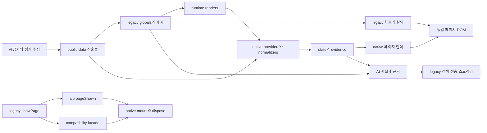

# 00 — 핵심 구조 진단과 단계적 개편 설계

기획·설계·집필: Astra · 조사 지원: GPT-5.6 Luna / MAX · 2026-09-19

상태: **핵심 구조의 1차 설계 기준선**. 전체 소스·콘텐츠 의미 검수 완료가 아니며, 후속 패키지에서 코드 근거와 반증을 누적한다.

> 2026-09-20 상태 변경: 다른 작업의 `e55eef47`이 W00을 구현했다. 아래 A01/A02는 v55.21 당시 사실이며 현행 미해결 목록으로 사용하지 않는다. 현재 재검증은 `RECHECK-20260920.md`를 우선한다. 구조 개편의 나머지 목표가 모두 완료됐다는 뜻은 아니다.

## 1. 구조적 결론

AIO는 정적 HTML 셸 위에 native ESM을 추가하여 데이터·상태·화면 소유권을 순차 이전 중인 시스템이다. 문제는 단순히 대형 파일이 남아 있다는 데 있지 않다. **라우트와 상태의 기준, 관측값의 기준, 화면 설명의 기준, 정책의 기준이 서로 다른 경로에서 결정되는 곳**이 있어 각 경로가 정상이어도 전체 사용자 경험이 어긋날 수 있다.

따라서 권장 방향은 기존 ESM 기반을 활용한 **완결된 기능 단위의 이전**이다. 첫 단위는 sentiment의 입력→수치→설명→갱신 수명이고, 동시에 공통 navigation 경계의 중복 명령과 초기 상태를 정렬한다. 이어 데이터 계약·AI 정책·콘텐츠 생성으로 같은 원칙을 확장한다. 전면 프레임워크 교체는 현재 근거만으로 비용을 정당화하지 못한다.

## 2. 이번에 확인한 현재 구조

작업 트리에는 추적 파일 2,542개가 있다. 이 중 `src/` 177개, legacy `js/` 10개, `scripts/` 207개, `public-data/` 1,417개, `architecture/` 35개, workflow 9개다. 이는 **목록 범위**이며 읽은 파일 수나 검수 완료율이 아니다. 생성된 데이터 파일은 개별 파일 수보다 producer·schema·실제 consumer의 계약을 묶어 검토한다.



도식은 주요 의존 방향을 보여준다. 모든 데이터가 반드시 legacy를 거친다는 뜻은 아니다. `runtime-readers.js`처럼 legacy 값을 native 형태로 읽는 경로와, artifact를 직접 읽는 경로가 함께 있다.

| 핵심 영역 | 현재 책임 위치 | 유지할 기반 | 심층 검토의 핵심 질문 |
|---|---|---|---|
| 부팅·라우트 | `js/aio-core.js`, `src/app/bootstrap.js`, `router.js`, compatibility facade | lazy page, route scope, abort/resource bag | 한 사용자 이동이 한 scope/한 canonical state가 되는가? |
| 상태·관측 | provider/normalizer/orchestrator, state, evidence, runtime readers | null-preserving 모델과 source evidence | 값과 시각·단위·source·허용 용도가 같이 이동하는가? |
| 도메인 | `src/domain/**` + legacy 계산/서술 | 순수 함수 추출과 명시적 보류 | 동일 지표·분모·기준일에 같은 의미를 부여하는가? |
| 화면·상호작용 | native pages + HTML/legacy secondary surfaces | 대부분 primary renderer 이전, 화면별 상태 표시 | 카드·설명·배지·차트가 같은 관측 revision인가? |
| 지식·기관공시 | builders, knowledge/masters artifacts, repository, pages | reference 경계, 원문 연결, bounded projections | 필드 이름과 내용이 일치하는가? 집계가 선택 범위와 같은가? |
| AI | `src/ai/**` + `js/aio-chat.js` | intent/evidence/claim 구조, provider abstraction 일부 | 정책이 호출 전·stream 중·완료 후 동일하게 적용되는가? |
| 운영·검증 | workflows, QA manifest/runner, SW, Workers | affected gates, 실패 재실행, 독립 배포 경계 | 현재 운영 증거인가? 실패·캐시·비용 한계가 관찰 가능한가? |

## 3. 우선 구조 문제: navigation의 단일 소유권

### A01 — 화면 위치와 canonical state가 부팅에서 갈라진다

`src/app/bootstrap.js:620`의 `aio:pageShown` listener만 `route/changed`를 dispatch한다. 그러나 초기 진입은 `641–647`에서 `router.transition(initialRoute)`를 직접 실행한다. 실제 로컬 cold boot에서 다음을 확인했다(`core-runtime.json`).

```text
DOM active     = page-home
router.active  = home
store.route    = null
```

내부 watchdog의 `store.route || router.active()` fallback(`bootstrap.js:629`) 덕분에 일부 기능은 동작한다. 하지만 canonical route를 구독하는 consumer에는 아직 위치가 없다는 뜻이다. 현재 특정 사용자 기능의 오동작까지 모두 확인한 것은 아니다. **상태 불변식 위반은 runtime에서 확정**했다.

### A02 — 한 번의 탐색이 두 번의 scope 전환과 잘못된 entity ID를 만든다

일반 `showPage`는 DOM/history/nav/focus/scroll을 바꾸고 `aio:pageShown`를 발행한다(`js/aio-core.js:27555`). facade는 원래 showPage 후 다시 `router.transition(canonicalRoute, {args})`를 호출한다(`src/legacy/compatibility-facade.js:441`). router는 entity route에서 `args[0]`를 ticker처럼 읽는다(`src/app/router.js:98`).

실제 사이드바의 기업 분석을 한 번 클릭한 결과:

```text
초기 mountId = 1
클릭 후 route = fundamental
클릭 후 mountId = 3
scope.entityId = [OBJECT HTMLDIVELEMENT]
```

nav 항목의 `data-pass-el=1`이 전달한 DOM 요소가 identity로 들어갔다. 이 관찰은 `core-runtime.json`에 보존한다. entity orchestrator는 현재 scope ID를 종목 조회 키로 사용하지 않으므로 **잘못된 종목 데이터 표시까지 확정하지 않는다**. 확인한 문제는 scope 식별자 오염과 중복 전환이며, 추가 abort/restart가 생기는 구조다.

### A03 — route 단위 완료율은 화면 의미 단위 완료율이 아니다

`architecture/route-owners.json`은 20 route의 lifecycle/renderer/data를 native로 선언하지만 chart native는 8개, narrative native는 1개이며 나머지에는 legacy 또는 해당 없음이 있다. 이 구분은 정직한 기반이다. 다만 route-level renderer 하나만 보면 secondary narrative의 다른 입력/갱신 경로가 가려진다.

**대표 사용자 의미 단위**의 소유권은 추적하되 기존 레지스트리 유지 자체를 요구하지 않는다. 현재 레지스트리가 선언과 실제 writer를 일치시킬 수 있는지 평가해 보강 또는 교체한다. 매 DOM node에 수동 원장을 만드는 방식은 유지비가 크다. 우선 `sentiment.put-call`, `sentiment.summary`, `home.regime`, `portfolio.valuation`처럼 수치와 설명이 함께 움직여야 하는 단위를 선택한다.

## 4. 목표 구조와 의존 규칙

### 4.1 Navigation은 한 번의 typed command로 확정

제안 경계는 `navigate({routeId, entityId, viewState, source, historyMode})`다. DOM element나 임의 positional args를 identity로 해석하지 않는다.

1. 별칭·파생 화면을 normalize한다. `theme-detail`은 canonical `themes` + detail state로 처리하되 기존 deep link를 보존한다.
2. 유효한 route/entity를 검증하고 transition ID를 만든다.
3. canonical route state와 active scope를 같은 transition에 묶는다.
4. 셸 effect(history, 제목, nav, focus, scroll)를 실행한다.
5. route module을 mount하고 필요할 때 provider를 동기화한다.
6. 통지 이벤트는 결과 관찰용으로 발행한다. 같은 결과 이벤트를 다시 명령으로 처리해 transition을 재생하지 않는다.

정확한 내부 commit 순서는 현 router의 취소/오류 정책에 맞춰 정하되, lazy import 실패 시에도 주소·화면·state가 어떤 상태인지 일관되게 노출해야 한다. 초기 진입, 클릭, 뒤로/앞으로, entity 변경이 같은 normalize/commit 경계를 사용해야 한다.

**단계적 이전:** 먼저 facade가 보낸 raw args를 typed entity context로 정리하고 event/facade 중 하나를 transition authority로 만든다. 이어 초기 route state를 같은 commit 경계로 옮긴다. 마지막에 셸 effect를 별도 모듈로 추출한다. 처음부터 모든 `showPage` 호출자를 일괄 치환하지 않는다. legacy callers는 thin adapter로 보존하되 내부 권한은 한 곳에만 둔다.

### 4.2 데이터는 숫자와 근거를 분리하지 않고 전달

권장 흐름은 기존의 `provider → normalize → evidence/state → domain selector → UI`다. 각 boundary에서 instrument/metric ID, 값, 단위, 관측일, 수집일, 기준 기간, source, revision, allowedUse를 잃지 않아야 한다. 이 설계는 새로운 전역 evidence 시스템을 추가하자는 의미가 아니다.

현재 `market-snapshot` validator의 self-reported coverage 의존, portfolio의 current/partial 혼합, market UI의 freshness 소비는 후속 데이터 패키지에서 같은 기준으로 다룬다. producer가 정상이어도 consumer가 null을 0으로 바꾸면 최종 사용자 의미는 깨진다. 반대로 모두 reference로 표시하는 것만으로 잘못된 수치나 분모가 정당화되지 않는다.

### 4.3 도메인 결과와 서술의 입력을 같게 유지

UI에서 DOM text를 읽어 도메인 판단을 만들지 않는다. 값·상태·문장을 같은 view model에서 파생하고 설명별 input evidence를 남긴다. 첫 적용은 패키지 01이다. chart도 같은 revision의 관측을 사용하되 차트 instance lifetime은 resource bag이 담당한다.

### 4.4 AI는 한 실행 계획과 공개 경계를 공유

두 채팅 화면의 UI는 유지하더라도 request plan, research result, policy decision, claim support, streaming publication은 공통 service 경계로 모은다. 정책 문서와 현재 코드가 다른 경우 **더 강한 차단으로 임의 변경하지 않는다**. 최근 제품 의도와 현재 테스트의 기대를 먼저 대조하여 정본을 결정해야 한다. 단계별 구현안은 후속 패키지에서 작성한다.

### 4.5 콘텐츠 구조 완성과 의미 검수를 별도 상태로 관리

배열에 문자열이 있다고 KPI가 되는 것은 아니다. 콘텐츠 builder의 입력 필드와 생성 필드 간 의미를 계약한다. `STRUCTURAL_REFERENCE_DRAFT` 등 기존 상태를 유지하면서 검토자·검토 대상·근거·갱신 필요 조건을 연결한다. 전수 semantic 완료는 schema PASS로 생성하지 않는다.

### 4.6 운영 증거는 코드 revision과 관측 수명에 연결

별도 배포인 app/Worker의 버전이 무조건 같아야 한다고 요구하지 않는다. 대신 protocol compatibility, source SHA, 관측시각, 실제 시도 여부, 환경을 명시한다. 저장된 예전 health 성공은 현재 연결 성공이 아니다. 네트워크 장애 시 route별 fanout과 retry 예산은 후속 운영 패키지에서 별도로 측정한다.

## 5. 실행 가능한 첫 구조 작업 — W00

| 작업 | 소유 파일/영역 | 완료 조건 |
|---|---|---|
| W00-A navigation 명령 정규화 | router, compatibility facade, bootstrap | entity ID는 명시적 문자열만; 일반 nav element는 사용하지 않음 |
| W00-B 단일 transition commit | router + bootstrap 이벤트 구독 | cold boot와 클릭에서 DOM/router/store 위치 일치; 클릭 한 번의 scope 생성 횟수 계약화 |
| W00-C 전환 lifecycle regression | 관련 runtime/browser gates | 이전 응답 지연·빠른 A→B→A·뒤로가기·hash 직접 진입에서 잘못된 write/abort 없음 |
| W00-D surface owner 보강 | route-owners와 선택된 surface 근거 | 이전/이후 writer와 input revision, narrative/chart 경계가 확인된 만큼만 변경 |

검증 동선: 무해시 home, `#fundamental` 직접 진입, 기업 분석 sidebar 클릭, AAPL→MSFT→AAPL, `theme-detail` canonicalization, knowledge query parameters 유지, unknown alias, 뒤로/앞으로, lazy module 실패. 포커스·문서 제목·스크롤 복원도 포함한다. `showPage`가 navigation 외에 entity 문맥 정리와 차트 정리를 수행하므로 기능 추출 때 이를 잃지 않아야 한다.

## 6. 패키지 순서와 의존

```text
00 핵심 구조와 navigation 기준
 ├─ 01 sentiment/home 의미 단위 cutover
 ├─ 02 portfolio 상태·valuation 모델
 └─ 03 데이터 계약과 화면별 근거 projection
      ├─ 04 knowledge/masters 콘텐츠 의미와 집계 범위
      └─ 05 AI 실행·정책·근거 공개 경계
           └─ 06 운영·SW·배포·QA 증거 수명과 비용
```

이 번호 순서는 초기 패키지의 역사적 순서이며 전체 개편의 필수 구현 순서가 아니다. 최신 우선순위는 19의 의사결정·이행 계획을 따른다. 독립적이고 확정된 결함은 대규모 라우터 이전을 기다릴 필요가 없다. navigation 공통 파일을 여러 구현 에이전트가 동시에 수정하지 않도록 파일 책임을 한 명에게 둔다. 다른 에이전트는 별도 domain/UI 패키지를 맡을 수 있다.

## 7. 이번 설계의 명시적 한계

전체 코드의 모든 함수·모든 생성 콘텐츠·모든 공급자 응답을 검수한 상태가 아니다. 외부 API 차단 로컬 증거만 확보했으며, 정상 네트워크·실제 AI 모델 스트림·배포 Worker·30일 운영·보조공학 사용자 연구는 미검증이다. 후속 영역의 발견은 조사대장에 남기고 설계 완료로 표시하지 않는다.

구현되지 않은 제안을 현재 아키텍처 계약으로 취급하지 않는다. 제품 코드·레지스트리·버전은 이번 감사에서 수정하지 않았다.
