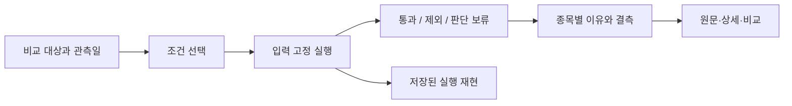

# 12 — 사용자가 계산의 의미와 흐름을 이해하는 화면

Astra 기획·설계 · 2026-09-20 · v56 로컬 화면 관찰 포함. 기능이 오류 없이 실행되는 것과 사용자가 결과를 이해하는 것을 별도 인수조건으로 둔다. 제품 수정이나 시안 구현은 하지 않았다.

## 이번 관찰과 결론

스크리너·테마·Masters를1440×1000 로컬 Chromium에서 열었다. 외부 요청/SW를 차단했으므로 snapshot·부분수신 상황이다. [화면 텍스트](v56-user-flow.json), [스크리너 화면](v56-screener.png). 정상 공급자 환경·작은 화면·실사용자 이해도는 아직 측정하지 않았다.

스크리너에는 입력 고정 실행, 결과 funnel, 결측/비매매 경계가 이미 있다. 그러나 첫 종목 행이 화면 맨 아래에 걸리고 그 위에 상태 문장·작업공간·저장/실행·여섯 preset·조건 builder·또 다른 다섯 preset·운영 정보가 함께 나온다. 정보가 부족해서만 생기는 문제가 아니다. 무엇을 먼저 선택하고 어떤 숫자를 현재 결과로 읽어야 하는지 계층이 약하다.

동일 화면에는 ‘조건 통과844’, ‘현재 필터 결과873’, ‘총873종목 중 상위20%174’, ‘계산보류29’, SEC562/655가 함께 보인다. 각각 분모가 다를 수 있지만 그 차이를 사용자가 즉시 구별하기 어렵다. ‘팩터 기준2026-09-20’과 ‘팩터 관측2026-09-18’도 생성일/관측일 차이를 설명해야 한다. 숫자가 서로 다르다는 사실 자체를 계산 오류로 판정하지 않는다.

테마는 근거0/11에서 판정 보류와 필요한 상대가격 이력을 명시했다. 이 정직한 결측 상태는 보존한다. Masters는13F가 전체·실시간 포트폴리오가 아님을 본문에서 설명한다. 이를 반복 경고만 늘리는 방향보다 선택한 기관·보고분기·자료 범위와 가까이 연결한다.

## 공통 표현 계약

각 결과를 다음 여섯 질문에 답하는 하나의 presentation model로 만든다. 여러 DOM writer가 수치·상태·설명을 각자 조립하지 않는다.

| 사용자 질문 | 첫 화면에서 보일 것 | 상세에서 보일 것 |
|---|---|---|
| 무엇을 보고 있나? |선택 종목/테마/기관, 결과의 이름과단위 |instrument identity·자료범위 |
| 언제의 정보인가? |시장 관측일 또는공시 보고기간 |수신·제출·가용·생성시각과timezone |
| 무엇과 비교하나? |비교집단/benchmark·가중기준 |eligible 집합과제외사유·분모정의 |
| 왜 이 결과인가? |가장 큰기여2–3개와실제기준 |원값→변환→가중기여→최종결과 |
| 무엇을 모르는가? |결과를 바꾸는핵심결측·오래된값 |필드별quality/source/제한 |
| 다음에 무엇을 확인하나? |원문/상세/비교/재실행 중관련행동 |재현run·모델버전·변경원인 |

‘현재’, ‘준비’, ‘통과’, ‘완료’는 서로 바꿔 쓰지 않는다. 수신됨은 최신임을, 계산됨은 조건통과를, 조건통과는 투자적합성을 뜻하지 않는다. 색과 등급만으로 의미를 전달하지 않고 짧은 설명과단위를 동반한다. ‘반대 근거 없음’도 실제 검토한 범위에서 미발견인지, 아직 조사하지 않았는지를 나눈다.

## W12-A — 스크리너의 한 가지 실행 흐름



상단의 핵심은 ‘어떤 범위에서 무엇을 찾고 있는가’다. 저장된 screen 정의와 factor weight profile은 기능이 다르므로 둘 다 ‘프리셋’처럼 경쟁하지 않게 한다. 조건 preset은 기본 작업 흐름에, 가중치 profile은 ‘순위 계산 기준’에 둔다. 선택 변경이 필터에 영향을 주는지 순위에 영향을 주는지 각각 설명한다.

기본 화면 순서: 제목/범위·시점 한 줄 → 조건 요약과 실행 → 결과 단계 요약 → 결과 표. source registry id, JSON editor, Operations sync, 자동추적 미연결 같은 구현·운영 상세는 필요 시 여는 영역으로 옮긴다. 사용자의 결과 해석에 필요한 제한은 숨기지 않는다.

funnel은 예를 들어 ‘대상873 → 계산 가능844 → 조건 통과N’를 같은 run에서 계산하고 제외/보류를 각 단계에서 열 수 있게 한다. 실제 N을 임의로844라고 고정하지 않는다. 결과 표에 보류종목까지 표시한다면 ‘표시873 = 통과N + 제외R + 보류U’를 밝히고 보기 필터를 제공한다. 상위20%의 분모는 ranking eligible인지 전체 universe인지 명시한다.

preview/run/replay를 분리한다. preview 변경은 마지막 고정run을 조용히 덮어쓰지 않는다. ‘결과가 바뀜’은 데이터 갱신, 조건변경, 가중치변경, universe변경 중 원인을 보여준다. 종목 상세 이동 후 복귀도 같은 run을 보존한다.

## W12-B — ‘왜 선정됐나’의 실제 설명

현재 `src/ui/pages/screener.js:997–1040`의 drawer는 factorScores를 막대로 표시하고, `index.html:12078`은 이를 ‘팩터 기여도’라고 부른다. 정규화 점수는 최종 점수에 대한 가중기여가 아니다. 이 구분을 수식과 화면에서 일치시켜야 한다.

v56 DELL 행을 실제로 열었을 때 ‘필드 coverage48.6% · 팩터 근거100%’, ‘필수 필드 결측 없음’, 모멘텀100/추세100/저변동41/K-vel87 막대가 함께 보였다. 서로 다른 coverage 정의일 수 있으나 분모가 생략돼 사용자가48.6%와100%의 차이를 이해하기 어렵다. `Provenance`에는 instrument US:DELL만 표시됐다. instrument identity는 출처 문서·관측시각을 대신하지 않는다. [상세 화면](v56-why.png). 공급자 차단 조건의 관찰이며 현재 가격 미수신을 서비스 장애로 판정하지 않는다.

drawer 첫 문장은 ‘조건 통과 · 순위 계산 가능/보류’를 말한다. `screenStatus=passed`만 보고 WhyRanked로 이름 붙이지 않는다. v56에서 도메인이 분리한 screenRankingState/screenExplanationState를 renderer도 사용한다.

그 아래 조건별 `기준 / 실제값 / 판정`을 표로 보여준다. 팩터는 `원값 / 비교집단 / 정규화 점수 / 적용가중치 / 기여`를 분리한다. 정렬이 rank 자체라면 순위가 새 독립 분석인 것처럼 설명하지 않는다. 조회하지 않은 재무·뉴스는 ‘반대근거없음’ 대신 ‘이번조건에서검토하지않음’으로 표현한다.

결측이 ranking을 막으면 ‘가격은 미수신이나9/18 종가 기반연구순위는계산됨’처럼 서로 다른 데이터축을 설명한다. 최신 가격을 못 받아도 모든 역사연구값을 지울 필요는 없지만 현재 가격처럼 읽히게 하면 안 된다.

## U01 — 미리보기와 실제 실행의 대상 정의가 다름

v56.01에서 새 브라우저 profile로 스크리너를 열고 선택된 ‘균형 상대 랭킹’을 그대로 실행했다. 실행 전 ‘현재 데이터 미리보기703통과’, 실행 후 ‘286통과/168데이터부족’이었다. 두 상태 모두 ‘활성조건0/활성조건없음’을 표시했다. 숫자는2026-09-21 관측이며 전날844와 비교해 회귀라고 단정하지 않는다. [동선 증거](5601-screener-run.json).

코드 연결: `src/data/orchestrators/screener.js:63`의 기본 pipeline screen은 빈 AND 조건으로 readiness를 평가한다. `src/ui/pages/screener.js`의 selectDefinition은 activeDefinition을 선택하지만 activeResult/activeRows를 비운다. renderer의 실행 전 counts는 이 기본 pipeline 결과를 사용한다. 실제 실행은 preset-balanced의 rank≥60 조건을 사용한다. 사용자에게 보이는 선택 이름과 ‘통과’ 수가 같은 정의를 뜻하지 않는다.

W12-A 보강: definitionId/hash를 preview 결과와 실행 결과 모두에 붙인다. 같은 선택 정의로 미리 계산한다면 preview와 execute가 동일 snapshot에서 같은 상태/건수를 내야 한다. readiness만 보여줄 경우 ‘조건 적용 전 계산 가능703개’로 표시하고 ‘통과’라 부르지 않는다. active 조건 목록에는 preset의 내장 조건과 사용자가 추가한 조건을 구분해 모두 보여준다. JSON editor를 열어야 실제 조건을 알 수 있는 구조는 기본 동선으로 삼지 않는다.

인수:6개 preset 각각 선택→조건목록→preview→고정실행→재현을 확인한다. 데이터 갱신이 없는 입력에서는 결과 변화가 없어야 하고, 갱신이 있었다면 snapshot 변경을 설명한다. 조건이 없는 screen만 ‘활성조건없음’을 표시한다. 표가 전체/통과/제외/보류 중 무엇을 보여주는지도 독립적으로 이름 붙인다.

## W12-C — 다른 기능과 콘텐츠의 의미 연결

| 화면군 | 사용자가 따라갈 연결 | 단절 방지 |
|---|---|---|
|시장/심리/환경 |관측지표→상승·하락기여→부분성→해석 |참고점수에서매매행동으로자동도약금지 |
|거시/환율/채권 |같은시점/단위→spread/변화→가능한경로→반증 |혼합시점curve·관측과인과혼동구분 |
|기술/테마 |bar주기/기간→지표/구조→benchmark상대위치 |tick/daily혼합,패턴이름과검증된detector구분 |
|기업/스크리너 |공시기간/availableAt→파생식→peer비교 |FY/TTM·가중치·산업분모노출 |
|포트폴리오 |저장상태→통화환산→평가→비중/집중도 |메모리저장과영구저장,원가와시장가구분 |
|Masters |신고주체→보고분기→원문행→변화→알수없는범위 |현재보유·투자자의전체전략으로승격금지 |
|원리/Atlas |개념→경제기제→산업/기업사례→검증질문→원문 |질문을KPI로,나열을인과사슬로표현금지 |
|뉴스/AI |기사/근거→관측/해석/가설→주장별출처 |제목만으로본문확인주장,근거전스트리밍구분 |

이 표는 각 화면의 목표 계약이며 모두 브라우저 검수했다는 뜻이 아니다. 교육 콘텐츠에서는 설명의 순서가 중요하다. 개념 정의를 먼저 읽고 그 개념이 비용·매출·현금흐름·밸류에이션 중 어디에 연결되는지 볼 수 있게 한다. 관계가 가설이면 가설로 표시하고 반증 질문을 함께 둔다.

## 인수시험: 사용자가 의미를 직접 확인할 수 있는가

자동시험: 숫자/문구가 같은run에 속함, 모든 비율의분모/단위 존재, stale/partial/empty/loading 분리, 관련 원문 링크 유효, focus/keyboard로 설명 접근, 오류 후 입력 보존.

브라우저 시나리오: 조건을 바꾸고 실행 → 통과1개/보류1개 이유 확인 → 종목상세 이동/복귀 → 과거실행 재현 → 새자료로재실행. 추가로 snapshot-only, 일부provider실패, 느린응답, 저장실패를 넣는다. 상태badge만 바뀌고 설명이 이전run에 남으면 실패다.

사람 검수: 화면을 처음 보는 참여자가 ‘언제의자료인지’, ‘왜통과했는지’, ‘무엇과비교하는지’, ‘무슨정보가없는지’, ‘원문을어디서보는지’를 자신의말로 설명하도록 한다. 정답은 화면/계약에 실제 있는 사실로 정하고 막힌지점을 기록한다. 개발자가 이해했다는 판단이나 screenshot미관을 사용자 이해도 통과로 대체하지 않는다. 이 사용자 검수는 아직 실행하지 않았다.

## 구현 순서

먼저 W07/W09/W10/W11의 계산·시점·저장 계약을 안정화한다. 다음 screener 한 경로에서 presentation model과 설명 drawer를 완성하고 같은 패턴을 시장·기업·포트폴리오·지식으로 넓힌다. 모든 화면에 경고 배너를 추가하는 방식으로 대체하지 않는다. 의미가 정리된 정보를 사용자의 질문 순서로 배치하는 것이 핵심이다.

## 2026-09-23 U01 현재 상태와 사용자·접근성 인수 프로토콜

상위 상태 판정은 [25](25-CURRENT-FINDING-STATUS-CROSSWALK.md), 실행 순서는 [26](26-EXECUTION-AND-ACCEPTANCE-PLAN.md)를 따른다.

**U01 상태: 부분 구현.** P1165는 같은 정의·같은 snapshot에서 preview와 execute가 같도록 계산 경로를 바꾸고 선택한 정의/hash 및 preset 내장 조건을 표시한다. P1164는 실행 전 pipeline 수를 `통과`라 부르지 않고 `조건 적용 전 계산 가능`으로 낮췄다. 하지만 P1165의 3 preset fixture는 873행이 모두 unavailable이라 결과 집합 동등성의 판별력이 낮다. 6개 preset 전체, 정상 통과/제외/보류 행, 저장·재실행·복원 결과의 동등성, 현재 live 배포는 아직 인수되지 않았다.

### U01 구현 인수에 필요한 결과 계약

preview와 run은 아래의 같은 키와 불변 inputs를 갖는다. archive 여부만 다르고 계산 판정의 의미는 같아야 한다.

```text
previewKey = definitionHash + snapshotId + universeRevision + modelVersion
runKey     = previewKey + runId
```

`funnel`은 `eligible`, `passed`, `excluded`, `undetermined`를 같은 definition/snapshot 기준으로 계산하고 아래 불변식을 만족한다.

```text
eligible = passed + excluded + undetermined
```

필터 전 준비성은 별도 `readiness`로 표시한다. readiness count는 `passed`로 바꾸지 않는다. 보관 run의 결과를 새 정의나 새 snapshot으로 다시 계산해 과거 기록을 덮지 않는다. 같은 run 복원은 저장된 result revision을 보여주고, 재실행은 새 runId를 발급한다.

### 사람 대상 과업 시험

이 시험은 통계적 대표성이나 투자 성과를 입증하지 않는 정성적 이해도 평가다. 초기 탐색 파일럿의 모집 예시는 초심자, 장기 투자자, 적극 거래 사용자, 한국/해외 시장 사용자, 위험 회피 성향, 접근성 보조기술 사용자 등 실제 타깃 집단을 포괄하는 6명이다. 이 수를 출시 합격 표본이나 고정 성능 기준으로 간주하지 않는다. 19/26에 따라 먼저 baseline을 관찰하고, 과업·대상 집단·사용 맥락을 확인한 뒤 모집 규모와 합격선을 사전 등록한다. 진행자는 계산 설명을 먼저 하지 않고, 화면만으로 답할 수 있는 과업을 무작위 순서로 제시한다. 개인 보유 내역이나 투자 조언을 요구하지 않는다.

| 과업 | 사용자가 설명해야 할 의미 | 중대 오해 실패 |
|---|---|---|
| preset 선택 후 실행 전 preview 확인 | 현재 건수가 어느 정의·snapshot의 preview인지, 실제 실행인지 | preview를 고정 run/조건 통과로 말함 |
| 결과 행의 Why 열기 | 적용 조건, ranking eligibility, 비교집단/분모, 원값과 점수의 차이 | 정규화 점수를 실제 수익률·확률·가중 기여로 해석 |
| 보류 행과 참고값 확인 | 값이 있는 참고 자료와 계산 부적격 자료의 차이 | 참고값을 현재 계산에 포함됐다고 해석 |
| 상세 이동 후 돌아오기 | 같은 run 복귀와 새로고침/재실행의 차이 | 과거 run이 새 데이터로 바뀌었다고 해석 |
| source/time 확인 | 관측일, 생성일, 원문 위치 | 생성일을 관측일로 답하거나 자료 시점을 찾지 못함 |

출시 합격선은 고정된 6명/5명 비율로 두지 않는다. baseline 시험에서 과업별 성공률·완료시간·도움 요청·중단·오해 유형을 기록하고, 제품 owner와 사용자 연구 owner가 대상 집단별 수용 기준을 **시험 전에** 등록한다. `참고/현재`, `미수신/0`, `preview/run`, `조건 통과/계산 가능` 중 하나라도 행동·매매 판단을 바꾸는 중대 오해는 표본 비율과 관계없이 blocker로 처리하고, 수정 뒤 같은 조건으로 재시험한다. 숫자 점수만으로 통과시키지 말고 인용한 화면 요소와 실제 발언을 익명 기록한다. 결과는 해당 표본의 정성·운영 evidence로만 보고하고 통계적 이해도나 금융 안전성을 주장하지 않는다.

### 접근성 실사

자동 20-route 접근성 matrix는 구조·이름·대상 크기·console을 검사하는 필요조건이다. 사람/보조기술 실사를 대체하지 않는다. 최소한 다음 경로를 route별로 기록한다.

- 키보드만으로 preset 선택→필터 확인→실행→Why 열기→닫기→정렬→상세 이동/복귀를 완료한다. focus 순서, 보이는 focus, dialog trap/escape, opener 복귀, sticky 영역에 가려지지 않는지 확인한다.
- Windows의 NVDA+Chrome 또는 Narrator+Edge 중 사전에 고정한 조합으로 heading/landmark, table header 관계, sort 상태, dialog 이름, 선택된 preset, loading/partial/failed/empty 전환, 결과 개수의 적절한 announce를 확인한다.
- 색만으로 pass/excluded/unknown을 구별하지 않으며, 차트에는 대응하는 텍스트 요약과 단위를 제공한다. 200% zoom과 좁은 viewport에서 핵심 과업과 오류 메시지를 유지한다. 대상 크기·텍스트 대비는 저장소의 기존 QA 기준과 같은 검사기로 수치 증거를 남긴다.
- dynamic update가 focus를 빼앗거나 오래된 run 설명을 다시 읽지 않는지, 닫힌 drawer의 숨은 컨트롤이 tab 순서에 남지 않는지 검사한다.

접근성 인수는 핵심 과업의 keyboard blocker 0건, 이름 없는 조작 컨트롤 0건, 상태가 announce되지 않아 의미를 잃는 오류 0건, 색상에만 의존한 핵심 판정 0건을 요구한다. 수동 항목은 통과/실패/미실행을 나누고 “자동 matrix 통과”를 screen-reader/contrast/zoom 실사 완료로 승격하지 않는다. 관련 repository gate/기준은 [`../../_context/QA-CHECKLIST.md`](../../_context/QA-CHECKLIST.md)의 `QA-A11Y-20260830-01`과 `QA-ARCH-12`를 함께 확인한다.

모든 사용자 시험 증거는 21의 trace manifest와 연결한다. route, viewport, 브라우저/보조기술 버전, build/deploy SHA, snapshot·definition·run ID, 과업 ID, 관찰 결과, 익명 화면 trace를 남긴다. 이 설계 절 작성 자체로 사용성·접근성 실사가 수행된 것은 아니다.
