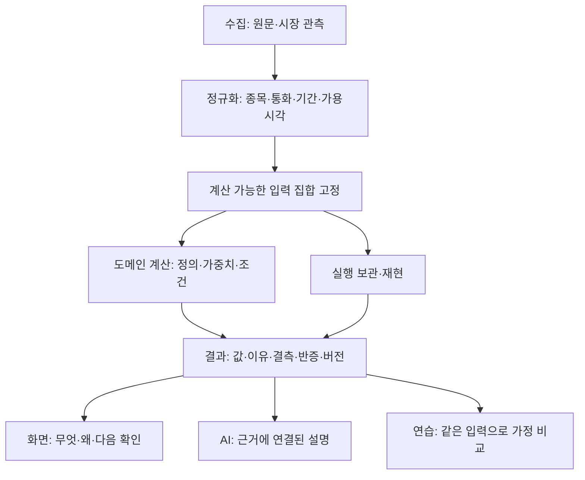

# 13 — 분석 결과·전략·학습을 같은 근거에 연결하는 구조

Astra 기획·설계 · 2026-09-21 · 기준 v56.01 / `2bf963a76c6f2fb1079166ce806beaaa820b1c6a`. 시작 시 tracked working tree clean. 실제 제품 코드 수정 없음. 이 문서는 기존 패키지의 오류 처방을 공통 구조로 연결하되, 하나의 대규모 재작성으로 실행하지 않는다.

**v56.15 설계 보강:** [25 현재성](25-CURRENT-FINDING-STATUS-CROSSWALK.md)과 [26 실행 카드](26-EXECUTION-AND-ACCEPTANCE-PLAN.md)를 먼저 적용한다. 이 문서의 기존 result/run 흐름은 원칙이며, P1177 이후 확인된 live mcap 계산 입력 정체성, P1168의 pipeline/user 실행 이력 구분, 권리·개인 경계의 구체 필드는 아래 계약을 더한다.

## 해결하려는 근본 문제

현재 시스템에는 evidence 계약, 순수 도메인 함수, screen run/replay, AI claim ledger, route scope, learning state가 이미 있다. 그러나 같은 결과에 대해 **계산은 도메인, 등급은 renderer, 행동 문장은 legacy, AI 설명은 별도 context**에서 결정할 수 있다. 각 부분이 정상 실행돼도 사용자는 서로 다른 의미를 받는다.

따라서 ‘설명을 더 추가한다’만으로 해결하지 않는다. 결과의 수치·범위·이유·불확실성·허용 행동을 한 실행 결과에 묶고, UI와 AI가 같은 결과를 읽게 한다. 가격·공시·뉴스·개인 메모를 무조건 하나의 상태 enum이나 종합점수로 합치지는 않는다.

## 목표 흐름과 소유권

| 소유자 | 책임 | 다른 계층에 넘길 계약 |
|---|---|---|
|provider/producer |원문·관측·수집 실패, identity 보존 |원값, source, observed/available/fetched 시각, unit, revision |
|normalizer/contract |단위·기간·identity 정렬, 허용 변환 |typed observation와 명시적 결측·변환 이력 |
|domain function |수식·threshold·동점·필수입력·가설 |결과와 operand/기여/조건별 판정 |
|orchestrator |같은 시점의 입력 고정·취소·실행 소유권 |run id, snapshot id, model/definition version |
|presentation model |사용자 언어·우선순위·근거 연결 |일관된 값·라벨·상태·다음 확인 항목 |
|UI/AI/학습 |표시·질문·설명·탐색 |동일 결과를 표현하며 금융 수치를 재계산하지 않음 |

기존 `src/data/contracts/evidence.js`, `src/data/contracts/screener.js`, 도메인별 결과, `src/ai/response/claim-ledger.js`는 재사용 후보이지 보존 의무가 아니다. 목표 의미·시점·재현 계약을 충족하지 못하면 교체한다. 이행 중 두 경로가 필요하면 비교 목적과 폐기 시점을 정하고 영구적인 이중 정본을 만들지 않는다. 공통 필드는 작은 계약으로 공유하되 도메인 고유 필드를 유지한다. 제품 목적부터 판단하는 상위 기준은 16을 따른다.

## 결과가 보존해야 하는 의미

공통 실행 참조: runId, inputSnapshotId, instrument/universe identity, modelVersion, definitionVersion, calculationAt, 비교 기준.

**입력 정체성은 두 단계다.** `artifactSnapshotId`는 불변 데이터 발행물의 관측 집합과 호환 버전을, `calculationInputId`는 실제 계산에 사용된 operand IDs/값·live revision·정의·유니버스·정책을 고정한다. `runId`는 calculationInputId와 결과/모형 버전에 연결한다. P1177의 top-level live 필드 제외는 거부 quote 진단의 churn을 막았지만 [24 R24-04](24-INDEPENDENT-STRUCTURAL-REVIEW-20260923.md)의 중첩 live mcap·size factor 반증까지 증명하지 않는다. 랭킹에 live 값이 쓰이면 새 계산 입력·새 run이어야 하며, 보관 run은 과거 artifact/result를 유지한다. live 값을 랭킹에서 빼는 선택도 허용하되 사용자에게 freshness/용도를 정확히 설명한다.

근거 참조: operand evidence ids, unit, 관측/공개/수신 시각, 공급자와 원문, 허용 용도. 공시 기간말과 발표일, 가격 거래일과 수신일은 구분한다.

원문·검색 후보·숫자 observation은 `rightsContractId`와 해당 출처의 지속 보존·표시·재배포·만료·삭제 범위를 함께 전달한다. 화면 근거 링크가 있다는 사실은 원문 전체의 저장/재배포 권한이 있다는 뜻이 아니다. 개인 Vault의 보유/메모는 public run 또는 학습 복사본에 기본 포함하지 않으며, AI 전송은 request별 동의·실제 payload로 인수한다. 권리/삭제 정책으로 원문이 사라지면 tombstone과 재현 가능한 파생 범위를 남기고 완전 재현이라고 표기하지 않는다.

계산 상태: 입력 수신, 현재성, 조건 평가, 순위 산출, 설명 가능성, 저장 상태를 서로 다른 축으로 둔다. 현재처럼 `passed`를 `ranked`나 `explained`로 사용하지 않는다. source가 공식이라는 이유로 숫자 조합까지 타당하다고 보지 않는다.

해석 참조: 관측 사실, 산술 파생값, 모델 분류, 경제적 가설, 사용자 선택 시나리오를 구분한다. ‘100점’이라는 숫자만 공유하지 않고 그 점수가 정규화 상대값인지 입력 충분성인지 경험적으로 보정된 확률인지 명시한다. 검증되지 않은 휴리스틱은 그대로 휴리스틱이다.

상세 원장: 조건의 원값/단위/기준/판정, 변환 후 값, 요청/실제 가중치, 기여도, 제외 이유, 반대 근거, 미검토 범위. 상단에 모두 표시할 필요는 없지만 상세에서 재구성 가능해야 한다.

## 전략과 행동의 분리

‘차트가 상승 정렬이다’는 관측 기반 분류이고 ‘지금 비중을 늘린다’는 전략 결정이다. 두 결과를 연결하려면 투자 기간, 위험 예산, 보유 상태, 실행가격/비용, 무효화 조건이 추가로 필요하다. 없으면 분석 설명과 확인할 조건을 제공한다. 단순 금지 경고만 보여주는 방식도 피한다.

전략 설명은 목적 → 성립 조건 → 현재 충족/미충족 → 대안 → 무효화 → 검증 한계의 순서로 둔다. ‘조건이 맞으면 무조건 성공’처럼 표시하지 않는다. 한 지표의 임계값을 지나면 왜 문구가 달라지는지, 다른 지표가 반대일 때 어떻게 보류하는지 사용자가 볼 수 있어야 한다.

예: 기술 분석의 설명 틀은 ‘일봉50/200MA 정렬을 관찰했습니다 → 거래량 확인은 미수신입니다 → 추세 지속 가설은 거래량과 기준 가격 이탈 여부를 추가 확인해야 합니다’다. 이는 실제 특정 종목에 대한 현재 판단이 아니라 **표현 계약의 예시**다. 해당 근거가 없는 실제 화면에 예시를 기본 결론으로 삽입하지 않는다.

## 사용자가 체득하는 세 단계

### 1. 읽기: 한 결과를 자기 말로 설명

첫 화면은 결과 한 문장과 핵심 근거2–3개를 보여준다. 사용자는 상세를 열어 같은 사실을 단위·기준일·비교 대상과 함께 확인한다. 용어 도움말은 사전 정의만 보여주지 않고 ‘지금 이 값이 계산에 어떻게 쓰였는가’로 연결한다.

### 2. 비교: 한 가정만 바꿔 결과 변화 확인

실제 run을 복사한 명시적 연습 snapshot에서 가중치·비교집단·관측 기간 중 하나를 바꾼다. 변경 전후의 차이를 값 변화/기준 변화로 분리한다. 미래 가격을 예측한 것처럼 보이지 않도록 ‘가정 비교’로 표시하고 원래 실제 run은 유지한다. 주식 매매가 없어도 실습을 끝낼 수 있어야 한다.

예: 품질 지표가 없을 때 품질100% profile은 왜 보류되는지, 같은 데이터에서 모멘텀 profile로 바꾸면 왜 다른 결과가 되는지 비교한다. 임의로 profile을 자동 대체하는 기존 결함을 학습 화면에서 다시 만들지 않는다.

### 3. 확인: 근거와 한계를 찾아 실제 연구에 적용

‘이 종목이 좋아 보이나?’ 대신 ‘이 비교에서 빠진 재무 기간은 무엇인가?’, ‘가격 기준일과 뉴스 발표일이 같은가?’, ‘상위 점수의 비교집단은 무엇인가?’ 같은 확인 과제를 제공한다. 답은 저장된 근거로 검증 가능해야 한다. 한 종목에서 익힌 방법을 다른 종목에 옮겨 확인하고, 반대 사례를 통해 적용 범위를 이해하게 한다.

## 학습 상태의 의미도 정직하게

`createLearningState`는 viewed/bookmark/note를 보존하고, principles와 atlas는 선택 시 markViewed를 호출한다. 현재 ‘열어봄’을 기록하는 것은 타당하다. 이 값을 이해도·숙련도·투자 역량으로 승격하지 않는다.

향후 연습을 추가하면 viewed, attempted, reviewedAnswer, revisited를 구별하고 article/content revision을 보존한다. 개념이 수정되면 과거 정답 상태도 같은 버전의 기록임을 표시한다. 사용자 메모의 저장 실패는 memory-only로 보이며, 메모를 AI에 보내는 동의는 열람·북마크와 분리한다. 점수·뱃지 획득이 아니라 근거 확인 능력을 목표로 한다.

## 점진적 구조 개편 작업 단위

1. **스크리너 결과 단일화**: 요청조건·입력snapshot·rank explanation을 한 run으로 묶고 W12 drawer를 실제 기여도에 연결한다. 현재 native screen 계약을 기반으로 한다.

   v56.15 인수는 artifact ID와 calculation input ID를 구분하고, 6개 preset에 실제 적격·통과·제외·보류 행을 넣어 preview/execute/Why/replay를 대조한다. 전 행 unavailable인 동일 결과만으로 등가성을 인증하지 않는다. 기계 sync의 `runHistory`와 사용자 보관 실행의 archive도 origin과 writer를 구별해 하나의 이름으로 오인하지 않게 한다.
2. **기술 분석 결과 단일화**: OHLCV의 기간/기업행동/결측 계약을 고정하고 pattern·risk·strategy 설명이 같은 snapshot을 참조하도록 옮긴다. 임계값 변경과 코드 이동을 별도 변경으로 관리한다.
3. **AI 실행 단일화**: 두 chat 진입점의 공통 research/evidence/publication state를 추출한다. guard를 중복 복사하지 않고 provider adapter만 분리한다. 기존 취소·fallback 동선을 replay한다.
4. **교육 연결**: 검증된 결과 객체에 개념 링크와 가정 비교를 붙인다. 현재 route bridge의 return context를 활용하되 run id/선택 종목/기준일이 복귀 때 유지되는지 확인한다.
5. **전략 검증**: 전략마다 경제 가설·대상시장·기간·비용·검증수준을 등록한다. 연구용 조건 비교를 거래 성과로 오인하지 않도록 결과를 구분한다.

각 단위는 현재 writer와 최종 owner, 종료할 compatibility 경로를 먼저 적고 수행한다. 새 경로가 검증되기 전에 기존 경로를 대규모 삭제하지 않는다. 금융 정의가 바뀌면 model version과 보관된 run의 해석도 함께 관리한다.

## 완료 기준

같은 run에서 화면 숫자·차트 표식·AI 설명·내보내기가 동일해야 한다. 입력 하나를 바꾸면 영향받는 결과와 이유가 함께 바뀌어야 하고, 영향 없는 결과는 불필요하게 변하지 않아야 한다. 결측/부분/복구/취소에서도 이 조건이 유지돼야 한다.

사용자는 설명을 읽고 비교대상·시점·선정 이유·불확실성·다음 확인을 찾아낼 수 있어야 한다. 실제 처음 보는 사용자의 과제 수행 검증 전에는 ‘직관성 검증 완료’로 선언하지 않는다. 이 패키지는 그 구조와 인수조건을 설계한 단계다.
