# AIO Screener 구조 개편 마스터플랜

> 이 문서는 2026-07-27 세션에서 수행한 코드·데이터·라이브 화면·브라우저 로그·자동화 운영 진단을 하나의 실행 가능한 구조 개편안으로 통합한 설계 자료다.
>
> **중요:** 이 문서는 설계와 작업 계약만 정의한다. 코드 수정, 데이터 수정, 버전 변경, 커밋, 배포를 완료했다는 의미가 아니다.

## 0. 문서의 지위

- 현재 애플리케이션 기준선: `v53.46`
- 로컬 코드 기준선: `b5fe0dd00fe2425fd671799cb33299fae3d4ae3b`
- 라이브 사이트: `https://ysnle.github.io/aio-screener/`
- 진단 대상 route: 17/17
- 기존 아키텍처 핸드오프 2개는 본문 인코딩이 심각하게 손상되어 실행 원장으로 신뢰할 수 없다.
  - `ARCHITECTURE-REMEDIATION-HANDOFF-2026-07-19.md`: U+FFFD 4,640개
  - `ARCHITECTURE-REBUILD-EXECUTION-PLAN-2026-07-19.md`: U+FFFD 2,449개
- 따라서 **향후 구조 개편의 기획·우선순위·페이지 완성도 기준은 이 문서를 우선 참조**한다.
- 기존 두 문서는 삭제하지 않는다. 정상 원본 복원과 차이 대조가 끝날 때까지 역사 자료로만 취급한다.

## 1. 경영진 수준 결론

AIO Screener의 재구축 방향은 올바르다. ESM 계층, evidence 계약, route lifecycle, 자동 데이터 생성, CI와 Pages 배포 게이트가 생겼다. 그러나 사용자가 실제로 접하는 시스템은 여전히 다음 두 구조가 공존한다.

1. 새 아키텍처가 선언하는 `Evidence -> Domain -> ViewModel -> Renderer`
2. 레거시 전역 상태가 직접 DOM·차트·점수·문구를 갱신하는 경로

문제의 본질은 기능 수가 부족한 것이 아니다. **하나의 값과 화면을 누가 소유하는지, 그 값이 의사결정에 사용 가능한지, 페이지를 떠난 뒤 누가 폐기하는지가 단일하게 결정되지 않는 것**이다.

따라서 이번 개편은 다음과 같이 정의한다.

> “더 많은 카드 추가”가 아니라 “모든 카드·차트·문구가 동일한 증거 계약과 route 수명주기를 따르도록 만드는 것.”

최종 제품은 다음 세 질문에 즉시 답해야 한다.

1. 지금 무엇이 관측되었는가?
2. 그 값은 언제·어디에서 왔고 어디까지 사용할 수 있는가?
3. 현재 데이터로 무엇을 말할 수 있고 무엇은 판단을 보류해야 하는가?

## 2. 사용자 설계 의도

### 2.1 제품 정체성

AIO Screener는 단순 시세판이나 자동 매수 추천기가 아니다.

- 여러 시장을 한 화면 체계로 연결하는 올인원 투자 연구 터미널
- 현재 시장 상태를 가격·폭·심리·매크로·신용·테마·종목으로 분해하는 관측 도구
- 초보자에게는 “무엇을 보고 왜 보는지”를 설명하고, 숙련자에게는 원자료와 계산 근거를 제공하는 이중 밀도 인터페이스
- 데이터가 부족할 때 자신 있게 틀리는 대신 판단을 보류하는 신뢰 우선 시스템
- 운영자 개입 없이도 갱신·검증·장애 감지·복구가 가능한 지속 운영형 정적 웹 애플리케이션

### 2.2 비타협 원칙

| 원칙 | 설계 계약 |
|---|---|
| 사실 우선 | 값보다 출처·관측시각·사용 가능 범위를 먼저 확정한다. |
| 결측 정직성 | `null`, 미수신, 오래됨을 `0`, 보합, 정상으로 바꾸지 않는다. |
| 단일 소유권 | 한 DOM 값, 차트, 문구는 한 route renderer만 쓴다. |
| 페이지 격리 | 다른 route·다른 ticker·이전 비동기 응답이 현재 화면을 갱신할 수 없다. |
| 완전한 필수 슬롯 | 각 페이지의 핵심 데이터·차트·설명 위치는 항상 존재한다. 값이 없으면 이유와 상태를 표시한다. |
| 고아 요소 금지 | 표시되지 않거나 갱신되지 않거나 설명되지 않는 카드·차트·문구를 남기지 않는다. |
| 분석과 행동 분리 | 연구용 상태 점수와 매수·매도 지시를 구분한다. 검증되지 않은 모델은 행동 문구를 만들지 않는다. |
| 초보/전문가 동시 지원 | 기본 화면은 핵심 요약, 상세 펼침은 산식·원자료·제약을 보여준다. |
| 실제 운영 기준 | 짧은 CI 성공만이 아니라 장시간 사용·외부 장애·페이지 반복 전환을 통과해야 한다. |
| 복리 가능한 구조 | 버그는 문서에서 끝나지 않고 runtime audit, CI, 테스트, 운영 알림 중 하나로 닫는다. |

### 2.3 “빠지는 정보가 없다”의 정확한 정의

외부 API가 실패했는데 값을 만들어 채우는 것은 완성도가 아니다. 페이지 완성도는 다음 두 상태를 모두 정상으로 본다.

- **Loaded:** 검증된 값·차트·텍스트가 출처와 함께 표시됨
- **Explained unavailable:** 값은 없지만 결측 이유, 마지막 성공 시각, 대체 원천, 재시도 상태가 같은 슬롯에 표시됨

다음은 실패로 본다.

- 빈 공간
- 멈춘 spinner
- `—`만 있고 이유가 없음
- 결측을 `0`, `+0.00%`, `$0`으로 표시
- 과거 값을 `current`로 표시
- 참조 전용 값을 매매 판단에 사용
- 차트는 있으나 데이터·단위·기준·기간 설명이 없음
- 설명은 있으나 대응하는 데이터·차트가 없음

## 3. 진단 근거와 한계

### 3.1 수행한 진단

- 저장소 구조, route owner, legacy facade, store, lifecycle, evidence 계약 점검
- `index.html`, `js/*.js`, `src/*`, 자동화 스크립트, 공개 데이터 산출물 점검
- 17개 route의 신규 진입과 연속 순회 화면 점검
- 페이지 전환 후 상태 재사용, 차트 크기, 표시값, 출처 라벨 점검
- 약 20분의 라이브 브라우저 이벤트·경고·오류 수집
- GitHub Actions의 최신 성공 및 같은 날 실패 이력 점검
- CPI, PCE, FOMC, DFF, SEC API 정책 등 공식 원천 교차 확인
- 문서 인코딩, 버전, preflight, QA 최신성 점검

### 3.2 진단 수치

- 시장 snapshot: 16/16 값 존재
- 상태: `STALE` 7, `DELAYED` 9
- 운영 용도: 16/16 `reference`
- reconciliation: `MATCH 3 / PARTIAL 14 / BLOCKED 5`
- 뉴스: 40건, 중복·미래 날짜 없음
- screener universe: 873행, 고유 symbol 870개, 중복 3개
- screener ranking: 845개
- SEC fundamentals: 539/725, 74.3%, 실패 100개
- 브라우저 이벤트: 248개
  - warning 245
  - error 3
  - proxy 144
  - fetch 54
  - chart 17
- 구조 gate burn-down 실측: explicit `window` writes 1,090으로 이전 baseline과 동일

### 3.3 한계

- 845개 종목의 모든 수치를 SEC·거래소 원문과 레코드별 수작업 대조한 것은 아니다.
- 전수 구조·분포·결측·관측연도·출처 메타데이터와 공식 표본 교차검증을 수행했다.
- 라이브 브라우저에서 재현한 chart height 폭증과 상태 오염은 확인됐으나, 정확한 단일 호출 스택은 구현 단계에서 계측해야 한다.
- 따라서 이 문서는 사실 인증서가 아니라 **구조 개편과 검증을 위한 실행 설계**다.

## 4. 사용자 유형별 목표 경험

### 4.1 처음 방문한 사용자

느껴야 하는 것:

- “어디부터 봐야 하는지 알겠다.”
- “숫자가 왜 중요한지 한 문장으로 이해된다.”
- “데이터가 없으면 시스템이 솔직하게 알려준다.”

필요한 UI:

- 페이지 상단 `현재 상태 / 데이터 완성도 / 판단 가능 여부`
- 전문용어 옆 짧은 설명
- 행동 지시 대신 확인 순서
- 빈 화면 대신 첫 행동 CTA

금지:

- `WATCH`, `매수 기회`, `방어`, `진입`처럼 증거보다 앞서는 문구
- 동일 의미의 카드 반복
- 값 없는 차트와 숫자 없는 해설

### 4.2 단기·스윙 사용자

느껴야 하는 것:

- “시세가 어느 세션 기준인지 알겠다.”
- “현재 환경과 실행 타이밍을 구분할 수 있다.”
- “지표가 오래됐으면 신호에서 빠졌다는 것을 확인할 수 있다.”

필요한 UI:

- 실제 관측시각, 시장 세션, 이전 종가 기준
- 가격·변동성·폭·신용·거래량의 동시 확인
- 신호 component coverage와 누락 입력
- 기술적 무효화 수준과 데이터 기간

### 4.3 장기·펀더멘털 사용자

느껴야 하는 것:

- “재무가 어느 보고서·어느 기간인지 알겠다.”
- “값이 오래됐는지, 비교 가능한 단위인지 알겠다.”
- “밸류에이션이 없는 종목이 중립 점수로 섞이지 않는다.”

필요한 UI:

- form, filedAt, observedAt, fiscal period
- 통화·단위·TTM/연간 구분
- 지표별 coverage와 missing reason
- 가격 데이터와 재무 데이터의 시점 차이

### 4.4 전문 분석가

느껴야 하는 것:

- “요약 뒤의 원자료와 산식을 추적할 수 있다.”
- “모델 버전과 가중치, 결측 처리를 확인할 수 있다.”
- “다른 페이지에서 동일 지표가 동일 값·동일 시각으로 보인다.”

필요한 UI:

- Evidence 상세 펼침
- 모델 버전·가중치·입력 coverage
- cross-page metric identity
- JSON/export 가능한 진단 정보

### 4.5 모바일·키보드·보조기술 사용자

느껴야 하는 것:

- “핵심 정보가 스크롤 초반에 있다.”
- “차트 없이도 동일한 의미를 텍스트·표로 얻는다.”
- “상태 변화가 과도하게 읽히거나 포커스를 빼앗지 않는다.”

필요한 UI:

- 320/375/768px 우선 정보 위계
- 차트 대체 요약표
- 제한된 `aria-live`
- 키보드 포커스 복귀와 접힘 상태

### 4.6 데이터 장애 중인 사용자

느껴야 하는 것:

- “사이트가 고장 난 것과 데이터 공급자가 실패한 것을 구분할 수 있다.”
- “무엇이 마지막 정상값인지 알겠다.”
- “이 화면에서 지금 판단하면 안 되는 이유를 알겠다.”

필요한 UI:

- degraded/blocked 상태
- 마지막 성공 시각
- 영향받는 카드 목록
- 수동 재시도와 공식 확인 링크

## 5. 전체 이슈 원장

### 5.1 P0 — 공개 신뢰와 보안을 직접 훼손

| ID | 이슈 | 실제 사용자 영향 | 근본 원인 | 완료 조건 |
|---|---|---|---|---|
| SR-P0-01 | `reference-only` 값이 Trading Score에 유입 | 참고값으로 산출한 점수가 현재 판단처럼 보임 | 표시 계약과 계산 selector가 분리 | decision selector가 `allowedUse=decision`만 반환하고 반례 테스트 통과 |
| SR-P0-02 | route 간 ticker·시장·테마 상태 오염 | NVDA 화면 값이 기술·테마 페이지에 잔류 | 전역 상태와 비동기 응답에 route/entity ownership 없음 | A→B→A 순회 후 모든 sink가 해당 route/entity 값만 표시 |
| SR-P0-03 | 차트 canvas 높이 폭증 | 페이지가 수천만 px로 늘어나 사용 불능 | chart lifecycle·container 측정·dispose 불완전 | 17 route 3회 순회 후 모든 canvas 높이 상한 준수, instance 수 불변 |
| SR-P0-04 | API 키 평문 IndexedDB mirror | PIN 암호화 신뢰가 실질적으로 무효 | 복호화된 런타임 키를 별도 저장 | 기존 평문 백업 삭제·마이그레이션, 암호화 백업 또는 자동 백업 폐기 |
| SR-P0-05 | 오래된 SEC 값이 `current` | 2022 재무가 최신인 것처럼 보임 | metric 존재 여부만 검사 | filing/form별 freshness 정책과 `current/aged/historical/blocked` 분리 |
| SR-P0-06 | 데이터 없이 `WATCH`·행동성 문구 | 사용자가 무근거 관찰·진입 판단 | UI 문구가 evidence coverage와 분리 | 필수 입력 부족 시 행동 label을 생성하지 않음 |
| SR-P0-07 | 출처 라벨 무한 누적 | 디버그 정보 오염, writer idempotence 상실 | 기존 label을 새 source로 재사용 | 동일 route 100회 표시 후 label이 동일 |
| SR-P0-08 | 핵심 핸드오프 문서 인코딩 손상 | 후속 작업자가 잘못된 계약을 수행 | 문서 무결성 gate 부재 | 정상 원본 복원, U+FFFD 0, SHA/UTF-8 gate blocking |

### 5.2 P1 — 정확성·정합성·페이지 완성도

| ID | 이슈 | 목표 |
|---|---|---|
| SR-P1-01 | 신규 진입 technical/themes가 장시간 빈 상태 | 3초 내 cached/blocked, 8초 내 loaded/degraded 중 하나 확정 |
| SR-P1-02 | 홈·매크로·FX/채권의 USD/KRW 등 동일 지표 불일치 | 하나의 canonical metric selector 사용 |
| SR-P1-03 | MOVE 결측이 `0.0`, 변동률 결측이 `+0.00` | null은 `미수신`으로 표시하고 계산 제외 |
| SR-P1-04 | 생성시각이 오래된 관측값을 가림 | 생성·관측·시장 세션 시각을 분리 표시 |
| SR-P1-05 | 팩터 결측이 z=0 중립으로 편입 | row별 coverage와 missing penalty/제외 계약 |
| SR-P1-06 | 재무 극단값·단위 이상 | 단위 정규화, plausibility quarantine, 원자료 링크 |
| SR-P1-07 | 뉴스 날짜 결측을 최근으로 간주 | invalid date 제외 또는 unknown-time 그룹 |
| SR-P1-08 | 뉴스 키워드가 부정어·문맥을 무시 | 감성은 참고용, rule version·confidence·표본 수 표시 |
| SR-P1-09 | 뉴스 0건이 score 50 | `unavailable`, score null |
| SR-P1-10 | 포트폴리오 일부 값 합계를 전체처럼 표시 | completeness 비율과 partial total 분리 |
| SR-P1-11 | 빈 포트폴리오가 `$0` | empty CTA, 측정값과 빈 상태 구분 |
| SR-P1-12 | 간이 RRG가 정식 RRG처럼 보임 | `AIO 상대회전 모델` 명칭과 산식·제약 공개 |
| SR-P1-13 | MA-stack Stage가 완전한 Weinstein처럼 보임 | `Stage 추정` 명칭, 충족·미충족 조건 표시 |
| SR-P1-14 | Guide가 실제 기능·페이지·데이터와 불일치 | capability manifest에서 문서 생성·검증 |
| SR-P1-15 | 시그널은 보류인데 확신형 시장 진단 출력 | narrative도 동일 evidence gate 사용 |
| SR-P1-16 | 브라우저 proxy/fetch 경고 폭주 | source별 circuit breaker 상태를 1개 이벤트로 집계 |
| SR-P1-17 | 같은 날 fast plane·watchdog·boot budget 간헐 실패 | 성공률·복구시간·연속 실패 알림 SLO |
| SR-P1-18 | 짧은 CI가 장시간 오염을 놓침 | route soak, entity race, chart stability를 blocking gate로 추가 |
| SR-P1-19 | CSP 등 응답 보안 헤더 부재 | Pages 제약을 고려한 meta CSP/Worker/custom hosting 결정 |
| SR-P1-20 | PBKDF2 100k·4자리 PIN 허용 | 버전형 KDF migration, 강한 passphrase 정책 |

### 5.3 P2 — 운영 효율과 유지보수성

| ID | 이슈 | 목표 |
|---|---|---|
| SR-P2-01 | explicit `window` write 1,090개가 감소하지 않음 | wave별 단조 감소, 신규 전역 write 0 |
| SR-P2-02 | renderer/data/chart/narrative owner가 route별 혼재 | route별 5-owner 단일화 |
| SR-P2-03 | document currency 경고가 nonblocking | active handoff·QA·CODE-MAP은 blocking |
| SR-P2-04 | QA SEC coverage가 13.9%로 오래됨 | 산출물에서 자동 삽입 |
| SR-P2-05 | CODE-MAP 본문 heading·line anchor 노후 | 스크립트 재생성, commit SHA 포함 |
| SR-P2-06 | universe 중복 3개와 ranking 누락 | canonical symbol key와 exclusion reason |
| SR-P2-07 | 하드코딩된 과거 FOMC·시장 fallback | event registry와 artifact SSOT만 사용 |
| SR-P2-08 | Actions가 version tag를 사용 | 외부 action commit SHA pin |
| SR-P2-09 | `npm install`, global Wrangler major 설치 | lockfile 기반 `npm ci`, 정확한 버전 pin |
| SR-P2-10 | 운영 status와 Worker health 불일치 | control plane이 실제 endpoint를 관측해 단일 판정 |
| SR-P2-11 | visible copy와 SEO가 “실시간·AI”를 과장 | claim registry와 live capability gate |
| SR-P2-12 | index.html U+FFFD 잔존 | UTF-8/control/replacement char 0 gate |

### 5.4 P3 — 품질 고도화

- 초보/전문가 모드의 정보 밀도 개인화
- 차트와 표의 동일 데이터 계약
- 모델별 calibration과 장기 walk-forward 검증
- 데이터 권리·재배포 가능 범위의 사용자 표시
- 사용자 피드백과 오류 신고에 evidence bundle 자동 첨부
- 운영 대시보드의 장기 추세와 회고 기능

## 6. 목표 아키텍처

```mermaid
flowchart LR
    A["Provider<br/>공식·시장·사용자 데이터"] --> B["Evidence Adapter<br/>값·단위·관측시각·출처"]
    B --> C["Quality Gate<br/>freshness·범위·정합성·권리"]
    C --> D["Canonical Store<br/>불변 evidence + route/entity scope"]
    D --> E["Selectors<br/>decision / reference / display"]
    E --> F["Domain Models<br/>점수·분류·요약"]
    F --> G["Page ViewModel<br/>loaded·partial·blocked·empty"]
    G --> H["Single Renderer<br/>DOM·Chart·Narrative 단일 owner"]
    H --> I["Telemetry<br/>사용자 증상·오류·SLO"]
```



### 6.1 계층별 책임

| 계층 | 허용 | 금지 |
|---|---|---|
| Provider | fetch, retry, rate limit, raw response | DOM, 점수 계산 |
| Evidence Adapter | 단위·시각·출처 정규화 | 사용자 행동 문구 |
| Quality Gate | freshness, 범위, cross-source, allowedUse | 값 조작·0 대체 |
| Store | immutable state, revision, scope | 직접 DOM 접근 |
| Selector | 목적별 필터와 completeness | fetch, 저장소 직접 쓰기 |
| Domain | 순수 계산과 모델 버전 | 전역 상태, DOM |
| ViewModel | 페이지 상태와 표시 형식 | 새로운 분석 공식 |
| Renderer | DOM·chart 생성·폐기 | raw API, 계산 공식 |
| Telemetry | 증상·지연·실패 집계 | 민감값 기록 |

### 6.2 Evidence 계약

모든 사용자 노출 값은 최소 다음 필드를 가진다.

```text
evidenceId
metric
value
unit
sourceKind
source
observedAt
fetchedAt
status
allowedUse
revision
```

`allowedUse`는 문자열 enum으로 통일한다.

- `decision`: 현재 계산·판정 입력 가능
- `reference`: 화면 참고만 가능
- `none`: 표시·계산 불가

boolean `true/false`, `reference-only`, `reference-until-*` 같은 혼합 표현은 adapter에서 위 enum으로 정규화한다.

### 6.3 목적별 selector

- `selectForDisplay(metric)`: `decision` 또는 `reference`
- `selectForDecision(metric)`: 오직 `decision`
- `selectLastKnown(metric)`: 별도 LKG 영역에서만 반환
- `selectCompleteness(requiredMetrics)`: 값 개수가 아니라 decision/reference/missing 비율 반환

Domain model은 `_liveData`, `DATA_SNAPSHOT`, `window.*`를 직접 읽지 않는다.

### 6.4 상태 모델

모든 카드·차트·페이지는 다음 상태 중 하나다.

| 상태 | 의미 | 사용자 표시 |
|---|---|---|
| loading | 제한시간 내 최초 수집 중 | skeleton + 예상 제한시간 |
| current | 현재 사용 가능한 증거 | 값 + 관측시각 |
| delayed | 지연됐지만 허용 정책 내 | 지연 badge + 관측시각 |
| reference | 참고 전용 | 참고 badge, 판단 제외 문구 |
| blocked | 필수 증거 부족/무효 | 원인 + 누락 목록 |
| empty | 사용자 데이터가 아직 없음 | 설명 + 첫 행동 CTA |
| error | 시스템 실패 | 재시도 + 오류 ID |

`loading`은 무기한 지속할 수 없다. route별 deadline 후 `blocked` 또는 `error`로 전환한다.

### 6.5 route와 entity 격리

모든 mount는 다음 scope를 발급한다.

```text
routeId
mountId
entityId
startedAt
AbortController
chartRegistry
timerRegistry
subscriptionRegistry
```

비동기 응답은 다음을 모두 만족할 때만 반영한다.

- 현재 route가 동일
- 현재 mountId가 동일
- entity page라면 entityId가 동일
- 요청이 abort되지 않음
- 응답 revision이 현재보다 오래되지 않음

dispose 시:

- fetch abort
- timer 해제
- listener 해제
- chart destroy
- route-local state 삭제
- pending render 무효화

### 6.6 Chart 계약

모든 chart는 `ChartSurface`를 통해서만 생성한다.

필수 필드:

- route
- canvasId
- owner
- requiredEvidence
- observationPeriod
- unit
- sourceLabel
- textualAlternativeId
- minHeight
- maxHeight
- state

규칙:

1. 부모 컨테이너에 고정된 logical height가 있어야 한다.
2. canvas 자체의 누적 inline height를 다음 mount에서 재사용하지 않는다.
3. 같은 canvasId는 chart instance가 최대 1개다.
4. 데이터 부족 시 chart를 만들지 않고 동일 공간에 blocked panel을 표시한다.
5. chart와 표는 동일한 ViewModel을 사용한다.
6. resize loop 횟수와 canvas height 상한을 runtime audit로 감시한다.

### 6.7 Narrative 계약

문구도 데이터와 동일한 산출물이다.

모든 narrative는 다음을 가진다.

- narrativeId
- inputEvidenceIds
- model/rule version
- coverage
- status
- generatedAt
- allowedClaimLevel

claim level:

- `OBSERVATION`: 값과 방향 설명
- `CONTEXT`: 역사적·교육적 맥락
- `HYPOTHESIS`: 가능성 제시
- `ACTION`: 개인 행동 지시

현재 공개 UI의 deterministic narrative는 기본적으로 `OBSERVATION`과 `CONTEXT`까지만 허용한다. 예측 검증과 적합성 계약 없이 `ACTION`을 생성하지 않는다.

## 7. 전역 화면 정보 구조

### 7.1 모든 페이지 상단 공통 상태 바

1. **관측 기준**
   - 가장 중요한 데이터의 실제 observedAt
   - 시장 세션
   - 생성시각과 구분
2. **데이터 완성도**
   - decision / reference / missing
3. **판단 상태**
   - 사용 가능 / 부분 / 보류
4. **운영 상태**
   - 정상 / 일부 지연 / 외부 원천 장애

색상만 사용하지 않고 텍스트·아이콘·tooltip을 함께 제공한다.

### 7.2 정보 위계

```text
1단계: 지금 상태 한 문장
2단계: 핵심 숫자 3~6개
3단계: 핵심 차트 1~2개
4단계: 왜 그런지 component 분석
5단계: 원자료·출처·산식·제약
```

동일 정보를 카드·게이지·문장으로 반복하지 않는다. 각 표현은 역할이 달라야 한다.

## 8. 17개 페이지 필수 정보 계약

### 8.1 페이지 공통 필드

모든 페이지는 다음을 가진다.

- page purpose 한 문장
- 핵심 상태 hero
- required metrics coverage
- 최소 1개의 시각적 추세 또는 명시적 “히스토리 미수신”
- 핵심 숫자의 텍스트 대체 표
- source / observedAt / allowedUse
- blocked/empty/error 상태
- 상세 근거 펼침

### 8.2 페이지별 계약

| Route | 사용자가 가장 먼저 알아야 할 것 | 필수 데이터·시세 | 필수 차트·시각화 | 필수 텍스트 | 빈값 처리 |
|---|---|---|---|---|---|
| home | 현재 시장 환경과 판단 가능 여부 | SPX, Nasdaq, VIX, DXY, 10Y, WTI, Gold, KRW, KOSPI, BTC, F&G, breadth, HY | 핵심 지수 추세, component coverage | 오늘의 관측·리스크·누락 | 점수 대신 보류, 누락 component 표시 |
| signal | 환경 점수의 구성과 한계 | 변동성, 모멘텀, 추세, breadth, macro, news | component bar, score history | 관측/맥락/무효화 조건 | 필수 evidence 부족 시 action 제거 |
| breadth | 상승이 얼마나 넓게 참여하는가 | 5/20/50SMA above, advance ratio, NH/NL, McClellan, RSP/SPY | breadth history, A/D, SPX 비교 | 참여도와 divergence | history 없으면 현재 단면만 명시 |
| sentiment | 공포·탐욕이 여러 시장에서 일치하는가 | F&G, VIX 9D/3M/6M, PCR, HY OAS, AAII, NAAIM | VIX term, F&G history, credit | 각 지표의 방향과 충돌 | 미수신 지표를 0점 처리하지 않음 |
| briefing | 마지막 갱신 이후 무엇이 변했는가 | 시장 snapshot, 주요 macro, news, event calendar | 주요 자산 미니 추세 | 변화·리스크·확인 일정 | 생성 실패 시 deterministic evidence 요약 |
| technical | 선택 종목의 가격 구조와 데이터 충분성 | OHLCV, MA, RSI, MACD, ATR, volume, Stage inputs | candle+volume, MA, indicator | 기간·패턴·지지저항·제약 | ticker 없음/봉 부족을 명시, 다른 ticker 잔류 금지 |
| macro | 정책·물가·고용·성장·금리의 현재 조합 | target range, DFF, CPI/core, PCE/core, NFP, unemployment, GDP, 2Y/10Y, DXY | yield curve, inflation/labor trend | 발표일·관측월·정책 해석 범위 | DFF와 목표금리 명칭 분리 |
| fxbond | 달러·금리·신용·캐리 위험 | 주요 FX, KRW, JPY, 2Y/10Y/30Y, MOVE, HY OAS, HYG/LQD/TLT | Treasury curve, DXY/10Y/JPY trend | carry 조건과 누락 입력 | MOVE null을 0으로 표시 금지 |
| themes | 섹터·테마의 상대적 위치와 참여도 | 11 sectors, ETF returns, breadth, leaders | AIO relative rotation, sector performance | 모델 제약·리더/후행 | 전부 같은 값/사분면이면 data integrity block |
| theme-detail | 선택 테마가 무엇으로 움직이는가 | ETF, 구성종목, 가중치, breadth, price/pct, catalysts | ETF·리더 비교 | 정의·촉매·리스크·출처 | 선택 없음은 themes로 안전 복귀 |
| ticker | 한 종목의 현재 관측을 한곳에서 확인 | quote, session, chart, technical, fundamentals, news | price/volume, 핵심 재무 trend | 데이터 coverage·관찰 포인트 | 가격·health 부족 시 WATCH 금지 |
| fundamental | 어느 보고서 기준으로 어떤 재무가 있는가 | form, filedAt, fiscal period, revenue, income, assets, equity, CF, ratios, valuation | 성장·수익성·BS·CF | 단위·기간·coverage·outlier | 오래된 filing은 historical/aged |
| options | 실제로 확보한 옵션 대체 지표가 무엇인가 | VIX term, PCR, SKEW, realized vol | term structure, volatility trend | chain/Greeks/GEX 미연동 명시 | 없는 chain을 간접 추정값으로 대체 금지 |
| portfolio | 보유 데이터의 완성도와 집중 위험 | holdings, qty, cost, live/reference price, cash, sector | allocation, P/L, concentration | privacy·partial total·risk | empty는 CTA, partial은 completeness |
| market-news | 어떤 출처에서 어떤 뉴스가 들어왔는가 | item count, source count, pubDate, language, translation state | time/category/source distribution | 원문·번역·감성 한계 | 번역 실패를 완료처럼 표시 금지 |
| screener | universe 중 얼마나 랭킹됐고 어떤 팩터가 작동하는가 | universe/ranked, quote/fundamental coverage, active factors, weights | factor distribution, coverage | model version·backtest·결측 처리 | 결측 팩터 중립 위장 금지 |
| guide | 실제 현재 기능을 어떻게 사용하는가 | capability manifest, page list, source states | 페이지 흐름도 | 정확한 사용법·제약·용어 | retired/미연동 기능 자동 제외 |

## 9. 고아 요소·고아 내용 제거 설계

### 9.1 고아의 정의

다음 중 하나라도 해당하면 고아다.

- DOM에는 있으나 owner가 없음
- owner는 선언됐으나 실제 writer가 없음
- writer는 있으나 required data 경로가 없음
- 차트 canvas는 있으나 instance lifecycle이 없음
- 설명 문구가 참조하는 지표가 페이지에 없음
- 값은 표시되나 단위·시각·출처가 없음
- 숨김 요소가 다시 표시될 조건이나 retire 계획이 없음
- route가 존재하나 직접 진입·뒤로가기·새로고침 계약이 없음
- 테스트가 존재한다고 가정하지만 실제 사용자 경로에서 실행되지 않음

### 9.2 Page Manifest

각 route는 하나의 manifest를 가진다.

```text
route
purpose
requiredMetrics[]
optionalMetrics[]
charts[]
narratives[]
interactiveControls[]
owners { lifecycle, data, renderer, chart, narrative }
states[]
directEntry
aliases[]
retiredElements[]
```

### 9.3 Element Registry

사용자 의미를 가진 DOM element는 다음과 연결한다.

```text
elementId
route
semanticRole
owner
viewModelField
requiredState
textAlternative
testId
```

CI는 다음을 실패 처리한다.

- manifest required element가 DOM에 없음
- DOM 의미 요소가 registry에 없음
- 두 writer가 동일 element를 씀
- chart canvas가 registry에 없거나 destroy gate가 없음
- narrative가 존재하지만 inputEvidenceIds가 없음
- hidden element가 retire reason 없이 30일 이상 남음

### 9.4 “정보 없음”도 하나의 설계된 요소

각 필수 슬롯은 값 대신 다음 구조를 표시할 수 있다.

```text
상태: 미수신 / 지연 / 참고 전용 / 검증 차단
이유: 공급자 실패 / 관측기간 부족 / 단위 불일치
마지막 정상: YYYY-MM-DD HH:mm
영향: 현재 점수에서 제외
다음 동작: 자동 재시도 / 공식 원천 열기
```

## 10. 분석 로직 개편 계약

### 10.1 Trading Score

- 이름: `시장 환경 점수`
- 예측·매수 신호가 아님을 hero에서 표시
- 모든 input은 decision selector만 사용
- component별:
  - value
  - observedAt
  - allowedUse
  - contribution
  - missing reason
- coverage가 임계치 미만이면 total을 만들지 않는다.
- reference input은 별도 context 영역에서만 표시한다.
- 단기와 장기 backtest를 함께 보여주고 sample size를 숨기지 않는다.

### 10.2 Market Health

- SPY/QQQ/VIX만으로 전체 시장 건강을 `current`로 확정하지 않는다.
- M7·sector row는 `pct`가 실제 숫자인 경우에만 denominator에 포함한다.
- price, pct, MA의 관측시각이 같은 정책창에 있어야 한다.
- coverage와 `partial`을 반환한다.

### 10.3 Factor Ranking

- factor 활성은 universe aggregate뿐 아니라 row-level freshness를 본다.
- missing value를 자동 z=0으로 만들지 않는다.
- 선택지:
  1. 해당 factor에서 row 제외
  2. coverage penalty
  3. score interval 표시
- 가중치는 유효 key, finite, non-negative, 합계 검증을 통과해야 한다.
- extreme fundamental 값은 quarantine하고 원자료를 보존한다.

### 10.4 News

- pubDate invalid/missing은 recent가 아니다.
- 뉴스 0건은 중립 50이 아니라 unavailable이다.
- 단순 키워드 score는 참고용이다.
- 번역 완료·실패·원문 사용을 구분한다.
- 동일 사건의 기사 수와 독립 출처 수를 구분한다.

### 10.5 Portfolio

- total은 completeness가 100%일 때만 definitive total이다.
- 일부 가격만 있으면 `known subtotal`로 표시한다.
- P/L, daily change도 사용된 보유종목 수를 함께 표시한다.
- reference price로 계산한 결과는 reference portfolio valuation이다.

### 10.6 SEC Fundamentals

- `current` 조건:
  - 허용 form
  - filedAt/observedAt valid
  - 종목 유형별 freshness window
  - 최소 metric coverage
- 그 외:
  - `aged`
  - `historical`
  - `partial`
  - `unavailable`
- 외국 발행사·ETF·US-GAAP 미매칭은 별도 reason code를 사용한다.

### 10.7 Technical Stage와 RRG

- Stage는 `MA 구조 기반 Stage 추정`
- RRG는 `AIO 상대회전 모델`
- 정식 방법론과 다른 부분을 상세 펼침에 명시한다.
- 히스토리 부족 시 사분면·Stage를 생성하지 않는다.

## 11. 보안·개인정보 개편안

### 11.1 API 키

P0 선택지:

1. 자동 IndexedDB 백업 제거
2. Vault 암호화 blob과 KDF metadata만 백업

금지:

- 복호화된 key snapshot 저장
- PIN 미설정 상태에서 자동 영구 백업
- plaintext legacy backup 자동 복원

마이그레이션:

- 기존 `aio-keys-backup` schema 탐지
- plaintext v1이면 복원하지 않고 사용자 동의 후 삭제
- encrypted v2 이상만 허용

### 11.2 KDF

- 기존 ciphertext를 깨뜨리지 않는 versioned envelope 필요
- `kdfVersion`, `iterations`, `salt`, `cipher`, `createdAt`
- 잠금 해제 시 구버전 decrypt 후 신버전 re-encrypt
- 최소 6자리 이상 또는 passphrase 권장
- 잠금 시 runtime key와 pending AI request 정리

### 11.3 브라우저 저장

- API key, portfolio, chat, journal, watchlist, alerts를 민감도 등급으로 분류
- 민감도별:
  - encryption
  - retention
  - export
  - delete
  - public/session mode
- 사용자 설정 화면에서 실제 저장 위치와 암호화 여부를 보여준다.

### 11.4 웹 보안

- CDN SRI 유지
- CSP 도입 가능성 검토
- inline script/style가 많으므로 nonce/hash 또는 점진적 외부화 계획 필요
- `X-Content-Type-Options`, `Referrer-Policy`, frame 제한, `Permissions-Policy`
- third-party script 장애·변조 시 앱 핵심 읽기 기능은 유지

## 12. 자동화·관측성 개편안

### 12.1 현재 해석

자동화는 존재하고 최근 실행은 성공했다. 그러나 같은 날 다음 실패가 있었다.

- boot network budget 실패
- fast plane 배포 smoke 실패
- independent fast quote plane watchdog 실패

따라서 상태는 “복구 가능”이지 “안정적”이 아니다.

### 12.2 운영 SLO

| SLO | 목표 |
|---|---:|
| 시장 artifact 예정 실행 성공률 | 99.5%/30일 |
| watchdog 성공률 | 99.5%/30일 |
| 연속 실패 감지 | 2회 이내 |
| cached 핵심 화면 확정 | 3초 이내 |
| network 화면 loaded/degraded 확정 | 8초 이내 |
| route 전환 후 이전 route write | 0 |
| browser uncaught error | 0 |
| 동일 source 경고 중복 | 1개 집계 이벤트/주기 |
| chart instance 증가 | 17 route 순회 전후 0 |
| canvas overflow | 0 |
| cross-page canonical metric mismatch | 0 |

### 12.3 Four Golden Signals

- Latency: route settle, provider, render, chart
- Traffic: 호출 수, 사용자 route, provider별 요청
- Errors: 사용자 증상 기준 오류, 공급자 실패, blocked count
- Saturation: pending fetch, chart instance, timer/listener, storage usage

### 12.4 알림

- 단일 실패: 기록
- 2회 연속: 운영 경고
- decision 핵심 데이터 blocked: 높은 우선순위
- live artifact와 Pages revision 불일치: 배포 경고
- security/privacy contract 실패: 즉시 차단

## 13. 구현 Wave

### Wave 0 — 기준선 복구

| Packet | 작업 | 담당 난이도 | 선행 |
|---|---|---|---|
| W0-01 | 손상 핸드오프 정상 원본 복원과 UTF-8 gate | 하위 에이전트 가능, 전문가 검토 | 없음 |
| W0-02 | route/page/element/chart/narrative inventory 재생성 | 하위 에이전트 가능 | 없음 |
| W0-03 | live/local/data revision 기준선 고정 | 전문가 | 없음 |
| W0-04 | 이번 문서 이슈 ID를 BUG/QA/gate 후보에 매핑 | 하위 에이전트 가능 | W0-01 |

### Wave 1 — P0 Truth Boundary

| Packet | 작업 | 담당 | 완료 증거 |
|---|---|---|---|
| W1-01 | allowedUse enum 단일화 | 전문가 | 모든 adapter/selector contract |
| W1-02 | decision selector 도입 | 전문가 | reference 반례에서 null |
| W1-03 | Trading Score/Execution Window/Health 경계 적용 | 전문가 | 모델 parity + fail-closed |
| W1-04 | SEC current freshness 상태 모델 | 전문가 | 오래된 NVDA fixture |
| W1-05 | ticker/action narrative gate | 전문가 | 필수 evidence 부족 시 action 없음 |

### Wave 2 — Lifecycle와 보안

| Packet | 작업 | 담당 | 완료 증거 |
|---|---|---|---|
| W2-01 | route mountId/entityId/abort scope | 전문가 | late response fixture |
| W2-02 | chart surface와 route chart registry | 전문가 | 3-lap soak |
| W2-03 | source annotation idempotence | 하위 에이전트 가능 | 100회 반복 동일 |
| W2-04 | plaintext IDB backup 제거·마이그레이션 | 보안 전문가 | v1 backup 삭제 fixture |
| W2-05 | versioned KDF 설계·마이그레이션 | 보안 전문가 | 구버전 decrypt/re-encrypt |

### Wave 3 — 페이지 Vertical Slice

순서는 사용자 영향과 공유 의존성을 기준으로 한다.

1. home + signal
2. technical + ticker
3. macro + fxbond
4. themes + theme-detail
5. fundamental + screener
6. breadth + sentiment
7. briefing + market-news
8. portfolio
9. options
10. guide

각 slice의 완료 조건:

- lifecycle/data/renderer/chart/narrative owner 확정
- required data 슬롯 100%
- loaded/reference/blocked/empty 상태
- 차트와 대체 표
- direct entry
- mobile/keyboard
- route leave/re-enter
- 외부 outage
- 사용자 문구 검토

### Wave 4 — 콘텐츠와 교육

- Guide를 capability manifest 기반으로 재작성
- “실시간”, “자동 번역”, “AI 기반”, “제공” claim 자동 검증
- RRG/Stage/뉴스 감성/시장 점수 명칭 정직화
- 금리·물가·역전·공포 지표의 단선적 인과 문구 수정
- 투자 행동 지시를 관측·체크리스트로 전환

### Wave 5 — 운영과 공개 준비

- route soak blocking CI
- visual state matrix
- artifact/live revision invariant
- 운영 SLO dashboard
- action SHA pin과 lockfile 설치
- security headers
- BETA/PUBLIC gate 재판정

## 14. 전문가와 하위 에이전트 작업 경계

### 14.1 반드시 전문가가 소유

- allowedUse와 decision selector
- route lifecycle·비동기 race·chart registry
- Vault·KDF·민감 데이터 migration
- Trading Score, factor, SEC, portfolio semantic 변경
- canonical metric identity
- renderer owner cutover와 legacy 삭제 승인
- 공개 가능 판정

### 14.2 하위 에이전트에 위임 가능

- 페이지 element/chart/text inventory
- manifest에 이미 정의된 DOM marker 추가
- 확정된 문구표에 따른 stale copy 교체
- fixture와 반복형 테스트 케이스 추가
- 문서 인코딩·링크·version preflight 정리
- universe duplicate report
- 공식 원천 링크·용어 tooltip 정리
- action SHA 후보 조사

### 14.3 위임 금지 조건

하위 에이전트는 다음 결정을 독자적으로 하면 안 된다.

- 데이터 결측을 어떤 숫자로 대체
- 모델 가중치 변경
- `current` freshness 기준 결정
- 암호화 migration 방식 결정
- 두 writer 중 어느 쪽을 살릴지 결정
- fail-closed를 완화
- gate를 현재 구현에 맞추기 위해 약화

## 15. 실제 브라우저 검증 설계

### 15.1 기본 Matrix

- 17 route
- desktop 1440×900
- tablet 768×1024
- mobile 375×812
- 상태:
  - 정상 네트워크
  - snapshot only
  - stale
  - provider outage
  - empty user data

### 15.2 Cold Start

각 route를 새 document에서 직접 연다.

확인:

- 3초 내 화면 상태 확정
- 8초 후 spinner 없음
- required slot 누락 없음
- source/observedAt 표시
- chart 또는 blocked alternative
- console error 0

### 15.3 Soak

순서:

```text
home → signal → breadth → sentiment → briefing → technical →
macro → fxbond → themes → theme-detail → ticker → fundamental →
options → portfolio → market-news → screener → guide
```

3회 반복한다.

확인:

- 이전 route 텍스트 잔류 0
- ticker A→B→A 값 일치
- 테마 선택 상태 의도대로 유지/폐기
- chart instance 수 불변
- canvas height 상한 준수
- source label idempotent
- timer/listener 증가 없음
- DOM scroll height 비정상 증가 없음

### 15.4 Persona Script

1. 초보자: 홈에서 지금 상태와 이유를 30초 안에 설명할 수 있는가?
2. 스윙 사용자: signal에서 사용된 입력과 제외된 입력을 구분할 수 있는가?
3. 장기 사용자: NVDA 재무의 보고서 연도와 현재성 상태를 찾을 수 있는가?
4. 분석가: screener factor의 coverage·가중치·모델 버전을 추적할 수 있는가?
5. 모바일 사용자: 차트 없이도 표와 텍스트로 동일 결론을 얻는가?
6. 장애 사용자: 데이터 공급 실패와 앱 오류를 구분하고 재시도할 수 있는가?

## 16. CI·Runtime Gate 설계

| Gate | 실패 조건 |
|---|---|
| G-TRUTH-01 | reference evidence가 decision model에 입력됨 |
| G-STATE-01 | inactive route 또는 stale mount가 DOM write |
| G-ENTITY-01 | response entity와 active entity 불일치 |
| G-CHART-01 | 동일 canvas chart instance >1 |
| G-CHART-02 | canvas height가 container 계약 초과 |
| G-ORPHAN-01 | manifest required element 누락 |
| G-ORPHAN-02 | 의미 DOM element owner/test 누락 |
| G-NARRATIVE-01 | narrative에 evidenceIds 없음 |
| G-NULL-01 | null이 0/보합/현재로 렌더 |
| G-SEC-01 | 오래된 filing이 current |
| G-VAULT-01 | plaintext key가 IndexedDB에 저장 |
| G-DOC-01 | active doc에 U+FFFD 또는 stale version |
| G-CROSSPAGE-01 | 동일 metric의 value/asOf/source 불일치 |
| G-SOAK-01 | 17 route 반복 후 resource 증가 |
| G-CLAIM-01 | capability 없는 “실시간/자동/제공” 문구 |

### 16.1 검증 실행 주기와 비용 정책

원칙:

> 작은 수정마다 전체 테스트를 반복하지 않는다. 작업 중에는 가장 가까운 실패를 빠르게 잡는 영향 범위 검증만 수행하고, vertical slice·Wave·전체 개편 종료 시점에 검증 범위를 단계적으로 넓힌다.

#### Level 0 — 편집 직후 정적 확인

대상:

- 단일 문구
- manifest 한 항목
- 작은 selector/adapter
- fixture 한 건
- CSS·DOM marker

실행:

- 수정 파일 syntax 또는 parse
- `git diff --check`
- 해당 파일의 직접 contract 1개

실행하지 않음:

- 17 route viewport matrix
- 전체 headless
- 전체 accessibility
- live invariant
- route soak

#### Level 1 — 작업 Packet 완료

대상:

- W1-01 같은 하나의 독립 작업 카드
- 한 domain model 또는 한 storage migration 단위

실행:

- 해당 모듈 unit/fixture
- 직접 소비 route 1~2개의 targeted browser check
- 새로 추가한 binary gate

전체 suite는 다음 경우에만 실행한다.

- router, store, lifecycle, evidence contract처럼 모든 route가 공유하는 핵심 계층을 수정
- targeted check가 예상하지 못한 교차 route 회귀를 발견
- Packet이 보안·데이터 migration처럼 되돌리기 어려운 상태를 변경

#### Level 2 — Vertical Slice 완료

대상 예:

- `home + signal`
- `technical + ticker`
- `macro + fxbond`

실행:

- slice 내 route의 cold start
- slice 내 route 반복 전환
- 관련 domain/data/renderer contract
- desktop/mobile targeted viewport
- 관련 accessibility
- slice와 인접한 공통 header 상태

실행하지 않음:

- 아직 손대지 않은 모든 route의 full visual/browser matrix
- 전체 live soak

#### Level 3 — Wave 완료

대상:

- Wave 1 Truth Boundary 전체 완료
- Wave 2 Lifecycle·보안 전체 완료
- Wave 3 페이지 vertical slice 묶음 완료

실행:

- 전체 syntax/static/runtime contract
- headless 전체
- 17 route 기본 viewport matrix
- architecture owner/burn-down
- storage/security gate
- 해당 Wave의 통합 회귀

Wave 안의 Packet마다 이 전체 검증을 반복하지 않는다.

#### Level 4 — 전체 구현 완료·배포 후보

모든 Wave가 끝난 뒤 한 번 수행한다.

- 17 route × desktop/tablet/mobile
- loaded/reference/blocked/outage/empty 상태
- 3-lap route soak
- ticker/entity A→B→A race
- chart instance·height·timer·listener·memory
- 전체 accessibility
- 전체 headless/runtime/static/data/version
- 문서·claim·security·storage
- local served asset parity
- 배포 승인 후에만 live Pages·Worker·Actions 검증

### 16.2 결과 재사용

- 검증 결과는 `commit SHA 또는 working-tree content hash + test ID + 환경`으로 기록한다.
- 관련 파일과 환경이 변하지 않았으면 동일한 고비용 테스트를 다시 실행하지 않는다.
- 자동 데이터 commit만 바뀐 경우 코드 viewport 전체 대신 data contract와 대표 route smoke를 우선한다.
- 문서 전용 작업은 문서·링크·인코딩 gate만 실행한다.
- CSS 전용 작업은 영향 route visual/a11y를 실행하고 domain/backtest 전체를 생략한다.
- 모델 전용 작업은 fixture/parity/backtest를 실행하고 무관한 페이지 visual 전체를 생략한다.
- shared core 변경은 영향 범위가 전체이므로 Level 3을 실행한다.

### 16.3 실패 시 재실행 규칙

1. 전체 suite에서 실패해도 즉시 전체 suite를 다시 돌리지 않는다.
2. 실패한 test와 직접 의존성만 반복 실행해 원인을 고친다.
3. targeted test가 안정적으로 통과한 뒤 해당 Level의 전체 검증을 한 번 재실행한다.
4. 환경·외부 네트워크 실패는 코드 실패와 분리해 기록한다.
5. 동일 tree에서 성공한 고비용 suite를 단순 보고 목적으로 재실행하지 않는다.

### 16.4 기본 검증 예산

| 작업 단위 | 기본 검증 범위 | 전체 suite |
|---|---|---|
| 문구·문서·manifest | L0 | 금지 |
| 단일 adapter/selector/domain | L0 + L1 | 원칙적으로 생략 |
| 단일 route renderer | L1 + 해당 route viewport | 생략 |
| 2-route vertical slice | L2 | 생략 |
| shared router/store/evidence/vault | L1 후 L3 | 필요 |
| Wave 종료 | L3 | 1회 |
| 전체 개편 종료 | L4 | 1회 |
| 배포 후 | live invariant + 대표 사용자 흐름 | 승인 후 1회 |

이 정책은 테스트를 줄이기 위한 것이 아니라, **실패 탐지는 가깝고 빠르게, 전체 확신은 큰 경계에서 한 번에 확보**하기 위한 것이다.

## 17. 완료 정의

### 17.1 페이지 완료

- 필수 정보 슬롯 100%
- 값 또는 설명된 unavailable 100%
- 고아 element/chart/narrative 0
- single owner
- direct entry 성공
- route 재진입 성공
- mobile/keyboard/a11y 통과
- source/asOf/allowedUse 노출
- reference-only 값이 행동·판정에 미사용

### 17.2 시스템 완료

- 신규 explicit global write 0
- 기존 global write 단조 감소
- 17 route soak 통과
- 사용자 증상 기준 console error 0
- chart leak 0
- cross-page mismatch 0
- plaintext sensitive backup 0
- active docs U+FFFD 0
- automation 30일 SLO 충족
- live revision과 source revision 일치

### 17.3 공개 판정

| 단계 | 조건 |
|---|---|
| INTERNAL | 구조 변경 중, 운영자·개발자 검증 |
| RESEARCH BETA | fail-closed, 출처·제약 표시, 개인정보 P0 해소 |
| PUBLIC BETA | 17 route live matrix·soak·SLO·보안 gate 통과 |
| PUBLIC | 30일 운영 안정성, 장기 모델 검증, 문서·claim·권리 검토 완료 |

현재 판정은 **RESEARCH BETA 이전의 구조 개선 단계**다.

## 18. 작업 시작 순서

다음 세션은 아래 순서를 바꾸지 않는다.

1. 이 문서와 실제 source를 대조해 기준선 재측정
2. 손상 핸드오프 문서 복구 여부 결정
3. W1-01 allowedUse enum
4. W1-02 decision selector
5. W1-03 score/health 적용
6. W2-01 route/entity scope
7. W2-02 chart lifecycle
8. W2-04 Vault backup
9. home+signal vertical slice
10. technical+ticker vertical slice

한 batch에서 다음을 동시에 하지 않는다.

- 모델 의미 변경 + 대규모 UI 개편
- owner 선언 변경 + 해당 gate 완화
- Vault migration + unrelated storage cleanup
- 2개 이상 vertical slice의 legacy writer 삭제

각 batch는 한 개의 실패 클래스를 닫고 binary gate를 추가한다.

## 19. 작업 카드 템플릿

```markdown
### Packet ID

- 사용자 문제:
- 현재 재현:
- 근본 원인:
- 변경 owner:
- 삭제 대상:
- 유지 대상:
- required evidence:
- loaded/reference/blocked/empty UI:
- 코드 대상:
- 테스트:
- live browser 시나리오:
- rollback:
- 완료 증거:
- 미검증:
```

### 19.1 Codex 실행 원장 (2026-07-27)

| Packet | 구현 결과 | 검증 상태 |
|---|---|---|
| P838 / W1 | decision/reference evidence 경계와 Trading Score fail-closed 적용 | Wave 1 전체 검증 완료; SA-04는 FRED 키가 없는 공개 snapshot으로 operator-required |
| P839 / W2 | abortable route/entity scope, chart registry, plaintext IndexedDB backup retirement 적용 | Wave 2 전체 검증 완료; SA-04는 동일한 환경 조건으로 operator-required |
| P840 / W1-04·W1-05·W2-05 | SEC freshness v2, ticker action gate, versioned Vault KDF 및 legacy migration 적용 | Wave 1·2 전체 검증 통과: headless 1102/1102, 17-route/browserErrors 0, FULL_INIT 68/68, Critical-10, PFE2-01~09, accessibility, SA-02/SA-03; SA-04 operator-required |
| P841 / Wave 3 | 10개 vertical slice registry, route marker/state, direct-entry·outage·mobile·re-entry browser gate 적용 | Wave 3 경계 검증 통과: static, headless 1102/1102, boot, 17-route architecture/browser, slice 10/10, SA-02/03, viewport 68/68, Critical-10, Vault PFE2-01~09, accessibility; SA-04는 FRED 키 없는 public snapshot으로 operator-required |
| P842 / Wave 4 | capability manifest, Guide claim audit, 정직한 콘텐츠·교육 문구와 referrer metadata 적용 | capability static/browser gate 통과: 9 capabilities, 9 Guide markers, forbidden-claim fixture 차단, Guide audit pass |
| P843 / Wave 5 | route soak, visual-state/SLO/readiness manifest, SHA pin·npm ci, security headers, conservative public gate 적용 | route soak 17 routes × 3 laps, browserErrors 0, max canvas 42 불변, AAPL→MSFT→AAPL 통과; final browser boundary headless 1102/1102, viewport 68/68, Critical-10, Vault, accessibility, SA-02/03 pass; live revision·edge header·30-day SLO·provider rights·SA-04는 operator-required |

작업 규칙에 따라 Packet 단위에서는 영향 범위 검증만 수행하고, Wave 또는 전체 구현 경계에서 전체 검증을 실행했다. v53.51 기준 로컬 구현·전체 검증은 완료되었고, 사용자 요청에 따른 커밋·배포와 live/operator 인증만 후속 단계로 남긴다.

## 20. 17개 route 라이브 관측 원장

이 표는 목표 설계가 아니라 2026-07-27 라이브 화면에서 실제로 관측한 문제를 기록한다. 구현 후 같은 시나리오로 재검증한다.

| Route | 신규 진입·일반 상태 | 장시간 순회 후 관측 | 사용자 위험 |
|---|---|---|---|
| home | `v53.46`, 환경점수 44 partial, macro missing. SPX·Nasdaq·VIX·F&G 등은 보이지만 다수가 reference/blocked | 로딩 중 점수 51→49→44 변동 | 사용자는 최종값과 중간값, 표시 가능과 판단 가능을 구분하기 어려움 |
| signal | 점수 44 partial, “현재 의사결정 불가” | 동시에 “세속적 강세장 내 순환 조정” 확신형 진단 | 보류 상태와 시장 결론이 충돌 |
| breadth | 5SMA 50, 20SMA 48, 50SMA 55, McClellan unavailable | “60% 돌파가 건강한 랠리 확인” 등 실제 값과 다른 서술 | 현재 단면과 교육/진단 문구 불일치 |
| sentiment | F&G 39, VIX 17.7 reference, VIX3M 20.5, 9D/6M·AAII missing, PCR 0.99 reference | 큰 상태 오염은 확인되지 않았으나 결측 지표가 종합 인상에 묻힘 | 여러 심리 지표가 모두 확보된 것처럼 오해 |
| briefing | score/SPY/QQQ/F&G blank, VIX/KOSPI만 표시, 분석 생성 중 지속 | 40개 durable news와 화면 35개 차이, 제목 포맷 일부 깨짐 | “브리핑 완료” 여부와 제외 이유 불명확 |
| technical | 새 문서 직접 진입 시 ticker·지표 blank, canvas 약 653×220 | 이전 NVDA·SPX·VIX 상태 혼입, canvas 최대 33,554,400px | 잘못된 종목 분석과 화면 사용 불능 |
| macro | 33 blocked, 99 reference. Fed 3.63을 “기준금리”로 표기, 2Y missing | USD/KRW가 home과 불일치, NFP 변화 텍스트 계산 오류 | 정책금리 개념·동일 시장값·증감 해석 오류 |
| fxbond | 49 blocked, 106 reference. 일부 핵심 ETF와 2Y missing | MOVE missing이 0.0, FX change가 +0.00, chart height 폭증 | 결측을 안정·보합으로 오해 |
| themes | 신규 진입에서 RRG·sector 값 blank | 11/11 sector가 모두 Leading, 모두 -4.68% | 다른 지표가 테마 수익률로 전파된 것으로 보이는 중대 오염 |
| theme-detail | fresh direct entry는 themes로 복귀 | 이전 선택·가격 상태에 의존 | 직접 진입·선택 유지 계약이 명확하지 않음 |
| ticker | 선택 종목 데이터가 일부 있을 때 hero 표시 | 가격·market health가 없어도 NVDA `WATCH`, raw signal은 null | 판단 근거 없는 행동 label |
| fundamental | NVDA 5개 지표 표시 | 2022 10-K가 `current` | 오래된 재무를 최신 재무로 오해 |
| options | chain·Greeks·flow 미연동을 비교적 정직하게 표시 | VIX/PCR reference 중심 | Guide의 GEX/IV Rank/Skew 제공 설명과 페이지 현실이 충돌 |
| portfolio | 빈 포트폴리오 | `$0` 자산·P/L, reference/blocked VIX로 exposure cap 80 | “데이터 없음”을 “측정된 0”으로 오해 |
| market-news | runtime 약 188 items, 34 sources, 12 shown/49 match | header는 84 sources, 45분 자동, 자동 번역 주장. 번역 완료는 1건 | 실제 수집·표시·번역 능력 과장 |
| screener | 고유 universe 870, ranked 845, 현재가 blank 행 다수 | 4 active factor인데 header는 VCP 등 더 넓은 모델 인상 | coverage와 실제 사용 factor를 오해 |
| guide | 모든 기능 완벽 작동, 200일 breadth, NAAIM/GEX 등 오래된 설명 | retired KR page와 단선적 투자 행동 문구 잔존 | 제품 전반의 잘못된 사용법을 학습 |

### 20.1 공통 라이브 장애 증상

- 전체 순회 약 20분 동안 event 248개, warning 245개, error 3개
- proxy 경고 144개, fetch 54개, chart 17개
- proxy circuit가 최대 1,800초 비활성화
- KOSPI/KOSDAQ/VKOSPI, candles, 수급, 일부 뉴스 자동 갱신 실패
- cold start는 비교적 보수적으로 blank를 유지하지만, route 재사용 후 잘못된 값이 채워지는 편이 더 위험
- short CI의 `browserErrors=0`과 실제 지속 사용 상태는 동일하지 않음

### 20.2 정적·데이터 관측 원장

- `market-snapshot.json`의 값은 폭넓지만 모두 research/reference 용도
- 상단 “갱신”은 artifact 생성시각을 강조하고 미국 시장 실제 관측일은 주말 전 종가일 수 있음
- SEC observation year는 2025가 445개, 2026이 48개지만 2023 이하가 40개 남아 있음
- fundamental raw 분포:
  - ROE: -376.1 ~ 1065.8
  - margin: -16569.8 ~ 15364.9
  - revenue growth: -536.4 ~ 39183.1
  - P/E 유효값: 61개
  - P/B 유효값: 63개
- UI clamp와 rank가 극단값의 화면 폭주는 줄이지만, 개념·단위·분모 오류를 해결하지는 않음
- long-run score 표본은 작고 일부 상관이 음수이므로 예측 효능을 선언할 수 없음
- `index.html`에는 U+FFFD 3개가 남아 있으며 FOMC 카드 `data-as-of`가 2026-06-17로 고정
- 하드코딩된 과거 TNX와 2026-04-04 fallback 경로가 남아 있어 SSOT 실패 시 재등장할 위험

## 21. 공식 외부 기준

구현과 콘텐츠 검수 시 다음 원천을 우선한다.

| 영역 | 기준 |
|---|---|
| CPI | U.S. Bureau of Labor Statistics `https://www.bls.gov/cpi/` |
| PCE | U.S. Bureau of Economic Analysis `https://www.bea.gov/news/` |
| FOMC 일정·정책 | Federal Reserve `https://www.federalreserve.gov/monetarypolicy/fomccalendars.htm` |
| 실효 연방기금금리 | FRED DFF `https://fred.stlouisfed.org/series/DFF` — 정책 목표 범위와 명칭 분리 |
| SEC filings/API | SEC Developer Resources `https://www.sec.gov/about/developer-resources` |
| Password KDF | OWASP Password Storage Cheat Sheet |
| CDN 무결성 | MDN Subresource Integrity |
| 운영 관측성 | Google SRE Monitoring Distributed Systems |

외부 원천 대조도 화면 계약을 우회하지 않는다. 공식 값이라도 관측시각이 오래됐거나 현재 판단 용도가 아니면 `reference` 또는 `historical`로 표시한다.

## 22. 최종 의사결정

이번 개편의 성공 여부는 화면 수, 카드 수, 테스트 개수로 판단하지 않는다.

성공 기준은 다음 한 문장이다.

> 사용자가 어느 페이지를 어떤 순서로 열더라도, 현재 화면의 모든 숫자·차트·문구가 같은 증거와 같은 시점을 말하고, 사용할 수 없는 데이터는 판단에서 제외되며, 비어 있는 영역은 그 이유를 설명하고, 페이지를 떠난 순간 그 페이지의 작업이 완전히 종료된다.

이 기준이 충족되기 전까지 AIO Screener는 기능이 풍부할 수는 있어도 이상적인 운영 아키텍처가 완성됐다고 선언하지 않는다.
