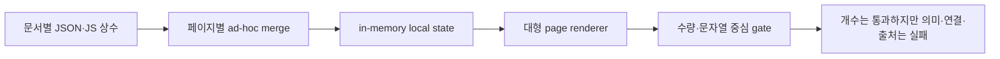

## Current scope override (2026-08-13)

The historical mobile/tablet acceptance references in this handoff are retained as audit history only. Current product QA and future implementation scope are desktop-only, using 1280×900, 1440×1000, and 1920×1080. Legacy responsive markup may remain for compatibility, but mobile/tablet work is not a required acceptance dimension unless the user explicitly reopens the scope.

## 2026-08-12 KA-11~15 implementation update

### 사용자 범위 보정

사용자는 퀴즈·연습문제·교육용 정량 랩을 요청하지 않았고 전문성과 신뢰성을 해칠 수 있으므로 신규 구현하지 않는다. 기존 생성 랩 파일은 보존된 기록일 뿐이며 Atlas 화면·지식 repository·CI 생성/검증 경로에서 제외한다. 이번 트랙의 콘텐츠 범위는 개념·원리·근거·시장 전달·반례·무효화·현재성 경계다.

실제 직접 확인한 공식·학술 자료는 NIST AI RMF, Transformer 논문, FRED, SEC/Investor.gov, DOE, FINRA, ASML, OECD, BLS, Federal Reserve, KRX로 한정한다. 각 원고에 연결된 사실은 `research-facts.json`의 source·scope·asOf·invalidation을 따른다. 확인하지 않은 423개 전체의 claim을 완성 처리하지 않는다.

The local implementation now carries the planned coverage and research-boundary artifacts. `public-data/knowledge/coverage-matrix.json` inventories 423 units: 111 core lessons, 48 foundations, 60 Principles concept guides, 95 taxonomy nodes, 50 deep branches, 19 domains, 20 players and 20 products. This is an inventory gate, not a completion claim.

Per-unit Web Research dossiers are generated for all 423 units. Web Search directly inspected twenty-six official/academic source pages and registered claim-scoped facts; all 159 article records now carry at least one evidence candidate, while 0 dossiers are fully researched, 280 are `RESEARCH_IN_PROGRESS`, and 143 are `RESEARCH_REQUIRED`. Source reuse, discovery-only promotion and current-value claims remain blocked by the dossier boundary.

KA-13 retains 159 unique reconstruction seeds but all articles remain `RECONSTRUCTION_REQUIRED`; the new `researchEvidence` fields attach directly inspected facts without falsely promoting the articles to human-reviewed publications. KA-14 adds 19 structural domain dossiers covering 95 taxonomy nodes and 73 linked deep branches. KA-15 quantitative labs are excluded from the product scope by user direction. KA-16 semantic/browser/live/user certification remains open.

## 2026-08-11 implementation update

The KA sequence now has local contract coverage for the canonical concept manifest (155 concepts), explicit principle edge semantics (71 edges), a 119-source/270-claim registry with directness labels, 159 structured article drafts, a 159-node/16-path learning graph, shareable route state, persistent local learning state, 198 route targets, a repository/selector layer, and five shared renderers.

This update does not promote the 159 drafts to completed deep articles. Each draft remains `STRUCTURED_REFERENCE_DRAFT` and `EDUCATIONAL_REFERENCE_ONLY`; semantic review, primary-source directness review, retrieval testing, and user validation remain required. Live browser certification is also still open because no in-app browser connector was available for this run.

**제품 사명 고정**: 시장 원리와 AI 시대 지식 지도는 각각 따로 노는 요약 페이지가 아니라 하나의 **주식·경제·금융·기술 백과사전**이다. 사용자는 세부 개념을 학습하고 관계를 축적한 뒤 `실물경제 → 산업·기술 가치사슬 → 기업·제품 → 재무제표·현금흐름 → 밸류에이션 → 금융시장·주가 → 관찰 지표·트레이딩 시나리오·무효화`까지 추적할 수 있어야 한다. 현재 구조 구현과 159개 draft 생성은 이 사명의 기반일 뿐 콘텐츠 완성이 아니다.

# 시장 원리·AI 시대 지식 지도 구조 개편 핸드오프

## 0. 결론

두 페이지는 분류 체계와 요약 원고가 갖춰진 **백과사전의 골격**이다. 그러나 현재 원고는 시장 원리 111개 중앙값 325자, AI 기초 48개 중앙값 275자에 불과하며 159개 모두 500자 미만이다. 필드가 존재한다는 사실을 “충분한 설명”으로 오인하면 안 된다. 지금 상태는 **완성된 지식 백과사전도, 완성된 지식 그래프·능동 학습 시스템도 아니다.**

최종 제품 범위는 좁은 “경제 입문”이나 “AI 산업 지도”가 아니다. 시장 원리는 경제학·통화·금리·채권·외환·신용·회계·기업재무·밸류에이션·주식시장 구조·섹터·포트폴리오·위험·트레이딩을 포괄하고, AI 시대 지식 지도는 수학·물리·데이터·AI 모델·반도체·메모리·파운드리·패키징·네트워크·데이터센터·전력·클라우드·로봇·응용산업·방산·우주·자원·정책·자본시장을 포괄한다. 각 세부 sector/domain/category는 얇은 카드가 아니라 독립적으로 학습 가능한 설명과 상위·하위·인접 연결을 가져야 한다.

감사 기준선(v53.98)의 핵심 이유는 다음 다섯 구조에 있었다.

1. **그래프의 진실성이 수량 게이트와 다르다.** 시장 원리에는 존재하지 않는 Atlas 노드를 참조하는 간선이 있고, Atlas는 95개 노드가 5개 연결 성분으로 분리돼 있다.
2. **출처가 하나의 해석 계층으로 통합되지 않았다.** 동일 화면에서 guide link, evidence registry, research source, player/product registry가 서로 다른 ID 공간과 렌더러를 사용한다.
3. **학습이 읽기 중심이다.** 경로·검색·다음/이전은 있으나 공유 가능한 node/lesson 상태, 진도, 재개, bookmark, note, retrieval quiz, 적용 기록이 없다.
4. **원고가 요약 카드 깊이에 머문다.** formal model, 단계형 worked example, 실물경제→기업→재무제표→밸류에이션→시장가격→트레이딩 적용의 폐쇄 경로가 lesson schema에 없다.
5. **페이지 파일이 데이터·도메인·상태·렌더링을 함께 소유한다.** 일부 artifact 하나의 실패가 `Promise.all` 전체 실패로 번지고, 계약 검사는 의미·연결성보다 개수와 문자열 존재를 인증한다.

v54.6 로컬 구현은 KA-01~09의 ontology·graph·evidence·draft·learning state·route bridge·repository·shared renderer 기반을 부분 구축했다. 그러나 159개 draft는 생성형 scaffold이며, 모든 세부 sector/domain/category의 독립 Web Research·학술 검토·정량 예제·기업/시장 적용을 통과하지 않았다. 따라서 기존 KA-00~10을 순차 완료한 뒤 **KA-11 전수 coverage → KA-12 Web Research dossier → KA-13 심층 원고 → KA-14 sector/domain 보강 → KA-15 시장 적용 lab → KA-16 최종 인증**을 추가 실행한다.

이 문서는 진단·실행 설계와 진행 중 구현의 핸드오프다. 사용자 노출 명칭은 `AI 시대 지식 지도`로 유지하고 route ID `atlas`와 데이터 namespace는 호환성을 위해 유지한다. 현재 v54.6 artifact와 모듈은 목표 아키텍처의 검증 가능한 scaffold이지, 백과사전 전체 콘텐츠·외부 원문 fact-check·실사용자 연구·라이브 인증 완료를 뜻하지 않는다.

---

## 1. 감사 범위와 증거 경계

### 1.1 전수 대조한 자산

| 영역 | 직접 대조 범위 |
|---|---:|
| 시장 원리 개념 | 60 nodes, 71 declared edges, 7 tree sections, 8 paths |
| 시장 원리 원고 | 15 chapters, 111 long-form lessons, 60 node guides, 39 compatibility lessons |
| Atlas 기초 | 6 curriculum layers, 48 modules/lessons, 18 sourceCoverage mappings |
| Atlas 산업 | 19 domains, 19 domain guides, 19 source packets, 57 structural claims |
| Atlas taxonomy | 95 nodes, 19 intra-domain chains, 18 cross-domain edges |
| Atlas 심층 | 10 topics, 50 branches, 56 unique anchored taxonomy nodes |
| 기업·제품 | 20 players, 20 products, 20 player/product sources, 20 currentness records each |
| 런타임 | `principles.js`, `atlas.js`, 각 contract/browser gate, 공개 v53.97 UI |
| 심층도 감사 | `_artifacts/knowledge-encyclopedia-depth-audit.json`, 159개 원고 분량·semantic field·worked example·학습 기능 |
| 설계 의도 | 2026-08-01 Principles page/graph UX/Atlas research specs, 이전 ChatGPT 진단 |

### 1.2 실제로 확인한 방법

- JSON artifact 전체 구조·필수 필드·ID 집합·중복·연결 성분을 코드 단위로 계산했다.
- 시장 원리 111개 원고와 AI 기초 48개 원고를 definition/mechanism/example/counter-limit/question/visualization/source 단위로 대조하고, 핵심 필드 총문자 수와 구조화된 심층 필드 존재 여부를 전수 계산했다.
- 공개 v53.97에서 Tree, Graph, Atlas 학습 지도, 산업 taxonomy, 심층 트리, player/product/source 표현을 직접 조작했다.
- 기존 정적·브라우저·접근성·route soak gate 결과와 실제 의미 결함을 교차 비교했다.

### 1.3 이번 감사가 인증하지 않은 것

- 연결된 외부 원문 전체를 다시 열어 문장별 학술 사실성을 독립 fact-check하지 않았다.
- 실시간 시장 수치와 기업별 최신 생산량·수율·매출을 인증하지 않았다. 현재 artifact도 이를 `current claim`으로 공개하지 않는다.
- 실제 초보자·투자자·트레이더·전문가 참여자를 모집해 과업 성공률·이해도·장기 학습효과를 측정하지 않았다. 아래 사용자 관점 평가는 실제 사람을 가장한 주장이 아니라 휴리스틱·시나리오 감사다.

따라서 이 문서의 `VERIFIED`는 저장소·artifact·그래프·renderer·라이브 UI의 현재 상태에 대한 판정이다. 외부 학술 사실의 전면 인증은 별도 source audit가 필요하다.

---

## 2. 이전 ChatGPT 진단 교차 판정

이전 진단은 시장 원리 8.5/A-, Atlas 8.7/A-로 평가하고, 설명 구조는 좋지만 출처 직접성·계산 예시·전문 깊이·deep link가 부족하다고 봤다. 방향은 대체로 맞지만 완성도 평가는 높게 잡혔다.

| 이전 판단 | 이번 판정 | 이유 |
|---|---|---|
| 초보자 학습 구조가 강하다 | 채택 | Tree/단계/질문/반례/다음 개념이 실제 화면에서 유효하다. |
| 원고가 폭넓고 개념적으로 건전하다 | 부분 채택 | 159개 모두 필수 요약 필드는 채워졌지만 백과사전 본문으로 부를 깊이·사례·형식 모델은 없다. |
| source-to-claim 직접성이 약하다 | 강화 | 단순 약점이 아니라 source namespace 분열과 미해결 ID가 라이브에 노출된다. |
| worked example·수식·계산이 부족하다 | 강화 | Atlas 기초 48개에는 수치 단위가 들어간 worked example이 0개다. Principles도 명확한 계산형 예시는 소수다. |
| 금융 plumbing·밸류에이션·회계 깊이를 보강해야 한다 | 채택 | 개념 소개는 있으나 재현 가능한 계산·공시 대조·사례 데이터가 없다. |
| Atlas의 software/model/data/security를 깊게 해야 한다 | 채택 | open AI 심층 분기는 있으나 95-node canonical graph와 lesson/evidence가 일체화되지 않았다. |
| 전체 구현 완성도 A- | 기각 | dangling edge, 5개 graph components, unresolved source, deep-link 부재, all-or-nothing loading을 반영하지 못했다. |
| live browser로 충분히 검증됐다 | 수정 | 이전 진단은 주로 기존 gate와 당시 화면 결과에 의존했다. 이번에는 v53.97에서 결함을 직접 재현했다. |

재평가 점수는 시장 원리 **6.3/10**, AI 시대 지식 지도 **6.1/10**이다. 범위와 정보구조는 강하지만, 백과사전급 본문·능동 학습·근거 추적·시장 연결을 포함하면 아직 C+/B- 경계다.

### 2.1 백과사전 심층도 전수 판정

| corpus | 원고 수 | 핵심 설명 합계 중앙값 | 1,200자 하한 통과 | structured worked example | 완전 semantic contract |
|---|---:|---:|---:|---:|---:|
| 시장 원리 | 111 | 325자 | 0/111 | 0/111 | 0/111 |
| AI 기초 | 48 | 275자 | 0/48 | 0/48 | 0/48 |

`1,200자`는 품질의 충분조건이 아니라 요약 카드와 심층 본문을 구분하는 최소 하한이다. 통과하려면 직관, 필요 시 형식 모델, 입력·가정·과정·결과·해석·실패 경계를 가진 worked example, 실물경제·기업·재무제표·밸류에이션·시장·트레이딩 전달 경로, 용어, 회상 질문, claim ID를 함께 갖춰야 한다. 길이만 늘린 반복 문장은 실패다.

### 2.2 다중 사용자 관점 감사

| 사용자 | 현재 판정 | 막히는 지점 | 목표 시나리오 |
|---|---|---|---|
| 처음 배우는 사용자 | PARTIAL | 선수 개념·용어는 분산되고 본문이 너무 짧다 | 용어→직관→예시→회상 질문→다음 개념 |
| 중급 투자자 | PARTIAL | KPI가 재무제표·밸류에이션 계산으로 닫히지 않는다 | 산업 병목→기업 KPI→공시 line item→valuation |
| 능동 트레이더 | WEAK | 관찰 지표·레짐·시점·무효화·차트 deep link가 없다 | 개념→현재 관찰값→차트→시나리오→무효화 |
| 전공자·전문가 | WEAK | 형식 모델·가정·논쟁·주장별 직접 출처가 부족하다 | 요약을 건너뛰고 모델·원문·반대 근거 확인 |
| 한국 투자자 | PARTIAL | 글로벌 충격의 환율·한국 산업·종목 전달이 제한적이다 | 미국/글로벌→달러·금리→한국 밸류체인→종목 |
| 재방문 학습자 | MISSING | 진도·bookmark·note·quiz·재개가 없다 | 마지막 위치 재개→오답 회수→적용 기록 |
| 모바일·키보드·스크린리더 사용자 | PARTIAL | 점진 공개는 있으나 동등한 그래프 설명·학습 상태가 없다 | 한 열 탐색·텍스트 관계 설명·완전 키보드 조작 |
| 위험 회피·회의적 사용자 | PARTIAL | 반례는 있으나 claim별 불확실성·대체 설명 결속이 약하다 | 주장→근거→반증→최신성→판정 보류 |
| 시간이 부족한 사용자 | PARTIAL | 요약은 좋지만 요약 아래 신뢰할 심층 본문이 없다 | 30초 요약→5분 설명→심층 원문 드릴다운 |

실제 사용자 연구 단계에서는 각 persona별 최소 5명, 초회/재방문 과업, 모바일/데스크톱, 이해도 사전·사후, task completion/time/error, 설명 후 시장 화면 적용 정확도를 측정해야 한다. 이를 수행하기 전 `USER_VALIDATED`를 선언하지 않는다.

---

## 3. 시장 원리 전수 진단

### 3.1 실제 강점

1. 15개 chapter와 111개 요약 원고가 정의→작동 원리→예시→반대 시나리오→검증 질문→도식의 일관된 문법을 가진다. 이는 좋은 authoring scaffold이지 심층 본문 인증은 아니다.
2. 60개 node guide가 definition·intuition·mechanism·KPI·connection·risk를 모두 가진다.
3. Tree는 7개 대분류로 60개 노드를 모두 수용하고, Path는 8개의 목적별 경로를 제공한다.
4. A~M은 희소성→돈·신용→금리·채권→기업·시장→산업→AI·반도체→전력으로 이어지는 교육 spine이 분명하다.
5. 반례와 실패 조건을 함께 제시해 단순 투자 낙관론이나 종목 권유로 흐르지 않는다.

### 3.2 인증 차단 결함

#### MP-S0-01. 선언 71간선과 실제 70 유효 간선이 다르다 — 기준선 결함, v53.99 로컬 해소

- `src/ui/pages/principles.js:236`은 `network-fabric → photonic-link-economics`를 선언한다.
- `network-fabric`은 Principles `CATALOG`에 없고 Atlas taxonomy node다.
- 결과는 `59-node component + isolated photonic-link-economics`다.
- 공개 Graph에서 포토닉 노드를 선택하면 “다음에 탐색할 개념”이 실제로 0개다.
- `scripts/ci-principles-contract-check.mjs:51`은 source 전체의 모든 `id:` 문자열을 정규식으로 수집해 실제 CATALOG 경계를 판별하지 못하고, edge endpoint도 검사하지 않는다.

이 결함은 단순 오타가 아니라 **게이트가 잘못된 구조를 정상으로 인증하는 문제**다.

v53.99 기준 구현은 잘못된 Atlas-only endpoint를 `compute → photonic-link-economics`로 교체하고, 실제 export된 CATALOG를 읽는 `scripts/ci-knowledge-core-semantic-check.mjs`에서 60 nodes/71 valid edges/1 component/isolated 0을 강제한다. 이 항목은 `RESOLVED_LOCAL`이며 배포 전 browser/live parity는 별도다.

#### MP-S0-02. 원래 설계된 typed edge contract가 구현되지 않았다 — v53.99 부분 구현

원 설계는 edge에 type, kind, strength, polarity, conditions, sourceIds, reviewedAt을 요구했다. 현재 edge는 `from/to/relation` 자유 문자열만 있고 Graph hop 계산은 방향을 지운 채 양방향 인접으로 처리한다. 따라서 “원인”, “자금 조달”, “가격 기준”, “물리적 제약”, “조건부 상관”을 기계적으로 구분할 수 없다.

v53.99는 `src/domain/knowledge/graph.js`의 canonical normalizer와 topology inspector를 연결했다. 모든 edge가 형식상 typed contract로 정규화되지만, 기존 70개 edge의 조건·직접 근거는 아직 추론/default에 의존하므로 KA-02 완료로 승격하지 않는다.

### 3.3 콘텐츠·근거 결함

| ID | 문제 | 실측 |
|---|---|---|
| MP-P1-01 | 111개 원고와 39개 route lesson이 이중 체계 | long-form 111개는 모두 `route: principles`; 실제 전문 화면 CTA는 39개 compatibility lesson에 집중된다. |
| MP-P1-02 | evidence UI의 의미가 분열 | 기본 희소성 상세에 Federal Reserve guide 성격 링크가 있어도 별도 block은 `0개 출처`, research는 `0개 관찰 기록`으로 보인다. |
| MP-P1-03 | broad source 재사용 | `MP-SEC` 35개, `MP-NIST` 31개 등에 집중된다. N의 15개 산업 개요가 NIST/PS-16/PS-18을 공통 사용해 농업·부동산·소비·헬스케어의 직접 근거가 아니다. |
| MP-P1-04 | 정량 학습 부족 | 111개 중 재현 가능한 수식·가정·계산·결과가 들어간 예시는 소수다. DCF, duration, real rate, ROIC, yield, PUE 등은 계산 lab이 없다. |
| MP-P1-05 | 시장 연결이 설명에 머묾 | macro/fxbond/fundamental/themes/technical 등 CTA는 있으나 선택 node·metric·timeframe까지 전달하는 deep link가 없다. |
| MP-P1-06 | 백과사전 깊이 부재 | 핵심 6필드 합계 284~375자, 중앙값 325자이며 111/111이 1,200자 하한 미달이다. 구조화된 worked example과 전체 시장 적용 chain은 0개다. |

### 3.4 UX·능동 학습 결함

- 원 설계의 공유 상태 `mode/node/path/step/chapter/lesson`이 URL에 없다. 공개 URL은 `#principles`까지만 유지한다.
- 검색·다음/이전·path step은 있지만 진도, 재개, bookmark, note, quiz, 오답 회수, 적용 기록이 없다.
- Tree/Graph/Path/Library가 하나의 학습 객체를 공유하지 않아, 111개 심화 lesson에서 Graph node나 전문 market route로 돌아가는 일관된 연결이 없다.
- 현재 Graph는 1/2-hop 탐색 도구이지, edge의 조건·근거·영향 방향을 학습하는 관계 설명 도구가 아니다.

### 3.5 시장 원리 판정

| 축 | 점수 | 판정 |
|---|---:|---|
| 개념 범위 | 8.7 | 매우 좋음 |
| 교육 요약 문장·반례 | 8.3 | 요약 원고로 좋음 |
| 백과사전·학문적·정량 깊이 | 4.5 | 재집필 필요 |
| 그래프 무결성 | 5.0 | 인증 실패 |
| 근거 직접성 | 5.7 | 구조 개편 필요 |
| 실제 시장/전문 화면 연결 | 6.8 | 부분 구현 |
| 능동 학습·재사용 | 4.8 | 미구현에 가까움 |
| 접근성·가독성 | 8.2 | 좋음 |

---

## 4. AI 시대 지식 지도 전수 진단

### 4.1 실제 강점

1. 6단계·48개 기초 curriculum은 물리·수학→학습→Transformer→Agent/World Model→인프라→경제성으로 흐름이 좋다. 단, 현재 문장은 개요 카드 깊이다.
2. 19개 domain guide는 definition·mechanism·unit·bottleneck·verificationQuestion을 모두 가진다.
3. 57개 domain claim은 모두 `PARTIAL`, `asOf: null`, `NOT_PUBLISHED_AS_CURRENT` 경계를 지켜 현재값으로 과장하지 않는다.
4. 10개 deep topic과 50개 branch는 공정 세대, EUV, 패키징, photonics, open AI, memory, AIDC/power, cloud/neocloud, physical AI, defense/space를 전문적으로 분해한다.
5. 플레이어·제품은 기술 KPI와 경제 KPI를 구분하고, 현재 수치·매매 신호가 아니라 reference map이라고 명시한다.

### 4.2 인증 차단 결함

#### AT-S0-01. 95개 taxonomy가 하나의 산업 그래프가 아니다 — 기준선 결함, v53.99 로컬 해소

19개 domain chain의 76개 내부 간선과 18개 cross-domain edge는 endpoint 자체는 유효하다. 그러나 무방향 연결 성분 계산 결과는 다음과 같다.

- 75 nodes: 주 component
- 5 nodes: Neocloud/GPU finance
- 5 nodes: Foundry/equipment/materials
- 5 nodes: AI applications
- 5 nodes: Resources/materials

즉, 4개 산업군 전체가 본 그래프와 분리돼 있다. 특히 Foundry와 compute/package, Neocloud와 cloud/economics, Applications와 workflow/ROI, Resources와 grid/policy가 연결되지 않아 사용자가 요청한 기술→산업→기업→현금흐름→자본시장 흐름이 끊긴다.

`scripts/ci-atlas-contract-check.mjs:55`는 chain 19개, node ref 95개, cross edge 18개, 총 edge 94개만 검사하며 graph component, reachability, 필수 domain bridge를 검사하지 않는다.

v53.99는 Neocloud→Cloud, Foundry→Compute, Application→Revenue Model, Resources→Foundry Material의 근거 ID·조건·방향을 가진 bridge를 추가하고, 의미가 약했던 Power→Defense/Space를 Physical AI→Defense→Space 흐름으로 교체했다. 현재 95 nodes/98 edges/1 component이며 parser gate가 endpoint·component·metadata·source ID를 함께 검사한다. 이 항목은 `RESOLVED_LOCAL`이다.

#### AT-S0-02. source ID 유효성 판정과 renderer 해석 범위가 다르다 — 기준선 결함, v53.99 로컬 해소

- contract는 `PP-*`와 research `PS-*` source의 합집합을 valid로 인정한다.
- `createReferenceSourceLinks()`는 `registry.sources`만 조회한다.
- TSMC/Micron/KIOXIA player/product가 가진 `PS-01..05`는 contract를 통과하지만 렌더러에서는 해석되지 않는다.
- 공개 미세공정 화면에서 `PS-01 · registry source`가 링크 없이 실제 노출된다.

이는 “데이터상 valid”와 “사용자에게 resolvable”이 다른 구조다.

v53.99는 `PS`, `PP`, `FND`, `AT` source catalog를 `src/domain/knowledge/evidence.js`에서 하나로 합치고 renderer가 `evidenceById`를 사용하게 했다. semantic gate가 현재 참조 64개 ID의 unresolved 0/conflict 0/URL 100%를 검사하고, browser gate가 파운드리 상세의 `PS-01` 링크와 unresolved badge 0을 검증한다. claim directness 분류는 KA-03의 남은 범위다.

### 4.3 의미·범위 결함

| ID | 문제 | 실측 |
|---|---|---|
| AT-P1-01 | 심층 taxonomy가 전체 taxonomy와 분리 | 10 topics가 56/95 unique nodes만 anchor한다. 나머지 39개 node는 deep branch가 없다. |
| AT-P1-02 | 대표 기업·제품 coverage 불균형 | representative players 47/95, products 41/95. 단순 공백뿐 아니라 category 전체의 비교 기준이 없다. |
| AT-P1-03 | company capability와 product evidence 혼합 | 기준선의 `samsung-hbm-family → foundry-process-node`, `ibm-quantum-platform → future-photonic-compute`는 v53.99에서 각각 HBM+3D stacking, quantum-only로 수정했다. 다만 전체 entity-product 관계의 전문가 전수 판정은 남았다. |
| AT-P1-04 | 기초 curriculum의 정량 예시 부재 | 48개 long-form 기초 원고의 numeric worked example은 0개다. 행렬, attention, KV cache, bandwidth, utilization, ROIC가 prose로 끝난다. |
| AT-P1-05 | currentness가 페이지 존재 확인에 치우침 | 20개 product status가 동일한 2026-08-02 기준이며 공식 페이지 존재를 MATURE/RAMP/RESEARCH 참고 분류로 번역한다. 실제 양산·출하·채택 증거와는 다르다. |
| AT-P1-06 | Atlas 자체 Graph/Path 부재 | 현재 mode는 학습 지도/산업·가치사슬/근거 자료실이다. 원 연구 명세가 요구한 초보자 Tree/Path와 숙련자 Graph/source 추적은 완성되지 않았다. |
| AT-P1-07 | 전문 시장 route 연결이 일반적 | 상세 node에서 해당 기업·섹터·재무 metric을 연 상태로 이동하지 못하며, route state는 `#atlas`에 머문다. |
| AT-P1-08 | 백과사전 깊이 부재 | 핵심 6필드 합계 208~320자, 중앙값 275자이며 48/48이 1,200자 하한 미달이다. structured worked example과 전체 시장 적용 chain은 0개다. |

### 4.4 resilience·상태 결함

- v53.98의 `atlas.js:1200-1202`는 11개 artifact를 한 `Promise.all`로 읽어 하나가 실패하면 전체를 fallback으로 표시했다.
- v53.99는 Principles 4개와 Atlas 11개를 공통 `loadKnowledgeCapabilities()`의 `Promise.allSettled` 단위로 분리했다. 성공 artifact를 보존하고 실패 capability만 fallback으로 표시하는 fixture가 semantic gate에 있다.
- 상태는 페이지 내부 객체에만 있고 URL/state store/persistence 계약이 없다.
- JSON schema validation은 runtime 입구가 아니라 개수 중심 CI에 의존한다.

### 4.5 Atlas 판정

| 축 | 점수 | 판정 |
|---|---:|---|
| 산업 범위 | 8.8 | 매우 좋음 |
| domain guide 요약 품질 | 8.2 | 요약 원고로 좋음 |
| 기초→산업 학습 흐름 | 8.2 | 좋음 |
| 그래프 연결성 | 5.2 | 인증 실패 |
| 제품·기업 의미 정확성 | 6.0 | 정규화 필요 |
| 근거 resolver | 5.4 | 구조 결함 |
| 백과사전·정량·학술 깊이 | 4.2 | 재집필 필요 |
| 능동 학습·시장 연결 | 5.0 | 부분 구현 |

---

## 5. 공통 근본 원인



1. **canonical ontology가 없다.** Principles와 Atlas가 유사 개념을 다른 ID와 artifact로 소유한다.
2. **schema와 compiler가 없다.** JSON은 저장 형식일 뿐, edge·claim·entity relation의 의미 계약을 강제하지 않는다.
3. **source registry가 분리돼 있다.** guide source, research source, foundation source, player/product source가 서로 다른 resolver를 거친다.
4. **page가 orchestration까지 소유한다.** fetch, merge, fallback, state, search, domain selection, rendering이 한 파일에 있다.
5. **게이트가 의미를 계산하지 않는다.** endpoint, component, reachability, source resolvability, relation semantics, lesson-to-route continuity를 인증하지 않는다.
6. **학습 상태가 도메인 모델이 아니다.** UI selection은 있으나 학습 목표·진도·회수·적용이 저장 가능한 객체가 아니다.
7. **depth schema가 없다.** 현재 required-fields gate는 문장 존재만 검사하고 심층 본문·형식 모델·worked example·시장 적용 폐쇄성을 검사하지 않는다.

---

## 6. 목표 아키텍처

### 6.1 원칙

- 기존 두 페이지에 데이터를 더 넣기 전에 공통 지식 계약을 먼저 만든다.
- authored source와 generated bundle을 분리한다.
- renderer는 데이터를 소유하지 않고 selector 결과만 표현한다.
- 모든 관계는 방향·종류·조건·근거를 가진다.
- 모든 세부 concept·principle·sector·domain·category는 canonical coverage matrix에 등록하고 누락을 허용하지 않는다.
- Web Search는 단순 링크 수집이 아니라 claim 단위 직접 근거·반대 근거·기준일·채택/기각 이유를 남기는 research dossier를 생산한다.
- current market data는 교육 원고에 복제하지 않고 전문 route selector/deep link로 연결한다.
- 부분 artifact 실패는 해당 capability만 degrade한다.

### 6.2 제안 계층

```text
schemas/knowledge/
  concept.schema.json
  edge.schema.json
  lesson.schema.json
  worked-example.schema.json
  application-chain.schema.json
  claim.schema.json
  entity-relation.schema.json

public-data/knowledge/
  manifest.json
  concepts/{economy,finance,industry,ai}.json
  edges/{principles,atlas,cross-page}.json
  lessons/{principles,atlas-foundations,atlas-deep}.json
  paths.json
  sources.json
  claims.json
  entities.json
  products.json

src/domain/knowledge/
  ontology.js
  graph.js
  pedagogy.js
  evidence.js
  entity-relations.js

src/data/contracts/knowledge.js
src/data/normalize/knowledge.js
src/state/slices/knowledge.js
src/state/selectors/knowledge.js
src/ui/knowledge/{tree,graph,path,lesson,evidence}.js
src/ui/pages/{principles,atlas}.js        # page composition only

scripts/build-knowledge.mjs
scripts/ci-knowledge-graph-semantic-check.mjs
scripts/ci-learning-continuity-check.mjs
scripts/ci-source-resolver-check.mjs
scripts/ci-encyclopedia-depth-check.mjs
scripts/ci-persona-journey-check.mjs
```

최종 파일명은 현행 repository conventions와 CODE-MAP을 확인해 확정한다. 중요한 것은 계층 경계이며, 기존 `principles.js`와 `atlas.js`에 새 상수와 분기를 계속 추가하지 않는 것이다.

### 6.3 canonical concept·edge 계약

```json
{
  "id": "edge-real-rate-equity-valuation",
  "from": "real-rate",
  "to": "equity-valuation",
  "type": "PRICES",
  "direction": "DIRECTED",
  "kind": "PRINCIPLE",
  "strength": "CORE",
  "polarity": "NON_MONOTONIC",
  "conditions": ["earnings expectations and risk premium are held separately"],
  "explanationLessonId": "lesson-real-rate-valuation",
  "sourceIds": ["source-fed-real-rates", "source-sec-valuation"],
  "reviewedAt": "YYYY-MM-DD"
}
```

필수 edge type 최소 집합은 `CAUSES`, `REQUIRES`, `ENABLES`, `CONSTRAINS`, `FUNDS`, `PRICES`, `MEASURES`, `EVIDENCES`, `EXPOSES_TO`다. hop 탐색은 type/direction을 보존하고 UI에서 “왜 연결되는지”를 보여줘야 한다.

### 6.4 evidence 단일 해석기

모든 source는 하나의 global ID registry에 등록하고 다음을 강제한다.

- publisher, title, url, sourceType, publication/accessed date
- supportedClaimIds 또는 supportedEdgeIds
- directness: DIRECT / CONTEXT / DISCOVERY
- asOf requirement
- renderer resolvability
- broken-link/review status

`PS-*`, `PP-*`, `FND-*`, `MP-*` prefix를 유지할 수는 있지만 resolver는 하나여야 한다. 화면은 “가이드”, “원고 출처”, “관찰 claim”, “기업·제품 근거”를 계층별로 표시하되 같은 ID는 같은 링크와 설명으로 해석해야 한다.

### 6.5 능동 학습 계약

각 lesson은 최소 다음을 가진다.

- learningObjective
- prerequisiteConceptIds
- workedExample: inputs, formula/process, result, interpretation
- counterExample 또는 failureBoundary
- retrievalQuestion, answer/rubric
- applicationPrompt: 실제 market route에서 무엇을 확인할지
- nextConceptIds, expertRouteTarget

상태는 `mode`, `node`, `lesson`, `path`, `step`, `completed`, `bookmark`, `noteRef`로 분리한다. mode/node/path/step/lesson은 공유 URL에 반영하고, 개인 진도·bookmark는 로컬 저장으로 유지한다. 민감 정보는 저장하지 않는다.

#### 6.5.1 백과사전 본문 profile

요약과 본문을 같은 필드에 밀어 넣지 않는다. `summary`는 30초 탐색용으로 유지하고, `article`은 최소 다음 의미 단위로 분리한다.

1. 한 문장 정의와 선수 개념
2. 초보자 직관·비유와 비유가 깨지는 경계
3. 단계별 mechanism/causal chain
4. 필요 시 수식·단위·가정·변수 설명 또는 `notApplicableRationale`
5. 입력·가정·과정·결과·해석·실패 경계가 있는 worked example
6. 반례·대체 설명·논쟁점
7. 인접 개념과 typed edge 설명
8. 실물경제→산업→기업→재무제표→밸류에이션→금융시장/주가 전달
9. 트레이딩에서 볼 metric·timeframe·regime·catalyst·invalidation. 매수/매도 명령은 금지
10. claim별 직접 출처·기준일·용어 사전·회상 질문

본문 하한은 core lesson 1,200자, overview 700자, deep branch 1,500자를 초기 기준으로 삼되 글자 수만으로 통과시키지 않는다. 초보자는 summary부터, 전문가는 model/evidence부터 진입할 수 있게 progressive disclosure를 제공한다.

### 6.6 실제 시장·금융시장 연결 방식

교육 node가 current 수치를 복제하지 않고 다음 target contract를 가진다.

| 개념 | 전문 화면 target | 전달할 상태 |
|---|---|---|
| 실질금리·수익률곡선 | `fxbond`, `macro` | metric, tenor, concept context |
| 신용스프레드·유동성 | `market`, `analysis` | indicator, regime question |
| 밸류에이션·ROIC | `fundamental`, `entity` | metric set, ticker only when user selected |
| 섹터 로테이션 | `themes` | sector/industry context |
| HBM·패키징·AIDC·전력 | `atlas`, `entity` | taxonomy node, evidence boundary |
| 포지션·위험 | `portfolio`, `technical` | educational checklist, no trade command |

CTA는 단순 페이지 이동이 아니라 “배운 원리→현재 관찰값→출처→반례 기록”의 루프를 이어야 한다.

### 6.7 장애 격리

- manifest를 먼저 읽고 artifact별 `Promise.allSettled` 또는 repository loader로 상태를 분리한다.
- `foundations`, `lessons`, `evidence`, `entities`, `currentness`는 capability별 loading/ready/degraded/error를 가진다.
- 기초 lesson이 실패해도 taxonomy와 research는 정상 표시한다.
- source resolver가 실패하면 원고는 남기되 citation capability만 명시적으로 degraded 처리한다.
- schema/version 불일치는 silent fallback이 아니라 해당 artifact의 진단 가능한 오류로 표시한다.

---

## 7. 실행 패킷

패킷 상태는 machine contract가 정본이다. v54.6 기준 `KA-00/01=VERIFIED_LOCAL`, `KA-02~09=PARTIAL_REFERENCE_IMPLEMENTATION`, `KA-10~16=DESIGNED`다. 기존 KA-00~10의 구조 작업을 순차 완료한 뒤 KA-11~16의 전수 콘텐츠 보강 작업으로 이어간다. 선행 패킷의 acceptance를 통과하기 전 다음 wave를 대량 병렬 착수하지 않는다.

### Wave 0 — 거짓 인증을 먼저 차단

#### KA-00. semantic gate baseline

- 실제 CATALOG/JSON 구조를 parser로 읽고 edge endpoint를 검증한다.
- graph component, orphan/dead-end, required bridge, direction, edge metadata를 계산한다.
- source ID가 CI에서 valid일 뿐 아니라 실제 renderer resolver에서 linkable인지 검사한다.
- 현재 결함을 failing fixture로 고정한다.

Acceptance:

- Principles invalid edge가 gate를 실패시킨다.
- Atlas 5 components가 gate를 실패시킨다.
- `PS-01..05` unresolved path가 gate를 실패시킨다.

#### KA-01. ontology·ID 동결

- Principles/Atlas node inventory를 공통 concept manifest로 추출한다.
- alias와 cross-page concept를 정의하고 namespace 충돌을 제거한다.
- `network-fabric`/`photonic-link-economics` 같은 cross-page 관계는 명시적 cross-page edge로 이동한다.

Acceptance: duplicate semantic concept, unknown ID, orphan leaf 0.

### Wave 1 — 근거·그래프 코어

#### KA-02. typed graph migration

- 자유 문자열 relation을 typed edge로 migration한다.
- Atlas의 분리된 4개 domain을 의미 있는 bridge로 연결한다.
- 모든 leaf에 lesson 또는 expert route를 둔다.
- component=1을 무조건 강제하기보다 의도적으로 분리된 component는 manifest에 rationale을 요구한다. 현재 4개 분리는 의도 기록이 없으므로 실패다.

Required bridge examples to validate, not blindly copy:

- neocloud capacity/reservation → cloud workload → CAPEX/lease → FCF/ROIC
- foundry design/process/yield → compute/memory/package → capacity/value capture
- AI applications workflow → payer/ROI → revenue quality/market expectation
- resources/refining → power/grid/semiconductor material → policy/supply resilience

#### KA-03. evidence unification

- global source/claim registry와 resolver를 만든다.
- broad/context source와 direct claim source를 분리한다.
- N 15개 산업 원고와 Atlas representative product 관계를 domain 전문가 기준으로 재매핑한다.
- source directness와 citation coverage report를 생성한다.

Acceptance: unresolved source 0, DIRECT 근거 없는 current/product claim 0, context source를 direct로 표시한 건 0.

### Wave 2 — 학습 콘텐츠의 깊이

#### KA-04. worked example·학문 깊이

- 159개 현행 요약 원고를 버리지 않고 `summary`로 보존하되, 별도 `article` 심층 본문을 schema 기반으로 재집필한다.
- Principles: real/nominal rate, bond duration, yield curve, DCF, dilution, ROIC, unit economics, PUE, utilization 예제를 추가한다.
- Atlas: matrix multiplication shape, attention scaling, KV cache memory, bandwidth/latency, yield/capacity, GPU-hour utilization, CAPEX/depreciation/FCF 예제를 추가한다.
- 모든 예제는 입력·과정·결과·해석·실패 조건을 가진다.
- 모든 본문은 realEconomyChannel→companyChannel→financialStatementChannel→valuationChannel→marketChannel→tradingApplication→invalidation을 채우거나 해당 없음의 근거를 남긴다.
- 개념 유형을 `FORMAL`, `CAUSAL`, `INSTITUTIONAL`, `INDUSTRY`, `APPLICATION`으로 나눠 수식·사례·출처 profile을 다르게 적용한다.
- 분야별 최소 primary/textbook/standard source mix를 정의한다.

Acceptance: 159/159가 1,200자 core 하한과 semantic profile을 통과하고, 159/159가 재현 가능한 worked example 또는 명시적 non-quantitative rationale를 가지며, 길이 중복·source concentration·claim directness gate를 통과한다.

#### KA-05. lesson/path continuity

- 111 long-form lesson과 60 guide/39 compatibility lesson의 이중 체계를 하나의 lesson graph로 합친다.
- Atlas 48 foundation, 95 taxonomy, 50 deep branch 사이 prerequisite/next/expert route를 연결한다.
- 39개 deep-unanchored Atlas node를 심층 분기 또는 명시적 overview-only 상태로 분류한다.

Acceptance: lesson/node/path/expert route dead-end 0.

### Wave 3 — 상태·UX·시장 연결

#### KA-06. shareable state and active learning

- router 계약에 맞춰 mode/node/path/step/lesson 상태를 직렬화한다.
- back/forward, reload, copy URL을 검증한다.
- 진도·bookmark·note·retrieval quiz를 별도 learning slice로 구현한다.
- 모바일에서는 Tree/Graph와 동등한 text alternative를 유지한다.

#### KA-07. professional route bridge

- concept→route target registry를 만든다.
- 현재 metric selector와 교육 context를 함께 전달한다.
- current data가 없거나 stale이면 교육 context만 유지하고 수치 주장을 만들지 않는다.

Acceptance: 핵심 20개 end-to-end scenario가 학습→전문 화면→근거→복귀를 유지한다.

### Wave 4 — renderer 분해·장애 격리

#### KA-08. repository/state/selectors extraction

- fetch/normalize/merge를 page 파일에서 data/domain layer로 이동한다.
- page별 state를 shared knowledge slice와 selectors로 이동한다.
- 4/11 artifact all-or-nothing Promise를 capability-level loading으로 교체한다.

#### KA-09. thin renderer migration

- 공통 Tree/Graph/Path/Lesson/Evidence renderer를 만든다.
- `principles.js`, `atlas.js`는 route composition과 page-specific layout만 소유한다.
- migration 완료 후 기존 JS 상수·fallback 원고·중복 mapper를 삭제 ledger로 제거한다.

Acceptance: 같은 원고/edge/source의 이중 소유 0, 페이지 renderer 내부 domain dataset 0.

### Wave 5 — 최종 인증

#### KA-10. semantic/browser certification

- schema, encyclopedia depth, topology, citation, learning continuity, route state, partial failure, accessibility, mobile, performance gate를 실행한다.
- 공개 revision에서 대표 시나리오를 재검증한다.
- 9개 persona heuristic scenario를 자동화하고, 별도 실제 사용자 연구 전에는 `HEURISTIC_VERIFIED`까지만 허용한다.
- INDEX의 DESIGN_ONLY 문구를 실제 `PARTIAL_IMPLEMENTED`, `VERIFIED_LOCAL`, `VERIFIED_LIVE` 상태와 일치시킨다.

---

## 8. 필수 신규 게이트

| Gate | 실패 조건 |
|---|---|
| `knowledge-schema` | required field, enum, schema revision 불일치 |
| `graph-endpoints` | unknown node, self-loop, duplicate edge |
| `graph-connectivity` | unexplained component, orphan/dead-end leaf, required bridge 부재 |
| `edge-semantics` | type/direction/condition/source/review metadata 누락 |
| `source-resolver` | valid ID지만 renderer에서 URL/label 해석 불가 |
| `claim-directness` | CONTEXT/DISCOVERY source가 DIRECT claim을 단독 지지 |
| `entity-product-fit` | product category/problem과 taxonomy node relation type 불일치 |
| `lesson-depth` | objective/example/failure/question/application field 미충족 |
| `encyclopedia-depth` | core 1,200자 하한 또는 semantic profile·worked example/application chain 미충족 |
| `learning-continuity` | node/lesson/path/expert route dead-end |
| `persona-journey` | 초보자·투자자·트레이더·전문가·재방문·모바일/접근성 핵심 과업 단절 |
| `route-state` | reload/back/forward/copy URL에서 선택 상태 유실 |
| `partial-failure` | 한 artifact 실패가 무관한 capability까지 fallback |
| `browser-semantic` | 단순 존재/개수는 통과하지만 관계·출처·CTA 의미가 다름 |
| `full-corpus-coverage` | 111 lessons·48 foundations·60 concept guides·95 taxonomy nodes·50 deep branches·19 domains 중 article/dossier 또는 명시적 canonical 합성 경로가 없는 항목 존재 |
| `web-research-dossier` | concept/article별 검색 질의·검색일·후보 source·채택/기각·source tier·반대 근거·claim coverage 누락 |
| `source-profile` | 공식/학술/표준/기업 직접 근거가 필요한 profile에서 broad·vendor·secondary source만 사용 |
| `article-uniqueness` | 무관한 concept 사이 template 문장·예제·시장 연결의 과도한 반복 또는 placeholder 존재 |
| `quantitative-example` | 계산 가능한 개념에 변수·단위·가정·단계·결과·해석·실패 경계가 있는 예제가 없음 |
| `market-transmission` | 실물경제→산업/기술→기업/제품→재무→밸류에이션→시장/주가→트레이딩 관찰·무효화 경로가 닫히지 않거나 해당 없음 근거가 없음 |
| `sector-domain-depth` | 세분화된 sector/domain/category가 상위 overview 한 장으로 대체되거나 독립 KPI·병목·기업·제품·근거·시장 연결이 없음 |
| `currentness-separation` | 변동 수치가 정적 교육 본문에 고정되거나 asOf/freshness/data-refresh 경계 없이 현재 사실로 노출 |

현재 contract gate는 보존하되 위 semantic gate의 하위 기반으로 재정의한다. 개수 통과가 의미 통과를 대신하지 못한다.

---

## 9. 구현 금지 패턴

1. `principles.js` 또는 `atlas.js`에 새 대형 상수·if branch·source map을 추가해 해결하지 않는다.
2. 깨진 edge 한 줄만 고치고 endpoint/component gate 없이 완료 처리하지 않는다.
3. Atlas의 4개 분리 domain에 임의 간선을 하나씩 붙여 component=1만 만들지 않는다.
4. source ID를 registry에 복사해 링크만 보이게 하고 claim directness를 해결했다고 하지 않는다.
5. lesson 수를 늘리는 것으로 학문 깊이와 능동 학습을 대체하지 않는다.
5-1. 짧은 필드 여러 개를 채우거나 같은 문장을 늘려 1,200자만 넘긴 뒤 백과사전 완료로 처리하지 않는다.
6. current market 수치를 정적 교육 JSON에 복제하지 않는다.
7. 기존 fallback과 새 canonical bundle을 장기 이중 운영하지 않는다.
8. browser gate에서 locator 존재만 검사하고 선택 후 의미 문장을 검증하지 않는 패턴을 반복하지 않는다.
9. `STRUCTURED_REFERENCE_DRAFT` 159개 생성 또는 schema PASS를 백과사전 콘텐츠 완료로 부르지 않는다.
10. Web Search 결과의 제목·요약·URL만 복사하거나 검색 결과 페이지를 직접 근거로 사용하지 않는다.
11. SEC·NIST·기업 홈페이지 같은 broad source 하나를 여러 무관한 산업·원리의 직접 근거로 반복하지 않는다.
12. sector/domain/category 일부만 대표 예시로 작성하고 나머지를 동일 template·상위 overview·빈 링크로 대체하지 않는다.
13. 글자 수를 채우기 위한 중복 문장, 근거 없는 수식, 가상의 최신 수치·회사 사례·매매 신호를 만들지 않는다.

---

## 10. 실행 순서와 완료 정의

```text
KA-00 gate baseline
  → KA-01 ontology
  → KA-02 typed graph + KA-03 evidence
  → KA-04 depth + KA-05 continuity
  → KA-06 learning state + KA-07 market bridge
  → KA-08 repository/state extraction
  → KA-09 thin renderer + legacy deletion
  → KA-10 structural/local certification
  → KA-11 full corpus coverage
  → KA-12 Web Research dossiers
  → KA-13 deep article reconstruction
  → KA-14 sector/domain/category enrichment
  → KA-15 market application labs
  → KA-16 encyclopedia browser/live/user certification
```

최종 완료는 다음을 모두 만족할 때만 선언한다.

- Principles와 Atlas의 모든 edge endpoint가 유효하고 의도치 않은 component·dead-end가 없다.
- 모든 화면 source ID가 실제 링크와 근거 역할로 해석된다.
- 159개 core lesson은 요약과 별도의 심층 본문, worked example/non-quantitative rationale, 반례, 검증 질문, claim 근거, 전문 화면 적용 chain을 가진다.
- 60 Principles concept guides, 95 Atlas taxonomy nodes, 50 deep branches, 19 domain overviews도 각각 독립 dossier 또는 중복 없는 canonical 합성 경로를 가진다.
- 모든 세부 sector/domain/category가 coverage matrix에서 `RESEARCHED`, `AUTHORED`, `SEMANTIC_REVIEWED`, `BROWSER_VERIFIED` 상태를 가진다. 대표 분야만 통과하고 전체 완료를 선언할 수 없다.
- 각 concept/article에는 Web Research dossier가 있고, 현재·정량·기업·제품 claim은 직접 primary/official 근거와 기준일을 가진다.
- 계산 가능한 원리는 재현 가능한 정량 예제를, 비정량 원리는 명시적 rationale·사례·반증 조건을 가진다.
- Tree/Graph/Path/Lesson이 같은 canonical concept와 학습 상태를 공유한다.
- Atlas 19 domains가 기술→산업→기업/제품→경제성→자본시장 경로로 탐색 가능하다.
- 공유 URL, reload, back/forward, mobile text alternative, keyboard가 동등하게 작동한다.
- artifact 일부 실패가 무관한 학습 영역을 파괴하지 않는다.
- 정적·브라우저·라이브 semantic gate가 모두 통과한다.
- 9개 persona 휴리스틱 과업이 통과하며, 실제 참여자 연구를 하지 않았다면 상태를 `USER_VALIDATED`로 승격하지 않는다.
- 문서 상태가 실제 구현·검증 상태와 일치한다.

---

## 11. 즉시 착수 우선순위

1. 다른 세션은 machine contract의 현재 상태를 기준으로 기존 **KA-00~10을 순차적으로 모두 완료**한다. 이미 생성된 artifact를 되돌리거나 별도 병렬 체계를 만들지 않는다.
2. KA-10 구조 인증 뒤 **KA-11**에서 전체 corpus·sector·domain·category coverage matrix를 확정한다.
3. **KA-12**에서 concept별 Web Research dossier와 claim-source directness를 완성한다.
4. **KA-13/14**에서 159개 core article과 모든 세부 sector/domain/category dossier를 batch 단위로 심층 재집필한다.
5. **KA-15/16**에서 정량 lab·주식/시장 적용·능동학습·브라우저·라이브·실사용자 인증을 닫는다.

이 순서가 “겉핥기식 덧붙이기”를 피하는 핵심이다. 먼저 잘못된 구조를 정상으로 인증하는 시스템을 고치고, 그 위에서 콘텐츠와 UX를 확장한다.

---

## 12. v54.6 현재 상태와 추가 작업 경계

완료:

- 사용자 노출 이름을 `AI 시대 지식 지도`, kicker를 `AI 시대 지식 백과`로 변경했다. 내부 `atlas` ID는 유지했다.
- 159개 원고의 분량·structured worked example·semantic field·source concentration·학습 기능을 `_artifacts/knowledge-encyclopedia-depth-audit.json`으로 재현 가능하게 기록했다.
- `src/domain/knowledge/graph.js`에서 typed edge normalization과 endpoint/component/orphan 검사를 분리했다.
- Principles는 60 nodes/71 valid edges/1 component, Atlas는 95 nodes/98 edges/1 component로 semantic gate를 통과한다.
- `src/domain/knowledge/evidence.js`가 4개 source namespace를 통합하며 현재 검증 대상 64개 source ID는 unresolved 0/conflict 0이다.
- Samsung HBM과 IBM Quantum의 잘못된 product→taxonomy 연결을 수정하고 negative assertion으로 고정했다.
- Principles 4개/Atlas 11개 artifact 로딩을 capability별 격리했다.
- `scripts/ci-knowledge-core-semantic-check.mjs`를 핸드오프 기준 gate로 추가했다.
- 로컬 Chromium browser gate는 새 제목·6단계·19개 산업·파운드리 `PS-01` 실제 링크·unresolved badge 0을 검사하도록 강화했다.
- Atlas/Principles browser, headless 1108/1108, accessibility 20 routes, route soak 20×3, viewport 17 routes×4 viewports=68 조합은 모두 통과했다.
- 과거 v53.99 시점의 15개 payload 묶음 `_artifacts/AIO-Knowledge-System-Structural-Handoff-v53.99.zip`은 이력 증거로만 보존한다. 현재 v54.6+KA-11~16 계약을 반영한 최신 패키지가 아니므로 배포·인수인계 정본으로 사용하지 않는다.
- v54.6에서 155 concepts/461 aliases, 71 explicit Principles edges, 119 sources/270 claims, 159 structured drafts, 159-node/16-path learning graph, route state/learning state, 198 route targets, repository/selectors, five shared renderer 기반을 추가했다.

여전히 차단:

- 159개 article은 `STRUCTURED_REFERENCE_DRAFT`이며, Web Research·학술/공식 원문 검토·고유한 worked example·full market transmission을 통과하지 않았다.
- 60 concept guides·95 taxonomy nodes·50 deep branches·19 domain overviews의 독립적인 깊이와 모든 세부 sector/domain/category coverage는 아직 완료 인증되지 않았다.
- current graph/evidence/article/learning/renderer artifact는 기준 구현이며, 구조 PASS를 콘텐츠 품질 PASS로 승격하지 않는다.
- 전체 architecture ratchet은 이 패킷 밖의 기존 AI research 변경에 포함된 explicit `window` write 2개 때문에 1092/1090으로 실패한다. baseline을 올려 녹색으로 위장하지 않았으며 해당 AI 소유 작업에서 제거해야 한다.
- 이 문서의 최신 확인 기준에서 공개 사이트는 v54.5, 로컬은 v54.6이다. v54.6의 live revision parity와 KA-11~16 결과는 아직 인증하지 않았다.
- 실제 참여자를 모집한 user study와 모든 외부 원문의 문장별 fact-check는 완료하지 않았다.

---

## 13. 코드 단위 인수인계 맵

아래 경로 중 `현재`는 v54.6 로컬 기준 구현, `현재→확장`은 구조 기반은 있으나 acceptance가 남은 경로, `신규 계획`은 KA-11~16에서 생성할 정본 경로다. 신규 계획 경로는 승인 없이 임의로 다른 위치에 만들지 않는다.

| 패킷 | 소유 경로 | 책임 | 병합 전 gate |
|---|---|---|---|
| KA-00 현재 | `scripts/ci-knowledge-core-semantic-check.mjs` | 실제 export/JSON 기반 endpoint·component·source·entity mapping·partial failure 검사 | semantic check PASS |
| KA-01 현재 | `public-data/knowledge/concepts.json`, `public-data/knowledge/aliases.json`, `schemas/knowledge/concept.schema.json` | 155 canonical concepts와 461 aliases의 유일 정본 | duplicate/unknown/orphan 0 |
| KA-02 현재→확장 | `src/domain/knowledge/graph.js`, `public-data/atlas/taxonomy-node-coverage.json`, `src/ui/pages/principles.js` | edge normalize/validate와 수작업 의미 이관 | inferred/default edge 0, unexplained component 0 |
| KA-03 현재→확장 | `src/domain/knowledge/evidence.js`, `public-data/knowledge/sources.json`, `public-data/knowledge/claims.json` | source ID·claim·directness·review/currentness의 단일 해석 | unresolved/conflict 0, DIRECT 오표시 0 |
| KA-04 현재→확장 | `public-data/knowledge/articles/principles/*.json`, `public-data/knowledge/articles/atlas-foundations/*.json`, `schemas/knowledge/article.schema.json` | 159개 structured draft를 Web Research 기반 심층 article로 승격 | depth/directness/example gate 159/159 |
| KA-05 현재→확장 | `public-data/knowledge/learning-graph.json` | prerequisite/next/path/expert route와 overview-only rationale | dead-end 0 |
| KA-06 현재→확장 | `src/domain/knowledge/learning-state.js`, `src/app/knowledge-route-state.js` | 공유 URL 상태와 로컬 진도·bookmark·note·retrieval 상태 분리 | reload/back/copy URL/persona gate |
| KA-07 현재→확장 | `public-data/knowledge/route-targets.json`, `src/domain/knowledge/route-bridge.js` | concept→전문 화면·metric·timeframe·return context 전달 | 핵심 E2E 20/20 |
| KA-08 현재→확장 | `src/data/knowledge/load-capabilities.js`, `src/data/knowledge/repository.js`, `src/domain/knowledge/selectors.js` | fetch/normalize/merge/state selector를 page 밖으로 이동 | capability failure isolation |
| KA-09 현재→확장 | `src/ui/knowledge/tree.js`, `graph.js`, `path.js`, `lesson.js`, `evidence.js` | 공통 renderer와 접근 가능한 text alternative | page 내부 domain dataset 0 |
| KA-10 확장 | `scripts/ci-knowledge-*.mjs`, viewport/accessibility/browser gates | local/live 상태를 분리한 최종 인증 | 모든 gate PASS + live revision parity |
| KA-11 신규 계획 | `public-data/knowledge/coverage-matrix.json` | 111+48 core, 60 guides, 95 nodes, 50 branches, 19 domains와 모든 세부 category의 coverage 상태 정본 | 누락·대표 샘플 대체 0 |
| KA-12 신규 계획 | `public-data/knowledge/research-dossiers/*.json` | content unit별 검색 질문·후보/채택/기각 출처·claim directness·합의/반론·현재성 기록 | dossier/source-profile gate 전수 PASS |
| KA-13 현재→재집필 | `public-data/knowledge/articles/principles/*.json`, `public-data/knowledge/articles/atlas-foundations/*.json` | 159개 draft를 고유 정량 예제와 완결된 시장 transmission을 가진 human-reviewed article로 승격 | article uniqueness/depth 159/159 |
| KA-14 신규 계획 | `public-data/knowledge/domain-dossiers/*.json` | 경제·금융·주식·산업·AI 기술 전 세부 sector/domain/category의 KPI·병목·기업·제품·재무·시장 연결 | sector-domain-depth 전수 PASS |
| KA-15 사용자 범위 제외 | 기존 `public-data/knowledge/quantitative-labs/*.json` 기록은 보존하되 제품·CI에서 로드하지 않음 | 퀴즈·연습문제·교육용 정량 랩은 사용자 요청 범위 밖 | 해당 gate 실행·완료 주장 금지 |
| KA-16 확장 | semantic/browser/viewport/accessibility/live/user gates | 전체 corpus의 의미·표현·실사용·배포 상태 최종 인증 | coverage state `LIVE_VERIFIED` + 사용자 검증 경계 명시 |

### 13.1 병렬 작업 경계

- KA-04 원고 작업은 Principles 15 chapter와 Atlas 6 foundation layer 단위로 분할할 수 있지만, concept/source/claim ID는 KA-01/03 정본이 동결된 뒤 시작한다.
- KA-06과 KA-07은 KA-05 learning graph를 읽기만 하도록 설계한다. 각자 별도 node/path 체계를 만들지 않는다.
- KA-08 repository가 page 소비 경로를 인수하기 전에는 기존 JSON/상수를 삭제하지 않는다. 전환 후에는 삭제 ledger와 dead-reference gate로 중복 소유를 제거한다.
- graph/source 스키마와 article 집필을 같은 변경에서 대량 수정하지 않는다. 구조 gate 실패와 내용 오류의 원인을 분리할 수 있어야 한다.

### 13.2 159개 심층 원고의 실제 제작 단위

각 article은 기존 6개 요약 필드를 `summary`로 보존하고 다음 네 묶음을 별도 객체로 작성한다.

1. `theory`: intuition, formal model 또는 비정량 근거, 전제, 용어.
2. `workedExample`: inputs, assumptions, steps, result, interpretation, failure boundary.
3. `marketTransmission`: 실물경제 → 기업 역할 → 재무제표 → 밸류에이션 → 금융시장/주가 → 트레이딩 적용.
4. `evidenceAndLearning`: claimIds, source 역할, 반례, invalidation, retrieval checks, prerequisite/next/expert route.

문자 수 1,200자는 탈락 하한일 뿐 합격 조건이 아니다. 같은 문장을 늘리거나 범용 SEC/NIST 링크를 반복하면 directness·중복·source concentration gate에서 실패해야 한다.

### 13.3 완료 상태 승격 규칙

- 코드와 데이터가 존재해도 gate 미통과면 `IMPLEMENTED_UNVERIFIED`다.
- 로컬 정적·브라우저·접근성·partial failure를 통과해야 `VERIFIED_LOCAL`이다.
- 배포 revision과 공개 브라우저를 같은 commit에서 재검증해야 `VERIFIED_LIVE`다.
- 실제 참여자 연구가 없으면 persona 자동화가 통과해도 `HEURISTIC_VERIFIED`를 넘지 않는다.

---

## 14. 전체 백과사전 coverage 계약

### 14.1 시장 원리·주식·경제·금융 범위

다음 범주는 canonical concept/lesson/article/route와 연결되어야 하며, 상위 overview 하나로 하위 범주를 대체할 수 없다.

| 대분류 | 필수 세부 범위 | 주식·시장 연결 최소 단위 |
|---|---|---|
| 경제 기초 | 희소성, 선택, 기회비용, 생산성, 성장, 경기순환, 수요·공급, 가격, 경쟁·독점, 외부효과 | 수요·가격·마진·산업구조·이익 민감도 |
| 화폐·신용·정책 | 화폐, 은행, 신용창조, 중앙은행, 재정, 통화정책, 인플레이션, 고용 | 유동성·대출·금리·실질소득·리스크 프리미엄 |
| 금리·채권·외환 | 실질/명목금리, 수익률곡선, duration/convexity, term/credit premium, 달러·환율, carry | 할인율·자금조달·채권 가격·환산손익·외국인 flow |
| 기업·회계·재무 | 매출 인식, 원가, 마진, 운전자본, 감가상각, CAPEX, 부채, 희석, 현금흐름, ROIC | 재무제표 line item·quality of earnings·자본배분 |
| 밸류에이션 | DCF, multiples, terminal value, risk premium, scenario/sensitivity, cyclicality | 기대치·estimate revision·multiple expansion/compression |
| 주식시장 구조 | 발행/유통시장, index/ETF, liquidity, market maker, order flow, short/derivatives, positioning | 가격발견·수급·변동성·event reaction |
| 포트폴리오·위험·행동 | diversification, correlation, beta/factor, drawdown, sizing, behavioral bias | exposure·risk budget·hedge·invalidation |
| 섹터·산업 | 기술, 커뮤니케이션, 소비재, 금융, 헬스케어, 산업재, 에너지, 소재, 유틸리티, 부동산 | 산업 KPI·value chain·대표 business model·cycle·valuation |
| 글로벌·한국 전달 | 미국/중국/유럽, 달러, 원화, 수출, 원자재, 글로벌 supply chain | 글로벌 충격→환율/금리→한국 산업→기업 실적·주가 |
| 트레이딩 적용 | trend, momentum, breadth, volatility, catalyst, regime, confirmation, failure | metric·timeframe·시나리오·확인·무효화; 직접 주문 지시 금지 |

### 14.2 AI·기술·산업 범위

| 대분류 | 필수 세부 범위 | 산업·자본시장 연결 최소 단위 |
|---|---|---|
| 기초 과학·수학 | 전력·에너지, 반도체 물리, 선형대수, 확률·통계, 최적화, 정보 표현 | 물리 한계·단위·성능/비용 trade-off |
| 데이터·모델 | 데이터 파이프라인, ML/DL, Transformer/attention, training/inference, agent, world model | compute·memory·latency·정확도·데이터 비용 |
| 컴퓨트 반도체 | GPU, ASIC, NPU, precision, interconnect | 설계→제조→출하→ASP·mix·capacity·고객 채택 |
| 메모리·스토리지 | SRAM, DRAM/HBM, NAND/SSD, CXL | bandwidth·capacity·yield·가격·재고·qualification |
| 파운드리·장비·소재 | design ecosystem, process node, lithography/장비, 소재, yield/capacity | wafer·die·수율·cycle time·CAPEX·value capture |
| 패키징·기판 | 2.5D/3D, interposer, substrate, glass | system integration·병목·원가·양산 인증 |
| 네트워크·포토닉스 | switch, optics, silicon photonics, CPO, fabric | bandwidth/latency·전력/bit·cluster scale·공급망 |
| AIDC·냉각·전력 | rack/server, liquid cooling, thermal, PUE, 발전·송전·연계·변압기 | MW·CAPEX·전력계약·감가상각·가동률·ROIC |
| Cloud·Neocloud 경제성 | cloud AI service, rental, reservation, lease, utilization, customer concentration | GPU-hour·가격·가동률·lease burden·FCF·funding spread |
| Edge·Physical AI·로봇 | edge NPU, sensing, perception, planning, control, actuation, digital twin | unit economics·deployment·service/maintenance·adoption |
| 응용 산업 | healthcare, manufacturing, automotive, finance, enterprise workflow | payer·ROI·규제·workflow 전환·revenue model |
| 방산·드론·우주 | kill chain, C2/ISR/EW, autonomy, production, procurement, launch/reuse/satellite | procurement·backlog·생산능력·mission economics |
| 자원·정책·안보 | copper, lithium, rare earth, refining, export control, incentive, cyber, supply resilience | 원재료·정책 제약·지역 집중·대체·CAPEX |
| 미래 기술 | quantum, photonic compute, neuromorphic, new energy | 실험→재현성→통합→생산성→지불 가능한 use case |
| 기업·제품·자본시장 | player role, product family, revenue quality, margin, balance sheet, market expectation | company capability와 product evidence 분리·comparable·valuation·expectation gap |

### 14.3 coverage 상태 규칙

- 각 항목은 `INVENTORIED → RESEARCHED → AUTHORED → SEMANTIC_REVIEWED → BROWSER_VERIFIED → LIVE_VERIFIED`로만 승격한다.
- 111 Principles lessons와 48 Atlas foundations는 모두 심층 article을 가진다.
- 60 Principles node guides, 95 Atlas taxonomy nodes, 50 deep branches, 19 domain guides는 독립 dossier를 갖거나 어떤 canonical article section을 합성하는지 명시한다. 합성 결과가 해당 항목의 고유 KPI·병목·기업·제품·근거·시장 연결을 잃으면 실패다.
- player/product는 회사 전체 capability와 개별 제품 evidence를 분리한다. 최신 수치·생산 상태·채택률은 static article이 아니라 asOf가 있는 claim/data surface를 사용한다.
- coverage report는 미작성·research 미완료·근거 부족·browser 미노출을 각각 별도 count로 공개한다.

---

## 15. Web Research·심층 원고 제작 계약

### 15.1 concept별 research dossier

모든 article/dossier는 원고 작성 전에 다음 research artifact를 가진다.

- concept/article ID, research question, 검색 query와 검색일
- 후보 source URL·publisher·title·publication/accessed date
- source tier: `PRIMARY_OFFICIAL`, `ACADEMIC_TEXTBOOK_STANDARD`, `COMPANY_FILING_IR`, `INDEPENDENT_CONTEXT`, `DISCOVERY`
- 채택·기각 이유, 지원 claim ID, 직접성 `DIRECT/CONTEXT/DISCOVERY`
- consensus와 disagreement, 반대 근거, 적용 범위, 현재성 만료 조건
- Q1 thesis, Q2 paradigm shift, Q3 disconfirming variable, Q4 structural mechanism, Q5 adjacent impact

검색 결과 snippet·검색 결과 페이지·Telegram/X·vendor marketing만으로 factual claim을 확정하지 않는다. 원문을 열고 해당 claim을 실제로 지지하는지 확인한다. 공식·학술 근거가 없는 경우 `UNVERIFIED`를 유지하고 설명을 축소한다.

### 15.2 source profile

| article profile | 최소 source 구성 |
|---|---|
| FORMAL/기초과학 | 교과서·학술논문·공식 표준 중 2개 이상, 변수·단위·가정 직접 근거 |
| MACRO/INSTITUTIONAL | 중앙은행·통계기관·법령/규정·공식 데이터 2개 이상 + 이론/역사 context |
| ACCOUNTING/VALUATION | 회계기준·규제기관·공시 + 교과서/실무 reference + 재현 가능한 계산 |
| INDUSTRY/TECHNOLOGY | 공식 표준/논문/정부·연구기관 + 기업 기술문서/filing + 독립 context |
| COMPANY/PRODUCT | filing/IR/공식 product document를 DIRECT로 사용하고 secondary는 context만 제공 |
| MARKET/TRADING | 거래소·규제기관·공식 시장 데이터 + empirical research/reference; 현재값은 data-refresh 경로 |
| EMERGING_TECH | peer-reviewed/공식 research + 구현 문서; vendor claim 단독으로 scale·상용화 확정 금지 |

현재·정량·생산·제품·기업 claim은 100% claim ID와 직접 출처·asOf를 가져야 한다. 일반 설명도 article profile의 최소 source mix를 충족해야 하며, 무관한 broad source 반복은 실패다.

### 15.3 원고 구조와 깊이

각 원고는 `30초 summary → 5분 core article → deep dive/evidence`의 점진 공개를 제공한다. 최소 구성은 다음과 같다.

1. 정의, 선수 개념, 핵심 질문, 용어와 단위.
2. 초보자 직관·비유와 비유가 깨지는 경계.
3. 단계별 mechanism, causal chain, typed relationships.
4. 형식 모델·수식·가정 또는 명시적 non-quantitative rationale.
5. inputs·assumptions·steps·result·interpretation·failure boundary가 있는 worked example.
6. 실제 역사/기업/산업 case study와 당시 조건; 현재 사실과 분리.
7. 반례·대체 설명·논쟁·bull/base/bear 또는 성립/불성립 조건.
8. 실물경제→산업/기술→기업/제품→재무제표→밸류에이션→금융시장/주가 전달.
9. metric·timeframe·regime·catalyst·confirmation·invalidation을 포함한 트레이딩 관찰 프레임.
10. 한국 투자자에게 관련될 경우 환율·수출입·국내 value chain·KOSPI/KOSDAQ 전달.
11. claim별 citation, 기준일, glossary, retrieval checks, 다음 개념, 전문 route.

1,200자는 core article의 탈락 하한일 뿐 목표 분량이나 합격 근거가 아니다. 관련 없는 concept와 동일한 mechanism/example/marketTransmission 문장, placeholder, 필드명만 바꾼 template, 가상의 수치·기업 사례는 실패다.

### 15.4 stock·market application closure

각 concept가 주식시장과 연결될 때 다음 질문에 답한다.

- 무엇이 매출량·가격·mix·원가·마진·운전자본·CAPEX·감가상각·부채·FCF·ROIC를 바꾸는가?
- 어떤 산업 KPI와 기업 공시 line item이 원리를 관찰 가능하게 만드는가?
- 시장 consensus와 실제 관측의 차이가 estimate·multiple·risk premium을 어떻게 바꾸는가?
- 금리·환율·신용·원자재·유동성·positioning과 어떤 조건에서 결합하는가?
- 어떤 catalyst·timeframe·confirmation이 필요하고 무엇이 가설을 무효화하는가?
- 현재 데이터가 없거나 stale할 때 무엇을 말하지 않아야 하는가?

이 closure는 종목 추천·목표가·자동 매매 명령이 아니다. 사용자가 학습한 원리를 현재 전문 화면과 근거에 적용하는 관찰·검증 체계다.

---

## 16. 기존 KA 이후 추가 실행 패킷

기존 KA-00~10은 다른 세션에서 machine contract 순서대로 계속 진행한다. 아래는 이를 대체하거나 초기화하지 않고 **추가로 이어서 수행하는 콘텐츠 완성 트랙**이다.

### KA-11. Full corpus·category coverage inventory

- 111 lessons, 48 foundations, 60 concept guides, 95 taxonomy nodes, 50 deep branches, 19 domains, player/product 관계를 canonical coverage matrix로 생성한다.
- 모든 sector/domain/category에 article/dossier 합성 경로와 현재 상태를 부여한다.
- Acceptance: 누락·thin orphan·근거 없는 overview-only 0. 의도적 overview-only는 rationale과 다음 심층 경로 필수.

### KA-12. Web Research dossier·source audit

- KA-11의 모든 content unit에 §15.1 research dossier와 §15.2 source profile을 적용한다.
- 검색 결과를 primary/official/academic/company 원문으로 대조하고 disagreement·invalidation·currentness를 기록한다.
- Acceptance: factual/current/quantitative/product claim direct-source coverage 100%, unresolved URL 0, discovery-only promotion 0, source-profile 미달 0.

### KA-13. 159 core deep article reconstruction

- 현재 159 `STRUCTURED_REFERENCE_DRAFT`를 summary scaffold로 보존하고 사람이 검토한 고유 article로 재집필한다.
- 개념 유형별 worked example·case study·market transmission·retrieval question을 작성한다.
- Principles는 15 chapter, Atlas는 6 foundation layer 단위 batch로 진행한다. 각 batch가 gate를 통과하기 전 다음 batch를 완료 처리하지 않는다.
- Acceptance: 159/159 semantic profile, source profile, uniqueness, example/rationale, application closure PASS.

### KA-14. Sector·domain·category dossier enrichment

- 60/95/50/19 세부 guide·taxonomy·deep branch·domain의 고유 KPI·병목·value chain·대표 business model·company/product evidence·재무/시장 연결을 보강한다.
- 14.1/14.2의 모든 범주를 coverage matrix와 browser navigation에서 접근 가능하게 한다.
- Acceptance: 모든 분류 coverage 100%, 대표 분야만 상세하고 나머지가 얇은 불균형 0, company capability/product evidence 오연결 0.

### KA-15. Quantitative lab·market application·active learning

- DCF, duration, real rate, yield curve, ROIC, unit economics, dilution, PUE, utilization, bandwidth, KV cache, yield/capacity, GPU-hour, CAPEX/depreciation/FCF 등의 재현 가능한 lab을 연결한다.
- concept→현재 전문 route→근거→시나리오→무효화→학습 복귀를 구현하고 quiz/note/bookmark/progress와 결합한다.
- Acceptance: 계산 가능한 핵심 lab 전수 PASS, 핵심 end-to-end scenario 20개 이상, stale/current fail-closed, 주문 지시 생성 0.

### KA-16. Encyclopedia semantic·browser·live·user certification

- full-corpus, Web Research, source profile, article uniqueness, quantitative example, sector depth, market transmission, persona, accessibility, mobile, performance, partial failure를 함께 검증한다.
- 실제 참여자 연구 전에는 `HEURISTIC_VERIFIED`, 로컬/공개 revision이 모두 통과해도 user study 없이는 `USER_VALIDATED` 금지.
- Acceptance: machine contract의 open content blocker 0, 모든 category `BROWSER_VERIFIED`, 배포 revision parity와 live semantic scenario PASS. 실제 사용자 연구는 별도 상태로 정직하게 기록.
